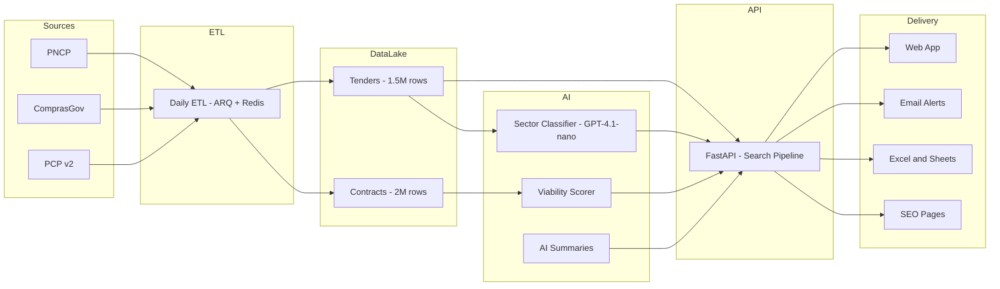

# SmartLic — Public Procurement Intelligence for Brazil

**Live product:** [smartlic.tech](https://smartlic.tech) · **Status:** Production · Paid trials · Stripe live

> AI-powered intelligence layer on top of Brazil's $500B/year public procurement market.
> We crawl, classify and rank ~10,000 daily tenders so B2G suppliers find winnable contracts
> in minutes — not days.

**For B2G suppliers, procurement consultancies and government sales teams** who need to monitor 10,000+ daily tenders across 27 states without drowning in noise.

<!-- Add screenshot: docs/assets/hero-screenshot.png -->

---

## The Problem

Brazil's government buys $500B+/year in goods and services. Most suppliers still find out about opportunities through fragmented portals, outdated PDFs, regional newsletters and WhatsApp groups.

The official source — PNCP — publishes ~10,000 tenders per day across 5,000+ agencies. Without automated classification, a supplier in a specific sector has to manually scan hundreds of irrelevant listings to find the two or three that actually matter to them. The ones who do it systematically win more contracts. Most don't.

## Why Now

Three things converged recently:

- **Lei 14.133/2021** replaced a 30-year-old procurement law and mandated that every federal contract flow through a single digital portal (PNCP) — the first time this data has ever been fully structured and accessible
- **PNCP's public API** (launched 2023) made it possible to ingest the full stream programmatically for the first time
- **LLM inference costs** dropped enough to make per-tender AI classification economically viable at scale — classifying a tender now costs a fraction of a cent

The window is early. Most govtech in Brazil is still manual or spreadsheet-based.

## The Market

| | |
|--|--|
| Annual government procurement (Brazil) | **$500B+/year** |
| Procurement software market (Brazil, 2025) | **$298M** → $746M by 2035 |
| Agencies issuing tenders | **5,000+ across 27 states** |
| New tenders daily via PNCP | **~10,000** |

## What We've Built

A production procurement intelligence layer on top of PNCP, ComprasGov and PCP v2 — with a proprietary DataLake that didn't exist before.

| | |
|--|--|
| DataLake | **3.5M+ records** (1.5M tenders + 2M historical contracts) |
| AI sector classification | **20 sectors** · precision ≥ 85% · recall ≥ 70% |
| Full-text search latency | **< 100ms at p95** |
| Test suite | **5,131+ passing · 0 failures** |
| Organic reach | **10,000+ programmatic SEO pages** (ISR, Google-indexed) |
| Production since | **v0.5 · Stripe billing live · paid trials active** |

## Traction

- **Paid trials:** Active — Stripe billing live, 14-day trial, no credit card required
- **Organic reach:** 10,000+ programmatic SEO pages indexed by Google, driving inbound from suppliers searching by sector and geography
- **Test coverage:** 5,131+ passing tests · 0 failures · CI green on every commit
- **Data compounding:** 3.5M+ records growing daily — 1.5M tenders (400-day window) + 2M+ historical contracts

> For MRR, conversion rate and growth metrics, request the investor data room: tiago.sasaki@confenge.com.br

## Architecture

## Data Moat

The DataLake is the core defensible asset. This dataset does not exist anywhere else in a clean, normalized, searchable form:

- **1.5M+ tenders** with 400-day rolling retention — full-text search in Portuguese, < 100ms at p95, and growing daily
- **2M+ historical contracts** — price benchmarking, supplier win-rate analysis, agency spending patterns by CNPJ
- **20-sector AI classification** using keyword density + GPT-4.1-nano arbiter for edge cases
- **Daily ETL** across all 27 states and 6 procurement modalities, incremental refresh 3×/day
- **Programmatic SEO** — 10,000+ pages indexed by Google, driving organic inbound from suppliers searching by sector and geography

## Business Model

SaaS, 14-day free trial, no credit card required.

| Plan | BRL/mo | USD/mo (approx) |
|------|--------|-----------------|
| Pro (monthly) | R$ 397 | ~$80 |
| Pro (annual) | R$ 297 | ~$60 |
| Consultoria (monthly) | R$ 997 | ~$200 |
| Consultoria (annual) | R$ 797 | ~$160 |

## Stack

FastAPI · Python 3.12 · Next.js 16 · Supabase (PostgreSQL 17) · Redis · ARQ · GPT-4.1-nano · Stripe · Railway

## Team

**Tiago Sasaki — Founder & CEO**
[GitHub](https://github.com/tjsasakifln) · tiago.sasaki@confenge.com.br · [smartlic.tech](https://smartlic.tech)

Founder of CONFENGE Avaliações e Inteligência Artificial LTDA. Built SmartLic from the PNCP crawler through Stripe billing as a solo technical founder — DataLake architecture, AI classification pipeline, 187 API endpoints, 10k+ programmatic SEO pages.

Backed by **CONFENGE Avaliações e Inteligência Artificial LTDA** — CNPJ 52.407.089/0001-09.

## Where We're Going

**Next 6 months:** Scale paying base in 5 priority sectors (engineering, IT, healthcare, cleaning, food services). Launch supplier intelligence module — CNPJ-level win-rate analytics and competitor spend patterns.

**12–24 months:** Expand to municipal tier (5,500+ city governments). Launch consultancy/partner program. Become the default procurement OS for Brazilian B2G suppliers.

**Vision:** The intelligence layer for every B2G transaction in LATAM. Brazil first — then Mexico, Colombia, Chile (combined $400B+ annual procurement).

## For Investors & Partners

Talking with seed-stage funds focused on LATAM B2B SaaS, govtech and vertical AI.

If you invest in govtech, public-sector SaaS, or vertical AI on regulated data:

→ **tiago.sasaki@confenge.com.br**

Data licensing and enterprise partnerships: same address.

---

Tags: `govtech` · `b2g-saas` · `pncp` · `comprasgov` · `public-procurement` · `gpt-4-classification` · `brazil` · `latam`

---

## Technical Docs

- [Detailed Architecture](./docs/architecture/) — modules, flows, ERD, ADRs
- [PRD](./PRD.md) — full product specification
- [Roadmap](./ROADMAP.md) — backlog and status
- [CHANGELOG](./CHANGELOG.md) — version history
- [Deploy & Setup](./docs/DEPLOYMENT.md) — Railway, Supabase, environment variables

---

## License

**© 2024–2026 CONFENGE AVALIAÇÕES E INTELIGÊNCIA ARTIFICIAL LTDA — All rights reserved.**

Proprietary software. Unauthorized use, copying, or distribution is prohibited.

Contact: tiago.sasaki@confenge.com.br
