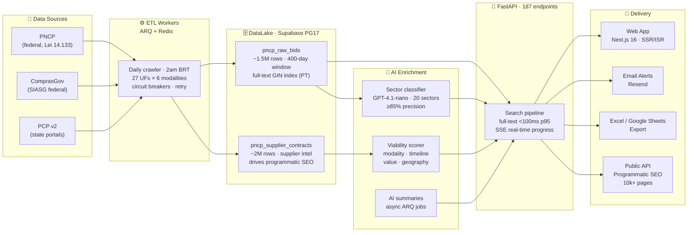
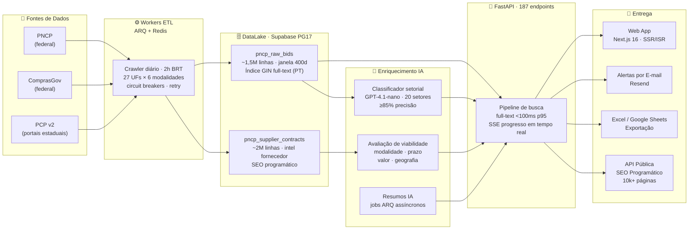

# SmartLic — Public Procurement Intelligence for Brazil

> **Brazil has a massive public procurement market, but opportunity discovery is fragmented, noisy and slow. SmartLic crawls, normalizes, enriches and ranks public tenders so B2G companies can find winnable opportunities faster.**

**Built for companies, consultants and sales teams selling to government.**

---

## The Market

Brazil's public sector is the **single largest buyer in the country** — and until recently, no structured layer existed on top of it.

| Metric | Value |
|--------|-------|
| Annual government contracts (Brazil) | **$500B+/year** |
| Procurement software market (Brazil, 2025) | **$298M** → $746M by 2035 |
| Agencies issuing tenders | **5,000+ across 27 states** |
| New tenders published daily via PNCP | **~10,000** |
| Historical contracts in DataLake | **2M+ records** |

## Why Now

- **PNCP API** (2023) consolidated all federal procurement into one structured, real-time stream for the first time
- **Lei 14.133/2021** mandated digital-first procurement — every federal contract now flows through PNCP
- **LLM inference costs** dropped enough to make per-tender AI classification economically viable at scale
- Brazil's govtech wave is early — most B2G companies still discover opportunities manually via email newsletters

## What We've Built

SmartLic is a **production-grade procurement intelligence platform** — not a prototype.

| Signal | Value |
|--------|-------|
| DataLake records | **3.5M+** (1.5M bids + 2M contracts) |
| Sectors with AI classification | **20** (precision ≥ 85%, recall ≥ 70%) |
| API endpoints | **187** (FastAPI, type-safe, OpenAPI) |
| Automated tests | **5,131+** passing · 0 failures |
| Programmatic SEO pages | **10,000+** ISR |
| Status | **Production v0.5** · paid trials active |
| Billing | **Stripe-integrated** · 14-day free trial |

## Architecture



## Data Moat

SmartLic's proprietary DataLake is the core defensible asset — this dataset does not exist anywhere else in a clean, normalized, searchable form:

- **1.5M+ tenders** indexed with 400-day rolling retention · full-text PostgreSQL search in Portuguese · <100ms at p95
- **2M+ historical contracts** — enables price benchmarking, supplier win-rate analysis, and agency spending patterns
- **20-sector AI classification** with keyword density scoring + GPT-4.1-nano arbiter for zero-match cases
- **Daily ETL**: 27 states × 6 procurement modalities · incremental refresh 3×/day · full crawl nightly at 2am BRT
- **Programmatic SEO moat**: 10,000+ ISR pages indexed by Google — organic inbound from suppliers searching their category + geography

## Business Model

SaaS with 14-day free trial, no credit card required.

| Plan | Price (BRL/mo) | Target |
|------|---------------|--------|
| Pro monthly | R$ 397 | B2G companies |
| Pro semi-annual | R$ 357 | B2G companies (10% off) |
| Pro annual | R$ 297 | B2G companies (25% off) |
| Consultoria monthly | R$ 997 | Bid advisory firms |
| Consultoria annual | R$ 797 | Bid advisory firms (20% off) |

## Tech Stack at a Glance

| Layer | Technologies |
|-------|-------------|
| **Backend** | FastAPI 0.136 · Python 3.12 · Pydantic 2.12 · httpx |
| **AI / LLM** | GPT-4.1-nano (classification + summaries) |
| **Queue** | ARQ 0.26+ · Redis (cache · circuit breaker · SSE · rate limiter) |
| **Database** | Supabase Cloud (PostgreSQL 17 + Auth + RLS) · 183 migrations · 48 tables |
| **Frontend** | Next.js 16.1 · React 18.3 · TypeScript 5.9 · Tailwind CSS 3.4 |
| **Billing** | Stripe 11.4 · 12 webhook events |
| **Infra** | Railway · Supabase Cloud · Redis · GitHub Actions CI/CD |
| **Observability** | Prometheus · OpenTelemetry · Sentry · Mixpanel |

## Contact

**Tiago Sasaki — Founder & CEO**
- Email: tiago.sasaki@confenge.com.br
- WhatsApp: +55 (48) 9 8834-4559
- Production: https://smartlic.tech

For **investment, partnership, data licensing, or white-label** inquiries, reach out directly.

---

[](https://github.com/tjsasakifln/PNCP-poc/actions/workflows/backend-tests.yml)
[](https://github.com/tjsasakifln/PNCP-poc/actions/workflows/frontend-tests.yml)
[](https://github.com/tjsasakifln/PNCP-poc/actions/workflows/codeql.yml)

> Automação de procurement público com IA · API PNCP · ComprasGov · Classificação setorial GPT-4.1-nano · B2G SaaS · Govtech Brasil

> **SOFTWARE PROPRIETÁRIO** — © 2024-2026 CONFENGE AVALIAÇÕES E INTELIGÊNCIA ARTIFICIAL LTDA. Todos os direitos reservados.

---

🇧🇷 [Português](#português) · 🇺🇸 [English](#english)

---

## Português

**SmartLic** é uma plataforma em produção de inteligência em licitações públicas que automatiza a descoberta, análise e qualificação de oportunidades em contratos públicos para empresas B2G (Business-to-Government). Produto da **CONFENGE Avaliações e Inteligência Artificial LTDA**.

Conecta-se às principais fontes oficiais do governo brasileiro — **PNCP (Portal Nacional de Contratações Públicas)**, **ComprasGov** e **Portal de Compras Públicas** — e aplica IA para classificar editais por setor econômico, avaliar viabilidade e entregar inteligência comercial acionável.

**Produção:** https://smartlic.tech | **Versão:** v0.5 (beta com trials pagos) | **Backend:** 187 endpoints · 65 módulos | **Frontend:** 25 páginas + 10 mil+ páginas SEO programático

---

### Para Quem É

SmartLic foi construído para qualquer organização que precise monitorar, analisar ou operar no ecossistema de compras governamentais brasileiro:

#### Empresas que vendem para o governo (B2G)
Automatize a prospecção de editais relevantes por setor (saúde, TI, engenharia, limpeza, vigilância, alimentos, vestuário etc.), elimine a triagem manual do PNCP e concentre esforço nas oportunidades com maior viabilidade de participação.

#### Consultorias e assessorias de licitação
Gerencie múltiplos clientes e setores em um único painel. Use o pipeline Kanban para acompanhar o ciclo de vida de cada edital — da descoberta à proposta. Exporte relatórios Excel e resumos executivos gerados por IA para entregar mais valor aos clientes.

#### Escritórios de advocacia especializados em licitações
Monitore editais, prazos de habilitação, modalidades (pregão eletrônico, dispensa eletrônica, concorrência, RDC, credenciamento sob Lei 14.133/2021) e histórico de contratos por órgão ou CNPJ.

#### Plataformas de busca de editais e marketplaces B2G
Integre via API os dados consolidados de PNCP + ComprasGov + PCP v2 — 1,5 milhão de editais indexados com deduplicação, classificação setorial e avaliação de viabilidade já processados. Evite construir e manter crawlers próprios.

#### Govtechs e civic-techs
Construa sobre uma infraestrutura de dados públicos já operacional: ingestão ETL diária, full-text search em PostgreSQL, 183 migrações versionadas, API pública de observatório municipal e setorial.

#### Portais de transparência, observatórios e órgãos de controle
Use os endpoints públicos de observatório (`/observatorio`, `/indice-municipal`, `/cnpj`, `/compliance`) para construir painéis de transparência, monitoramento de fornecedores e alertas. Compatível com Tribunais de Contas, Controladorias e Ministérios Públicos.

#### Fintechs e seguradoras de seguro-garantia
Acesse o histórico de contratos por CNPJ para avaliação de risco de crédito e verificação de regularidade de fornecedores públicos.

#### Venture studios de govtech, aceleradoras e investidores B2G
Código-fonte completo de uma plataforma B2G em produção: DataLake com 3,5M+ registros, classificação por IA, billing Stripe, 5.131+ testes automatizados, arquitetura Railway + Supabase + Redis.

---

### Funcionalidades Principais

| Funcionalidade | Descrição |
|----------------|-----------|
| **Busca multi-fonte** | PNCP + PCP v2 + ComprasGov v3 agregados com deduplicação por prioridade de fonte |
| **DataLake próprio** | ~1,5M editais (`pncp_raw_bids`, 400d) + ~2M contratos (`pncp_supplier_contracts`); full-text search PostgreSQL <100ms p95 |
| **20 setores** | Classificação por keyword density + GPT-4.1-nano arbiter + zero-match (precisão ≥85%, recall ≥70%) |
| **Viabilidade** | Score automático: modalidade (30%), prazo (25%), valor (25%), geografia (20%) |
| **Pipeline Kanban** | Drag-and-drop para gestão de ciclo de vida de editais |
| **Relatórios** | Excel estilizado + resumo executivo IA + exportação Google Sheets |
| **SEO programático** | 10k+ páginas ISR: observatório setorial, CNPJ, órgãos, municípios, alertas, índice municipal |
| **API pública** | Endpoints de observatório, contratos, licitações por setor/UF/órgão — dados abertos sem autenticação |
| **Billing Stripe** | Pro R$ 397/mês · semestral R$ 357/mês · anual R$ 297/mês · Consultoria R$ 997/mês · Trial 14 dias |
| **Observabilidade** | Prometheus + OpenTelemetry + Sentry · canário PNCP · monitoramento pg_cron |

---

### Arquitetura



---

### Fontes de Dados Oficiais

| Fonte | Base Legal | Endpoint |
|-------|-----------|----------|
| **PNCP** (Portal Nacional de Contratações Públicas) | Lei 14.133/2021 | `pncp.gov.br/api/consulta/v1` |
| **ComprasGov** (SIASG/CATMAT/CATSER) | Decreto 7.892/2013 | `dadosabertos.compras.gov.br` |
| **Portal de Compras Públicas (PCP v2)** | Público | `compras.api.portaldecompraspublicas.com.br/v2` |

---

### Stack Tecnológica

| Camada | Tecnologias |
|--------|-------------|
| **Backend** | FastAPI 0.136 · Python 3.12 · Pydantic 2.12 · httpx · OpenAI SDK 1.109 |
| **IA / LLM** | GPT-4.1-nano (classificação setorial + resumos executivos) |
| **Filas** | ARQ 0.26+ · Redis (cache · circuit breaker · SSE · rate limiter · locks distribuídos) |
| **Banco de dados** | Supabase Cloud (PostgreSQL 17 + Auth + RLS) · 183 migrações · 48 tabelas · 13+ RPCs |
| **Frontend** | Next.js 16.1 · React 18.3 · TypeScript 5.9 · Tailwind CSS 3.4 · Framer Motion · @dnd-kit |
| **Billing** | Stripe 11.4 (12 eventos webhook) · Resend (e-mail transacional) |
| **Infra** | Railway (web + worker + frontend) · Supabase Cloud · Redis · GitHub Actions |
| **Observabilidade** | Prometheus · OpenTelemetry · Sentry · Mixpanel |

---

### Instalação Local

#### Pré-requisitos

- Python 3.12+
- Node.js 18+
- Supabase project (URL + chaves)
- Redis (opcional — há fallback)
- OpenAI API key

#### Backend

```bash
cd backend
python -m venv venv
source venv/bin/activate  # Windows: venv\Scripts\activate
pip install -r requirements.txt
uvicorn main:app --reload --port 8000
# Swagger disponível em http://localhost:8000/docs
```

#### Frontend

```bash
cd frontend
npm install
npm run dev
# Aplicação em http://localhost:3000
```

#### Variáveis de Ambiente

```bash
cp .env.example .env
# Preencha OPENAI_API_KEY, SUPABASE_URL, SUPABASE_ANON_KEY,
# SUPABASE_SERVICE_ROLE_KEY, STRIPE_SECRET_KEY, REDIS_URL, etc.
```

Veja [.env.example](.env.example) para a lista completa de 70+ variáveis documentadas.

---

### Testes

```bash
# Backend (454 arquivos, 5.131+ aprovados)
cd backend
pytest --timeout=30

# Frontend (376 arquivos, 2.681+ aprovados)
cd frontend
npm test

# E2E Playwright (60 fluxos críticos de usuário)
cd frontend
npm run test:e2e
```

---

### Deploy em Produção

| Componente | Plataforma |
|------------|-----------|
| Frontend | Railway (`RAILWAY_SERVICE_ROOT_DIRECTORY=frontend`) |
| Backend API | Railway web process (`PROCESS_TYPE=web`, Uvicorn multi-worker) |
| Worker ARQ | Railway worker process (`PROCESS_TYPE=worker`) |
| Banco de dados | Supabase Cloud (PostgreSQL 17 + Auth + RLS) |
| Cache | Redis (Upstash ou Railway addon) |
| CI/CD | GitHub Actions — testes + API types check + migration gate |

Push para `main` dispara deploy automático via Railway watch patterns.

---

### Documentação

- [PRD Técnico](./PRD.md) — Especificação completa do produto
- [Roadmap](./ROADMAP.md) — Status e backlog
- [CHANGELOG](./CHANGELOG.md) — Histórico de versões

---

### Parcerias e Licenciamento

Software proprietário. Para propostas de **parceria, integração, licenciamento de dados ou white-label**:
- **Email:** tiago.sasaki@confenge.com.br
- **WhatsApp:** +55 (48) 9 8834-4559

---

## English

**SmartLic** is a production-grade public procurement intelligence platform that automates the discovery, analysis, and qualification of government contracting opportunities for B2G (Business-to-Government) organizations. Built by **CONFENGE Avaliações e Inteligência Artificial LTDA** in Brazil.

Connects to Brazil's official procurement sources — **PNCP (National Public Procurement Portal)**, **ComprasGov**, and **Portal de Compras Públicas** — and applies AI to classify bids by economic sector, assess viability, and deliver actionable commercial intelligence.

**Production:** https://smartlic.tech | **Version:** v0.5 (beta with paid trials) | **Backend:** 187 endpoints · 65 modules | **Frontend:** 25 pages + 10k+ programmatic SEO pages

---

### Who Is It For

SmartLic is built for any organization that needs to monitor, analyze, or operate within Brazil's government procurement ecosystem:

#### B2G companies (businesses selling to government)
Automate bid discovery by sector (healthcare, IT, engineering, cleaning, security, food, apparel, etc.), eliminate manual PNCP screening, and focus effort on opportunities with the highest participation viability.

#### Procurement consulting firms and bid advisors
Manage multiple clients and sectors in one dashboard. Use the Kanban pipeline to track each bid's lifecycle. Export AI-generated Excel reports and executive summaries for client delivery.

#### Law firms specializing in public procurement
Monitor bids, qualification deadlines, procurement modalities (electronic bidding, direct award, concorrência, RDC, credenciamento under Lei 14.133/2021), and contract history by agency or CNPJ.

#### Bid search platforms and B2G marketplaces
Integrate via API the consolidated data from PNCP + ComprasGov + PCP v2 — 1.5M indexed bids with deduplication, sector classification, and viability scoring already processed. Avoid building and maintaining your own crawlers.

#### Govtechs and civic-techs
Build on top of an already operational public data infrastructure: daily ETL ingestion, PostgreSQL full-text search, 183 versioned migrations, and a public observatory API for municipal and sector-level data.

#### Transparency portals, observatories, and oversight bodies
Use public endpoints (`/observatorio`, `/indice-municipal`, `/cnpj`, `/compliance`) to build transparency dashboards, supplier monitoring tools, risk indices, and contract anomaly alerts. Suitable for Courts of Audit, Internal Control Bodies, and Public Ministries.

#### Govtech venture studios, accelerators, and B2G investors
Full source of a production B2G platform: DataLake with 3.5M+ records, AI classification, Stripe billing, 5,131+ automated tests, Railway + Supabase + Redis architecture. Architectural reference for govtech startups in Brazil.

---

### Core Features

| Feature | Description |
|---------|-------------|
| **Multi-source search** | PNCP + PCP v2 + ComprasGov v3 aggregated with priority-based deduplication |
| **Proprietary DataLake** | ~1.5M bids (`pncp_raw_bids`, 400d) + ~2M contracts (`pncp_supplier_contracts`); PostgreSQL full-text <100ms p95 |
| **20 sectors** | Keyword density + GPT-4.1-nano arbiter + zero-match classification (precision ≥85%, recall ≥70%) |
| **Viability scoring** | Automatic score: modality (30%), timeline (25%), value (25%), geography (20%) |
| **Opportunity Kanban** | Drag-and-drop pipeline for bid lifecycle management |
| **Reports** | Styled Excel + AI executive summary + Google Sheets export |
| **Programmatic SEO** | 10k+ ISR pages: sectoral observatory, CNPJ, agencies, municipalities, alerts, municipal index |
| **Public API** | Observatory, contracts, and bids endpoints by sector/UF/agency — unauthenticated public data |
| **Stripe Billing** | Pro BRL 397/mo · semi-annual BRL 357/mo · annual BRL 297/mo · Consulting BRL 997/mo · 14-day trial |
| **Observability** | Prometheus + OpenTelemetry + Sentry · PNCP canary · pg_cron monitoring |

---

### Official Data Sources

| Source | Legal Basis | Endpoint |
|--------|-------------|----------|
| **PNCP** (National Public Procurement Portal) | Lei 14.133/2021 | `pncp.gov.br/api/consulta/v1` |
| **ComprasGov** (SIASG/CATMAT/CATSER) | Decreto 7.892/2013 | `dadosabertos.compras.gov.br` |
| **Portal de Compras Públicas (PCP v2)** | Public | `compras.api.portaldecompraspublicas.com.br/v2` |

---

### Tech Stack

| Layer | Technologies |
|-------|-------------|
| **Backend** | FastAPI 0.136 · Python 3.12 · Pydantic 2.12 · httpx · OpenAI SDK 1.109 |
| **AI / LLM** | GPT-4.1-nano (sector classification + executive summaries) |
| **Queues** | ARQ 0.26+ · Redis (cache · circuit breaker · SSE · rate limiter · distributed locks) |
| **Database** | Supabase Cloud (PostgreSQL 17 + Auth + RLS) · 183 migrations · 48 tables · 13+ RPCs |
| **Frontend** | Next.js 16.1 · React 18.3 · TypeScript 5.9 · Tailwind CSS 3.4 · Framer Motion · @dnd-kit |
| **Billing** | Stripe 11.4 (12 webhook events) · Resend (transactional email) |
| **Infra** | Railway (web + worker + frontend) · Supabase Cloud · Redis · GitHub Actions |
| **Observability** | Prometheus · OpenTelemetry · Sentry · Mixpanel |

---

### Local Setup

```bash
# Backend
cd backend && python -m venv venv && source venv/bin/activate
pip install -r requirements.txt
uvicorn main:app --reload --port 8000
# Swagger at http://localhost:8000/docs

# Frontend
cd frontend && npm install && npm run dev
# App at http://localhost:3000

# Environment variables
cp .env.example .env
# Fill: OPENAI_API_KEY, SUPABASE_URL, SUPABASE_ANON_KEY,
# SUPABASE_SERVICE_ROLE_KEY, STRIPE_SECRET_KEY, REDIS_URL
```

---

### Tests

```bash
# Backend (454 files, 5,131+ passing)
cd backend && pytest --timeout=30

# Frontend (376 files, 2,681+ passing)
cd frontend && npm test

# E2E Playwright (60 critical user flows)
cd frontend && npm run test:e2e
```

---

### Production Deploy

| Component | Platform |
|-----------|---------|
| Frontend | Railway (`RAILWAY_SERVICE_ROOT_DIRECTORY=frontend`) |
| Backend API | Railway web process (`PROCESS_TYPE=web`, Uvicorn multi-worker) |
| ARQ Worker | Railway worker process (`PROCESS_TYPE=worker`) |
| Database | Supabase Cloud (PostgreSQL 17 + Auth + RLS) |
| Cache | Redis (Upstash or Railway addon) |
| CI/CD | GitHub Actions — tests + API types check + migration gate |

---

### Partnerships and Licensing

Proprietary software. For **partnership, integration, data licensing, or white-label** inquiries:
- **Email:** tiago.sasaki@confenge.com.br
- **WhatsApp:** +55 (48) 9 8834-4559

---

## Licença / License

**© 2024-2026 CONFENGE AVALIAÇÕES E INTELIGÊNCIA ARTIFICIAL LTDA — Todos os direitos reservados / All rights reserved.**

Este software é propriedade exclusiva da CONFENGE. É estritamente proibido o uso, cópia, modificação, distribuição ou sublicenciamento sem consentimento prévio por escrito.

This software is the exclusive property of CONFENGE. Unauthorized use, copying, modification, distribution, or sublicensing is strictly prohibited.

Consulte / See [LICENSE](./LICENSE) for full terms.

**Contato / Contact:** tiago.sasaki@confenge.com.br · +55 (48) 9 8834-4559 · CONFENGE Avaliações e Inteligência Artificial LTDA
