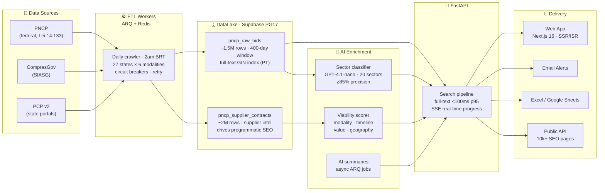

# SmartLic — Public Procurement Intelligence for Brazil

> **Brazil has a massive public procurement market, but opportunity discovery is fragmented, noisy and slow. SmartLic crawls, normalizes, enriches and ranks public tenders so B2G companies can find winnable opportunities faster.**

**Built for companies, consultants and sales teams selling to government.**

---

## The Problem

Brazil's government buys $500B+/year in goods and services. Most suppliers still find out about opportunities through fragmented portals, outdated PDFs, regional newsletters and WhatsApp groups.

The official source — PNCP — publishes ~10,000 tenders per day across 5,000+ agencies. Without automated classification, a supplier in a specific sector has to manually scan hundreds of irrelevant listings to find the two or three that actually matter to them. The ones who do it systematically win more contracts. Most don't.

## Why Now

Three things converged recently:

- **Lei 14.133/2021** replaced a 30-year-old procurement law and mandated that every federal contract flow through a single digital portal (PNCP) — the first time this data has ever been fully structured and accessible
- **PNCP's public API** (launched 2023) made it possible to ingest the full stream programmatically for the first time
- **LLM inference costs** dropped enough to make per-tender AI classification economically viable at scale — classifying a tender now costs a fraction of a cent

The window is early. Most govtech in Brazil is still manual or spreadsheet-based.

## The Market

| | |
|--|--|
| Annual government procurement (Brazil) | **$500B+/year** |
| Procurement software market (Brazil, 2025) | **$298M** → $746M by 2035 |
| Agencies issuing tenders | **5,000+ across 27 states** |
| New tenders daily via PNCP | **~10,000** |

## What We've Built

A production procurement intelligence layer on top of PNCP, ComprasGov and PCP v2 — with a proprietary DataLake that didn't exist before.

| | |
|--|--|
| DataLake | **3.5M+ records** (1.5M tenders + 2M historical contracts) |
| AI sector classification | **20 sectors** · precision ≥ 85% · recall ≥ 70% |
| Full-text search latency | **< 100ms at p95** |
| Test suite | **5,131+ passing · 0 failures** |
| Organic reach | **10,000+ programmatic SEO pages** (ISR, Google-indexed) |
| Status | **Production** · paid trials active · Stripe billing live |

## Architecture

## Data Moat

The DataLake is the core defensible asset. This dataset does not exist anywhere else in a clean, normalized, searchable form:

- **1.5M+ tenders** with 400-day rolling retention — full-text search in Portuguese, < 100ms at p95
- **2M+ historical contracts** — price benchmarking, supplier win-rate analysis, agency spending patterns by CNPJ
- **20-sector AI classification** using keyword density + GPT-4.1-nano arbiter for edge cases
- **Daily ETL** across all 27 states and 6 procurement modalities, incremental refresh 3×/day
- **Programmatic SEO** — 10,000+ pages indexed by Google, driving organic inbound from suppliers searching by sector and geography

## Business Model

SaaS, 14-day free trial, no credit card required.

| Plan | BRL/mo |
|------|--------|
| Pro (monthly) | R$ 397 |
| Pro (annual) | R$ 297 |
| Consultoria (monthly) | R$ 997 |
| Consultoria (annual) | R$ 797 |

## Stack

FastAPI · Python 3.12 · Next.js 16 · Supabase (PostgreSQL 17) · Redis · ARQ · GPT-4.1-nano · Stripe · Railway

## Contact

**Tiago Sasaki — Founder**
tiago.sasaki@confenge.com.br · +55 (48) 9 8834-4559 · https://smartlic.tech

For investment, partnership, or data licensing inquiries, reach out directly.

---

> Automação de procurement público com IA · PNCP · ComprasGov · Classificação setorial GPT-4.1-nano · B2G SaaS · Govtech Brasil

---

## Documentação Técnica / Technical Docs

- [Arquitetura detalhada](./docs/architecture/) — módulos, fluxos, ERD, ADRs
- [PRD](./PRD.md) — especificação completa do produto
- [Roadmap](./ROADMAP.md) — backlog e status
- [CHANGELOG](./CHANGELOG.md) — histórico de versões
- [Deploy & Setup](./docs/DEPLOYMENT.md) — Railway, Supabase, variáveis de ambiente

---

## Licença / License

**© 2024-2026 CONFENGE AVALIAÇÕES E INTELIGÊNCIA ARTIFICIAL LTDA — Todos os direitos reservados.**

Proprietary software. Unauthorized use, copying, or distribution is prohibited.

Contact: tiago.sasaki@confenge.com.br
