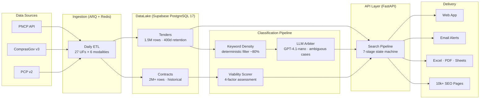

# SmartLic — Public Procurement Intelligence Platform

**Live:** [smartlic.tech](https://smartlic.tech) · Production v0.5 · Paid trials · Stripe live billing

---

## What This System Does

SmartLic ingests Brazil's public procurement data from 3 government APIs (PNCP, ComprasGov, PCP v2),
normalizes it into a unified DataLake, runs full-text search in Portuguese against 3.5M+ records,
classifies opportunities into 20 industry sectors using a hybrid keyword + LLM pipeline, scores
viability across 4 factors, and delivers results through a web app with alerts, exports, and
billing enforcement.

**Technically:** a 3-layer data architecture (ETL ingestion → PostgreSQL full-text search pipeline →
multi-tier cache) exposed through a FastAPI backend with 187 endpoints, a Next.js 16 frontend
with 10k+ programmatic SEO pages, Stripe billing with atomic quota enforcement, ARQ background
workers for summaries and exports, and a Prometheus + Sentry + OpenTelemetry observability stack.

For a detailed engineering narrative, see [CASE STUDY](./CASE_STUDY.md).

---

## Technical Overview

### Architecture

### Key Metrics

| Metric | Value | Evidence |
|--------|-------|----------|
| DataLake records | 3.5M+ (1.5M tenders + 2M contracts) | Measured from Supabase `pncp_raw_bids` + `pncp_supplier_contracts` row counts, 2026-06 |
| Full-text search latency | < 100ms p95 | `search_datalake` RPC execution time, Sentry Performance p95 window |
| Test suite | 5,131+ passing, 0 failures | CI result on latest `main` (`.github/workflows/backend-tests.yml`) |
| AI sector classification precision | ≥ 85% | Validated against 15 labeled samples/sector, benchmark in `tests/test_llm_arbiter_benchmark.py` |
| AI sector classification recall | ≥ 70% | Same benchmark; 20 sectors × 15 samples = 300-label evaluation set |
| SEO pages indexed | 10,000+ | Google Search Console indexed pages estimate + ISR `revalidate=3600` |
| API endpoints | 187 | OpenAPI schema auto-generated from FastAPI route decorators |
| PostgreSQL migrations | 183+ | `supabase/migrations/` directory, applied via CI auto-deploy |
| Daily ingestion volume | ~10,000 tenders | PNCP API daily publication rate, 27 UFs × 6 modalities |
| Billing | Stripe live, 9 plans | 12 webhook events with idempotency, atomic quota via RPC |

### Stack

| Layer | Technology |
|-------|-----------|
| Backend | FastAPI 0.136, Python 3.12, Pydantic 2.13, httpx 0.28 |
| Frontend | Next.js 16, React 18.3, TypeScript 5.9, Tailwind CSS 3.4 |
| Database | Supabase (PostgreSQL 17), 48+ tables, RLS on all tables |
| Cache | Redis (L1 InMemoryCache 4h → L2 Redis 4h → L3 Supabase 24h) |
| Queue | ARQ 0.26+ (Python async job queue backed by Redis) |
| LLM | OpenAI GPT-4.1-nano (classification + executive summaries) |
| Billing | Stripe 11.4 (Checkout, webhooks, customer portal) |
| Email | Resend (transactional, domain `smartlic.tech`) |
| Observability | Prometheus + OpenTelemetry + Sentry + Mixpanel |
| Infrastructure | Railway (web + worker), Supabase Cloud, Redis (Upstash/Railway) |

### Testing

5,131+ backend tests + 2,681+ frontend tests + 60 E2E (Playwright). CI gate on every push.

Tests protect:
- **Search pipeline** — 7-stage state machine contracts, time budget invariants, dedup logic
- **LLM responses** — structured output parsing, hallucination checks, fallback on malformed JSON
- **Billing** — webhook signature verification, plan enforcement, quota atomicity, grace periods
- **Auth** — JWT validation (3 strategies), RLS enforcement, role checks
- **Cache** — SWR staleness windows, L1/L2/L3 fallthrough, key invalidation
- **Ingestion** — content hash dedup, checkpoint resume, 400-day retention enforcement
- **API contracts** — OpenAPI snapshot diff (`openapi_schema.diff.json`), Pydantic schema canary
- **Security** — pip-audit in CI, CodeQL analysis, secret scanning

---

## Market Context

### The Problem

Brazil's government procurement market moves $500B+/year. Most suppliers discover opportunities
through fragmented portals, outdated PDFs, regional newsletters, and WhatsApp groups.

PNCP (the official national procurement portal) publishes ~10,000 tenders per day across 5,000+
agencies. Without classification, a supplier must manually scan hundreds of irrelevant listings
to find the few that match their sector.

### Why Now

- **Lei 14.133/2021** mandated structured digital procurement data for the first time
- **PNCP public API** (launched 2023) made programmatic ingestion viable
- **LLM inference costs** dropped to fractions of a cent per classification — economically viable at scale

### Business Model

SaaS, 14-day free trial, no credit card required.

| Plan | BRL/mo | USD/mo (approx) |
|------|--------|-----------------|
| Pro (monthly) | R$ 397 | ~$80 |
| Pro (annual) | R$ 297 | ~$60 |
| Consultoria (monthly) | R$ 997 | ~$200 |
| Consultoria (annual) | R$ 797 | ~$160 |

### Traction

- Paid trials active — Stripe billing live
- Organic inbound via 10k+ Google-indexed SEO pages
- DataLake compounding daily (3.5M+ records, growing)

For detailed metrics, request the investor data room: tiago.sasaki@confenge.com.br

---

## Team

**Tiago Sasaki — Solo Technical Founder / Applied AI Engineer**
[GitHub](https://github.com/tjsasakifln) · tiago.sasaki@confenge.com.br

Solo technical founder. Built the full stack: DataLake architecture, AI classification pipeline,
187 API endpoints, Stripe billing integration, 10k+ programmatic SEO engine, observability.

CONFENGE Avaliações e Inteligência Artificial LTDA — CNPJ 52.407.089/0001-09.

---

## Documentation

### For Engineers (evaluating the system)

| Document | Purpose |
|----------|---------|
| [CASE STUDY](./CASE_STUDY.md) | Engineering narrative: problem, architecture, decisions, incidents, lessons |
| [AI Classification Pipeline](./docs/ai-pipeline.md) | Hybrid keyword + LLM pipeline: anti-hallucination, cost control, structured output |
| [System Architecture](./docs/architecture/system-architecture.md) | Full module map, ERD, C4 diagrams, ADRs |
| [Operational Reliability](./_reversa_sdd/operational-reliability-2026-05.md) | SLO targets, incident history, MTTR, error budget |
| [Backend README](./backend/README.md) | FastAPI app structure, module map, test commands, env setup |
| [Deployment](./docs/DEPLOYMENT.md) | Railway, Supabase, environment variables, CI/CD |

### For Product / Business

| Document | Purpose |
|----------|---------|
| [PRD](./PRD.md) | Full product specification |
| [Roadmap](./ROADMAP.md) | Backlog and status |
| [CHANGELOG](./CHANGELOG.md) | Version history |

---

## Operational Status

| Signal | Target | How Measured |
|--------|--------|-------------|
| API latency | p95 < 2s | Sentry Performance |
| Uptime | > 99.5% | `/health/ready` probe |
| MTTR | < 30min | Time from Sentry alert to confirmed fix |

- Sentry: https://confenge.sentry.io/projects/smartlic-backend/
- Health probe: https://api.smartlic.tech/health/ready
- Runbook: [`_reversa_sdd/operational-reliability-2026-05.md`](./_reversa_sdd/operational-reliability-2026-05.md)

---

## License

© 2024–2026 CONFENGE AVALIAÇÕES E INTELIGÊNCIA ARTIFICIAL LTDA — All rights reserved.

Proprietary software. Contact: tiago.sasaki@confenge.com.br

---

Tags: `govtech` · `b2g-saas` · `pncp` · `comprasgov` · `public-procurement` · `llm-classification` · `fastapi` · `nextjs` · `supabase` · `brazil` · `latam`
