# Arquitetura — SmartLic

> Gerado pelo **Reversa Architect** em 2026-04-27 · `doc_level=completo`
> Confiança: 🟢 CONFIRMADO · 🟡 INFERIDO · 🔴 LACUNA

---

## 1. C4 — Nível 1 (Contexto)

```mermaid
flowchart TD
    subgraph Atores
        EM[Empresa B2G CEO/Sócio]
        CONS[Consultoria/Assessoria de Licitação]
        ADM[Admin SmartLic CONFENGE]
        BOT[Googlebot / SEO crawlers]
    end

    subgraph SmartLic
        SYS[SmartLic Platform v0.5]
    end

    subgraph Fontes Públicas Brasil
        PNCP[PNCP API consulta/v1]
        PCP[PCP v2 Portal Compras Públicas]
        CG[ComprasGov v3 dadosabertos]
    end

    subgraph SaaS dependências
        STRIPE[Stripe Billing & Subscriptions]
        OPENAI[OpenAI GPT-4.1-nano]
        SUPA[Supabase PostgreSQL + Auth + Storage]
        REDIS[Redis Upstash queue + cache]
        RESEND[Resend Email]
        GOOGLE[Google Sheets API + OAuth]
        SENTRY[Sentry observability]
        MIX[Mixpanel analytics]
        BRAS[BrasilAPI CNPJ enrichment]
        IBGE[IBGE municipios enrichment]
        GSC[Google Search Console]
        RAILWAY[Railway hosting]
    end

    EM -->|busca + analisa| SYS
    CONS -->|multi-cliente| SYS
    ADM -->|operations| SYS
    BOT -->|crawl SEO programmatic| SYS

    SYS -->|pull bids| PNCP
    SYS -->|pull bids fallback| PCP
    SYS -->|pull bids fallback| CG
    SYS -->|webhooks signed| STRIPE
    SYS -->|classify+summarize| OPENAI
    SYS -->|persist + auth + RLS| SUPA
    SYS -->|cache + queue + state| REDIS
    SYS -->|transactional + lifecycle| RESEND
    SYS -->|export user-OAuth| GOOGLE
    SYS -->|telemetry| SENTRY
    SYS -->|product analytics| MIX
    SYS -->|enrich CNPJ| BRAS
    SYS -->|enrich municipios| IBGE
    SYS -->|sitemap submit| GSC
    SYS -.->|deploy + logs| RAILWAY
```



### Fontes externas — papel

| Fonte | Tier | Uso |
|-------|------|-----|
| **PNCP** | priority 1 | ETL diário Layer 1 + live fallback (legacy) |
| **PCP v2** | priority 2 | live fallback (no auth) |
| **ComprasGov v3** | priority 3 | live fallback (legacy + Lei 14.133) |
| **OpenAI GPT-4.1-nano** | LLM tier | classification (zero-match) + summaries (ARQ background) |
| **Stripe** | billing | 12 webhook events + subscriptions + checkout |
| **Supabase** | DB+Auth | PostgreSQL 17 + RLS + Storage + Auth JWT |
| **Redis Upstash/Railway** | infra | ARQ queue + SSE Streams + cache L2 + rate limiter |
| **Resend** | email | transactional + lifecycle + webhooks delivery |
| **Google Sheets** | export | user-scoped OAuth + batchUpdate API v4 |
| **Sentry** | observability | exception tracking + traces |
| **Mixpanel** | analytics | product events (paywall_hit, trial_started, conversion) |
| **BrasilAPI** | enrichment | CNPJ → razão social, endereço, atividade econômica |
| **IBGE** | enrichment | municípios → códigos, regiões |
| **Railway** | hosting | 3 services (web, worker, frontend) |

---

## 2. C4 — Nível 2 (Containers)

```mermaid
flowchart TB
    subgraph "Browser (User)"
        UI[Next.js 16 React 18 SSG/ISR/RSC]
    end
    subgraph "Browser (Bot)"
        CRAWLER[Googlebot]
    end

    subgraph "Railway — bidiq-frontend"
        FE[Next.js server runtime + middleware.ts CSP/auth]
    end

    subgraph "Railway — bidiq-backend (web)"
        WEB[FastAPI 0.136 / Gunicorn 110s timeout]
        WEB --> RR[startup register_routes]
        RR -->|65 routers + 187 endpoints| EP[Endpoints]
        EP --> PIPE[SearchPipeline 7-stage state machine]
        EP --> AUTH[auth.require_auth + 3-strategy JWT]
        EP --> BILL[billing/quota/webhook handlers]
        EP --> ADM[admin endpoints]
        EP --> SEO[18 SEO programmatic routers]
        EP --> SITEMAP[5 dynamic sitemap routes]
    end

    subgraph "Railway — bidiq-backend (worker)"
        WK[ARQ Worker max_jobs=10 timeout=300s]
        WK --> JOBS[7 functions: llm_summary, excel, search, bid_analysis, daily_digest, email_alerts, classify_zero_match]
        WK --> ARQCRON[9 ARQ cron schedules: daily_digest, alerts, cron_monitor, ingestion full+inc+purge, contracts crawl, enrich entities+municipios]
    end

    subgraph "Lifespan loops (web+worker)"
        LL[19 background tasks: health_canary, cache_cleanup, session_cleanup, reconciliation, dunning, alerts, trial_sequence, support_sla, daily_volume, sector_stats, seo_snapshot, indice_municipal, new_bids_notifier, pncp_canary, llm_batch_poll]
    end

    subgraph "Supabase Cloud"
        DB[PostgreSQL 17 + RLS + 48 tables + 183 migrations]
        SUPAUTH[Supabase Auth JWT JWKS]
        STORAGE[Supabase Storage signed URLs]
    end

    subgraph "Redis"
        REDISQ[ARQ queue arq:queue:*]
        REDISC[Cache L2 search_results + capabilities + plan_status]
        REDISL[Distributed locks: alerts, reconciliation, revenue, plan_recon, stripe_purge]
        REDISR[Rate limiter token bucket]
        REDISST[SSE state + cancel flags]
    end

    subgraph "External APIs"
        PNCPAPI[PNCP]
        PCPAPI[PCP v2]
        CGAPI[ComprasGov v3]
        OPENAIAPI[OpenAI]
        STRIPEAPI[Stripe Webhooks + API]
        RESENDAPI[Resend]
        GSAPI[Google Sheets]
        BRASAPI[BrasilAPI]
        IBGEAPI[IBGE]
    end

    UI -->|HTTPS| FE
    CRAWLER -->|crawl SSR/ISR pages + sitemaps| FE
    FE -->|REST proxy /api/*| WEB
    WEB -->|enqueue| REDISQ
    WK -->|consume| REDISQ
    WEB -->|R/W| DB
    WK -->|R/W| DB
    WEB -->|cache + locks| REDISC & REDISL & REDISR & REDISST
    WK -->|cache + locks| REDISC & REDISL
    WEB -->|fetch fallback| PNCPAPI & PCPAPI & CGAPI
    WK -->|ETL crawler| PNCPAPI
    WEB -->|verify token| SUPAUTH
    WEB -->|signed URL| STORAGE
    WK -->|signed URL| STORAGE
    WEB -->|classify| OPENAIAPI
    WK -->|classify+summarize| OPENAIAPI
    WEB -->|webhook signature| STRIPEAPI
    WK -->|email| RESENDAPI
    WEB -->|user OAuth| GSAPI
    WK -->|enrich| BRASAPI & IBGEAPI
    LL -.->|sched tasks| WEB & WK
```



### Container responsibilities

| Container | Process | Scope |
|-----------|---------|-------|
| `bidiq-frontend` | Next.js 16 server | SSR/ISR/RSC, middleware CSP/auth, sitemap.xml, /api/* proxy |
| `bidiq-backend` web | Gunicorn + uvicorn workers | API HTTP /v1/*, /health/*, /webhooks/stripe |
| `bidiq-backend` worker | ARQ worker | jobs (llm summary, excel, search offload, ingestion) + ARQ cron |
| `Supabase Cloud` | managed | DB + Auth + RLS + Storage |
| `Redis` (Upstash/Railway) | managed | queue + cache + locks + rate limiter + SSE state |

### Concurrency / scaling notes

- **Web**: `WEB_CONCURRENCY=1` historically conservative (Hobby $5 metered) — pode subir para 2-4 (memory `reference_railway_hobby_plan_actual.md`)
- **Worker**: 1 instance, ARQ `max_jobs=10` concurrent
- **Lifespan loops**: rodam em CADA web worker — locks Redis previnem duplicação se concurrency > 1
- **Time budget waterfall**: assertado em testes; previne Railway proxy 120s kill
- **WEB_CONCURRENCY=1 + sync .execute() em algumas rotas SEO bloqueia event loop** (root cause Stage 2 outage 2026-04-27, fixed PR #529)

---

## 3. C4 — Nível 3 (Componentes — Backend)

```mermaid
flowchart TB
    subgraph "Entry Layer"
        MAIN[main.py app_factory]
        MAIN --> MWS[startup/middleware_setup]
        MAIN --> EH[startup/exception_handlers]
        MAIN --> LIFE[startup/lifespan]
        MAIN --> ROUTES[startup/routes register]
    end

    subgraph "API Layer (65 routers)"
        SEARCH[routes/search/*]
        PIPELINE[routes/pipeline]
        BILLING[routes/billing + webhooks/stripe]
        AUTH[routes/auth_* + admin]
        ALERTS[routes/alerts + alertas_publicos]
        MESSAGES[routes/messages]
        FEEDBACK[routes/feedback]
        ANALYTICS[routes/analytics]
        ONBOARDING[routes/onboarding]
        EXPORT[routes/export + export_sheets]
        SEO_PUB[18 routers _publicos]
        SITEMAP[5 sitemap routers]
        ADMIN_API[admin + admin_trace + admin_cron + admin_llm_cost + slo + seo_admin]
        ORG[routes/organizations + partners + referral]
    end

    subgraph "Domain Services"
        PIPE_SVC[search_pipeline + 7 stages + state_manager]
        FILTER_SVC[filter/ + llm_arbiter/ + viability]
        BILL_SVC[services/billing + quota/]
        AUTH_SVC[auth.py + authorization + oauth]
        CACHE_SVC[cache/ + redis_pool + search_cache LEGACY]
        DATALAKE_SVC[ingestion/ + datalake_query]
        EMAIL_SVC[email_service + templates/emails]
        EXPORT_SVC[excel + google_sheets + pdf_generator_edital]
        FEEDBACK_SVC[feedback_analyzer]
        MFA_SVC[mfa.py]
        ORG_SVC[org services]
    end

    subgraph "Data Access"
        SUPA_CLI[supabase_client get_supabase + sb_execute + CB]
        REDIS_CLI[redis_client + redis_pool]
        STRIPE_CLI[stripe SDK]
        OPENAI_CLI[openai SDK]
        RESEND_CLI[resend SDK]
    end

    subgraph "Background"
        ARQ_POOL[job_queue.get_arq_pool]
        ARQ_FUNC[7 ARQ functions]
        CRON_LOOPS[19 lifespan loops]
        ARQ_CRON[9 ARQ cron schedules]
    end

    subgraph "Cross-cutting"
        TELE[telemetry + metrics + audit + log_sanitizer]
        FFLAG[feature_flags runtime]
        CONFIG[config + sectors_data.yaml]
    end

    SEARCH & PIPELINE & BILLING & AUTH & ALERTS & MESSAGES & FEEDBACK & ANALYTICS & ONBOARDING & EXPORT & SEO_PUB & SITEMAP & ADMIN_API & ORG --> PIPE_SVC & FILTER_SVC & BILL_SVC & AUTH_SVC & CACHE_SVC & DATALAKE_SVC & EMAIL_SVC & EXPORT_SVC & FEEDBACK_SVC & MFA_SVC & ORG_SVC

    PIPE_SVC & FILTER_SVC & BILL_SVC & AUTH_SVC & CACHE_SVC & DATALAKE_SVC & EMAIL_SVC & EXPORT_SVC & FEEDBACK_SVC & MFA_SVC & ORG_SVC --> SUPA_CLI & REDIS_CLI & STRIPE_CLI & OPENAI_CLI & RESEND_CLI

    PIPE_SVC --> ARQ_POOL
    EMAIL_SVC --> ARQ_POOL
    DATALAKE_SVC --> ARQ_POOL

    ARQ_POOL --> ARQ_FUNC

    LIFE --> CRON_LOOPS
    ARQ_POOL --> ARQ_CRON

    FFLAG --> CACHE_SVC & PIPE_SVC & EMAIL_SVC
    TELE -.->|instruments| PIPE_SVC & SUPA_CLI & STRIPE_CLI & OPENAI_CLI
```



---

## 4. C4 — Nível 3 (Componentes — Frontend)

```mermaid
flowchart TB
    subgraph "Routing"
        APP[app/ Next.js 16 App Router]
        APP --> ROOT[app/page.tsx landing]
        APP --> AUTH_PG[app/login app/signup app/auth app/recuperar-senha]
        APP --> BUSCAR[app/buscar — main search page]
        APP --> PIPE_PG[app/pipeline kanban]
        APP --> ANALYTICS_PG[app/dashboard]
        APP --> HIST[app/historico]
        APP --> MSG_PG[app/mensagens]
        APP --> CONTA[app/conta]
        APP --> PLANS[app/planos + app/planos/obrigado + app/pricing + app/features]
        APP --> ONB[app/onboarding 3-step wizard]
        APP --> ADMIN_PG[app/admin/{cache,feature-flags,emails,metrics,partners,seo,slo}]
        APP --> SEO_PG[app/{observatorio,cnpj,fornecedores,orgaos,municipios,licitacoes,contratos,blog/*,alertas-publicos,indice-municipal,calculadora,comparador,compliance}]
        APP --> SITEMAP_RH[app/sitemap.xml + sitemap-N.xml route handlers]
    end

    subgraph "Cross-cutting"
        MID[middleware.ts CSP + 8 protected routes]
        AUTH_CTX[components/AuthProvider supabase-js client]
        SWR_PROV[components/SWRProvider global SWR config]
        SHELL[components/NavigationShell Sidebar BottomNav PageHeader]
        ANALYTICS_HK[hooks/useAnalytics Mixpanel]
        TRIAL_HK[hooks/useTrialPhase + useTrialUpsell]
        PLAN_HK[hooks/usePlan localStorage 1h cache]
        AUTH_HK[useAuth]
        TOUR[components/tour/Tour Shepherd.js]
    end

    subgraph "Component Library"
        UI_LIB[components/ui/{button,Input,Label,Modal,Pagination,EmptyState,ErrorMessage,...}]
        BUSCAR_COMP[33 components em app/buscar/components/]
        PIPE_COMP[PipelineKanban PipelineColumn PipelineCard PipelineMobileTabs]
        BILLING_COMP[components/billing/*]
        TOUR_COMP[components/tour/*]
    end

    subgraph "State"
        SUPA_BR[lib/supabase/browser supabase-js]
        SUPA_SR[lib/supabase/server SSR cookies]
        STORAGE[lib/storage safeGetItem safeSetItem]
        TYPES[app/types.ts re-export api-types.generated]
    end

    APP --> MID & AUTH_CTX & SWR_PROV
    AUTH_CTX --> AUTH_HK
    BUSCAR --> BUSCAR_COMP
    PIPE_PG --> PIPE_COMP
    PLANS --> BILLING_COMP
    APP --> SHELL
    APP --> TOUR
    APP --> UI_LIB
    AUTH_HK --> SUPA_BR
    TYPES -.->|strong-typed| BUSCAR_COMP & PIPE_COMP & BILLING_COMP
```

### Routing/SSR strategy

| Route type | Rendering | Caveat |
|-----------|-----------|--------|
| Landing `/` | SSG | static |
| Auth `/login` `/signup` | CSR | dynamic auth state |
| `/buscar` | CSR | client-only (auth + SSE + heavy state) |
| `/dashboard` `/historico` `/conta` `/pipeline` | CSR | auth-gated |
| `/onboarding` | CSR | auth-gated wizard |
| `/admin/*` | CSR | auth-gated (admin role) |
| `/observatorio/*` `/cnpj/*` `/blog/*` `/orgaos/*` `/municipios/*` `/licitacoes/*` `/contratos/*` etc. (SEO programmatic ~3k+ pages) | ISR `revalidate=3600` | public + Googlebot-friendly |
| `/sitemap.xml` + 4 sub-sitemaps | route handler | Cache-Control max-age=3600 swr=86400 |
| `/calculadora`, `/comparador` | SSG ou ISR | público |

---

## 5. ERD — Schema Completo (48 tables)

```mermaid
erDiagram
    auth_users ||--|| profiles : "1:1"
    profiles ||--o{ search_sessions : "user_id"
    profiles ||--o{ search_state_transitions : "user_id"
    profiles ||--o{ pipeline_items : "user_id"
    profiles ||--o{ classification_feedback : "user_id"
    profiles ||--o{ conversations : "user_id"
    profiles ||--o{ alerts : "user_id"
    profiles ||--o{ alert_preferences : "user_id"
    profiles ||--o{ user_subscriptions : "user_id"
    profiles ||--o{ monthly_quota : "user_id (year, month)"
    profiles ||--o{ trial_email_log : "user_id"
    profiles ||--o{ trial_extensions : "user_id"
    profiles ||--o{ user_oauth_tokens : "user_id"
    profiles ||--o{ google_sheets_exports : "user_id"
    profiles ||--o{ saved_filter_presets : "user_id"
    profiles ||--o{ shared_analyses : "user_id"
    profiles ||--o{ referrals : "user_id ou referrer_id"
    profiles ||--o{ partner_referrals : "via partner_id"
    profiles ||--o{ trial_exit_surveys : "user_id"
    profiles ||--o{ mfa_recovery_codes : "user_id"
    profiles ||--o{ mfa_recovery_attempts : "user_id"
    profiles ||--o{ organization_members : "user_id"
    organizations ||--o{ organization_members : "org_id"
    organizations ||--o{ pipeline_items : "org_id (nullable, multi-tenant)"
    plans ||--o{ user_subscriptions : "plan_id"
    plans ||--o{ plan_features : "plan_id"
    plans ||--o{ plan_billing_periods : "plan_id"
    user_subscriptions ||--|| stripe_webhook_events : "via subscription_id"
    conversations ||--o{ messages : "conversation_id"
    search_sessions ||--o{ search_state_transitions : "search_id (append-only)"
    pncp_raw_bids ||--o{ classification_feedback : "via bid_id (PNCP id)"
    ingestion_runs ||--o{ ingestion_checkpoints : "run_id"
    pncp_supplier_contracts ||--o{ enriched_entities : "cnpj_fornecedor"
    alerts ||--o{ alert_sent_items : "alert_id"
    alerts ||--o{ alert_runs : "alert_id"
    partners ||--o{ partner_referrals : "partner_id"
    referrals ||--o{ profiles : "redeemed_by"
    leads ||--o{ founding_leads : "via email"
    incidents ||--o{ health_checks : "tied via component"
```



### Tabela canonical (sample — full em `data-master.md`)

| # | Table | Schema | PK | Owner | Retention |
|---|-------|--------|-----|------|-----------|
| 1 | `profiles` | public | `id (uuid)` | auth.users | infinite |
| 2 | `plans` | public | `id (text)` | system | infinite |
| 3 | `user_subscriptions` | public | `id (uuid)` | profiles | infinite |
| 4 | `search_sessions` | public | `search_id (uuid)` | profiles | 90d cleanup |
| 5 | `search_state_transitions` | public | `(search_id, sequence)` | append-only | 90d |
| 6 | `monthly_quota` | public | `(user_id, year, month)` | profiles | infinite |
| 7 | `plan_features` | public | `(plan_id, feature)` | system | infinite |
| 8 | `conversations` | public | `id (uuid)` | profiles | infinite |
| 9 | `messages` | public | `id (uuid)` | conversations | infinite |
| 10 | `user_oauth_tokens` | public | `(user_id, provider)` | profiles | until revoke |
| 11 | `stripe_webhook_events` (events_processed) | public | `id (text=stripe_event_id)` | system | env retention (default 30d?) |
| 12 | `google_sheets_exports` | public | `id (uuid)` | profiles | infinite |
| 13 | `audit_events` | public | `id (uuid)` | profiles+system | 90d |
| 14 | `pipeline_items` | public | `id (uuid)` | profiles | infinite, unique(user_id, pncp_id) |
| 15 | `search_results_cache` | public | `params_hash (text)` | system | 24h pg_cron |
| 16 | `plan_billing_periods` | public | `id (uuid)` | plans + Stripe | sync |
| 17 | `trial_email_log` | public | `id (uuid)` | profiles | infinite |
| 18 | `alerts` | public | `id (uuid)` | profiles | until delete |
| 19 | `alert_sent_items` | public | `id (uuid)` | alerts | 90d? |
| 20 | `alert_preferences` | public | `user_id (uuid)` | profiles | 1:1 |
| 21 | `alert_runs` | public | `id (uuid)` | alerts | 90d |
| 22 | `reconciliation_log` | public | `id (uuid)` | system | 90d |
| 23 | `health_checks` | public | `id (uuid)` | system | 7d |
| 24 | `incidents` | public | `id (uuid)` | system + admin | infinite |
| 25 | `mfa_recovery_codes` | public | `id (uuid)` | profiles | until used |
| 26 | `mfa_recovery_attempts` | public | `id (uuid)` | profiles | 30d |
| 27 | `organizations` | public | `id (uuid)` | profiles (owner) | infinite |
| 28 | `organization_members` | public | `(org_id, user_id)` | organizations | infinite |
| 29 | `partners` | public | `id (uuid)` | admin | infinite |
| 30 | `partner_referrals` | public | `id (uuid)` | partners | infinite |
| 31 | `search_results_store` | public | `(search_id, field)` | system | 24h pg_cron cleanup-search-store |
| 32 | `classification_feedback` | public | `id (uuid)` | profiles | infinite |
| 33 | `pncp_raw_bids` | public | `(content_hash)` ou `(id)` | system ETL | 400d pg_cron purge-old-bids |
| 34 | `ingestion_checkpoints` | public | `id (uuid)` | system ETL | active |
| 35 | `ingestion_runs` | public | `id (uuid)` | system ETL | 90d |
| 36 | `shared_analyses` | public | `id (uuid)`, `hash (text)` | profiles | infinite |
| 37 | `referrals` | public | `id (uuid)` | profiles | infinite |
| 38 | `report_leads` | public | `id (uuid)` | system | infinite |
| 39 | `trial_extensions` | public | `id (uuid)` | profiles | infinite |
| 40 | `leads` | public | `id (uuid)` | system | infinite |
| 41 | `seo_metrics` | public | `id (uuid)` | system snapshot | 90d? |
| 42 | `saved_filter_presets` | public | `id (uuid)` | profiles | infinite |
| 43 | `pncp_supplier_contracts` | public | `(content_hash)` | system ETL | 400d? infinite? |
| 44 | `enriched_entities` | public | `cnpj (text)` | system ETL BrasilAPI | 30d refresh |
| 45 | `trial_email_dlq` | public | `id (uuid)` | system | infinite (DLQ) |
| 46 | `indice_municipal` | public | `(municipio, uf)` | system snapshot | refresh job |
| 47 | `trial_exit_surveys` | public | `id (uuid)` | profiles | infinite |
| 48 | `founding_leads` | public | `id (uuid)` | system | infinite |

### RPCs (PostgreSQL functions)

| RPC | Purpose |
|-----|---------|
| `upsert_pncp_raw_bids(rows)` | ETL upsert com content_hash dedup |
| `purge_old_bids(days)` | retention cleanup |
| `cleanup_search_cache()`, `cleanup_search_store()` | TTL via pg_cron |
| `search_datalake(params)` | full-text search principal |
| `get_panorama_setor(setor_id, days, uf)` | aggregação SEO |
| `get_contratos_orgao(cnpj, ...)`, `get_contratos_setor(setor, uf)` | SEO programmatic |
| `get_top_fornecedores_setor` | top fornecedores por setor |
| `get_alertas_setor_uf(setor_id, uf)` | preview público |
| `get_table_columns_simple(table_name)` | introspecção (admin) |
| `check_and_increment_quota_atomic(user_id, year, month, limit)` | atomic quota |
| `get_cron_health()` | pg_cron monitoring |

### Indexes notáveis

- `pncp_raw_bids` GIN tsvector(`objeto`) PT-BR
- `pncp_raw_bids` partial idx por `data_publicacao DESC` (ordering)
- `pncp_raw_bids (cnpj_orgao)` (SEO-013)
- `pncp_raw_bids` trigram (objeto_compra) — 2026-04-13
- `pncp_supplier_contracts` UF + trigram (2026-04-13)
- `psc_municipio` trigram (memory: planner não-pick com ORDER+LIMIT — feedback)
- `search_sessions` composite (user_id, created_at DESC) — 2026-02-25
- `search_results_cache (params_hash)` PK
- `pipeline_items` unique (user_id, pncp_id)
- `RLS index_user_id` em todas tables com user_id (2026-03-07)

---

## 6. Integrações Externas — Detalhe

| Integração | Protocolo | Auth | Failure mode |
|-----------|-----------|------|-------------|
| PNCP | HTTPS GET | none | circuit breaker 15 fail/60s cooldown; canary monitora shape drift |
| PCP v2 | HTTPS GET | none | fail silently → next source |
| ComprasGov v3 | HTTPS GET | none | fail silently → next source |
| OpenAI | HTTPS POST | API key | retry 3x; fallback PENDING_REVIEW (gray zone) |
| Stripe | webhook POST | signature | events_processed idempotência; 30s timeout |
| Supabase | postgres-rest + pg | JWT + service_role | circuit breaker; statement_timeout=60s service_role |
| Redis | redis://...rediss:// | password | InMemoryCache LRU fallback 10k entries |
| Resend | HTTPS POST | API key | DLQ `trial_email_dlq` se fail |
| Google Sheets | HTTPS API v4 | OAuth user-scoped + Fernet AES-256 | refresh on-demand |
| BrasilAPI | HTTPS GET | none | best-effort enrichment (não-bloqueante) |
| IBGE | HTTPS GET | none | best-effort |
| Sentry | HTTPS POST | DSN | fire-and-forget |
| Mixpanel | HTTPS POST | TOKEN | best-effort (memory: backend gap até piped-cray) |
| GSC | OAuth + Playwright | Google session | manual sitemap submit (Playwright) |

---

## 7. Spec Impact Matrix

> Onde mudar quando você muda X. Use este mapa antes de iniciar qualquer story.

| Mudança | Backend touch points | Frontend touch points | Tests | Migration |
|---------|---------------------|----------------------|-------|-----------|
| **Add new sector** | `sectors_data.yaml` | `frontend/app/buscar/page.tsx SETORES_FALLBACK` (sync via `scripts/sync-setores-fallback.js`) | `test_filter` keyword tests + benchmark precision/recall | — |
| **Add new filter** | `filter/pipeline.py` + ordem fail-fast | `app/buscar/components/FilterPanel.tsx` | `test_filter*` cobertura | — |
| **Add billing plan** | `services/billing.py` plan defs + `quota/plan_enforcement.py` capabilities | `app/planos/page.tsx` cards + `usePlan` hook | `test_billing` + `test_quota` + Stripe webhook contract test | `plan_billing_periods` insert + sync Stripe |
| **Modify Excel structure** | `excel.py::create_excel` columns | — (download direct) | `test_excel.py` columns | — |
| **Change LLM prompt** | `llm_arbiter/zero_match.py::_build_zero_match_prompt` ou `llm_arbiter/classification.py` | — | `test_llm_arbiter*` precision benchmark 15 samples/sector | — |
| **Add API endpoint** | new `routes/X.py` + register em `startup/routes.py::_v1_routers` + Pydantic schema com `response_model=` | `app/api/X/route.ts` proxy + types via `api-types.generated.ts` regen | route test + handler unit | — |
| **Add Stripe webhook handler** | `webhooks/handlers/X.py` + register em `webhooks/stripe.py` event router | — | `test_stripe_webhook_X.py` + idempotência via `events_processed` | — |
| **Add Pipeline stage** | `schemas/pipeline.VALID_PIPELINE_STAGES` + frontend `STAGES_ORDER` | `PipelineKanban`, `PipelineColumn`, mobile tabs | tests stage transitions | — (CHECK constraint update) |
| **Modify search state machine** | `models/search_state.py::SearchState + VALID_TRANSITIONS + STAGE_TO_STATE` | — | `test_search_state_machine.py` invariants | — (text column allows new states) |
| **Add cron job** | new `jobs/cron/X.py` + register em `scheduler.register_all_cron_tasks` | — | mock Redis lock + scheduling test | optional pg_cron migration |
| **Add ARQ job function** | new fn em `jobs/queue/X.py` + add to `WorkerSettings.functions` | — | `test_jobs_X.py` mock pool | — |
| **Add new email template** | `templates/emails/X.py` + register em sender (cron loop or service) | — | `test_email_template_X.py` HTML render | optional `trial_email_log.template_name` enum extension |
| **Add SEO programmatic page** | new `routes/X_publicos.py` + RPC se needed | new `app/X/[slug]/page.tsx` ISR `revalidate=3600` + `next:{revalidate:3600}` fetch | route test + Playwright E2E SEO bot smoke | optional new index |
| **Add new table** | optional service helper | optional types | tests RLS + queries | new `supabase/migrations/YYYYMMDDHHMMSS_X.sql` + `.down.sql` mandatory (STORY-6.2) |
| **Modify capabilities matrix** | `quota/plan_enforcement.py` + `quota/plan_capabilities` | `usePlan` localStorage cache invalidate | tests cada role | optional `plan_features` insert |
| **Add multi-tenant feature** | `org_id` propagation em handler | passar org context em hooks | tests cross-org RLS isolation | optional `organization_X` table |
| **Add MFA factor** | `mfa.py` + `routes/mfa.py` | `app/conta/mfa/page.tsx` | tests TOTP/SMS flow | `mfa_X` table se needed |

### ADR cross-references (Spec Impact Matrix → ADRs)

> Decisões arquiteturais que governam linhas da matriz acima. Index canonical: [`docs/adr/README.md`](../docs/adr/README.md). Lifecycle status: [`docs/adr/LIFECYCLE-REVIEW-2026-05-09.md`](../docs/adr/LIFECYCLE-REVIEW-2026-05-09.md).

| Linha matriz | ADR(s) governando | Path |
|--------------|-------------------|------|
| Add API endpoint (`response_model=` mandatory) | ADR-PARITY-BE-FE-001 | `docs/adr/ADR-PARITY-BE-FE-001-response-model-mandatory.md` |
| Add billing plan / Stripe webhook | ADR-BILL-SYNC-001 | `docs/adr/ADR-BILL-SYNC-001-bidirectional-strategy.md` |
| Add cron job | ADR (cron consolidation) | `docs/adr/cron-consolidation.md` |
| Add MFA factor | ADR-MFA-EXT-001 (canonical), `mfa-policy.md` (predecessor) | `docs/adr/ADR-MFA-EXT-001-mandatory-policy.md` |
| Add multi-tenant feature | ADR (org RBAC) | `docs/adr/org-rbac.md` |
| Godmodule split / new package decomposition | ADR-ARCH-001 | `docs/adr/ADR-ARCH-001-godmodule-split-strategy.md` |
| `service_role` query (`statement_timeout`) | ADR-SEN-BE-001b | `docs/adr/ADR-SEN-BE-001b-service-role-timeout.md` |
| Founding-plan touch points | ADR-BIZ-FOUND-002 | `docs/adr/ADR-BIZ-FOUND-002-founding-policy.md` |
| Partner program / referral / commission | ADR (partner program) | `docs/adr/partner-program.md` |

### Spec Impact por arquivo crítico

| File | Outras file que importam ele |
|------|------------------------------|
| `search_pipeline.py` | `routes/search/__init__.py`, `routes/onboarding.py`, `jobs/queue/search.py` |
| `auth.py::require_auth` | quase todos `routes/*.py` |
| `quota/quota_atomic.py::check_and_increment_quota_atomic` | `routes/search/`, `routes/pipeline.py`, `routes/onboarding.py`, `routes/export*.py` |
| `supabase_client.get_supabase` | TODAS rotas + services |
| `redis_pool.get_redis_pool` | cache, ARQ, SSE, rate limiter, locks |
| `schemas.BuscaRequest` | `routes/search/`, `routes/onboarding.py`, frontend `types.ts` (codegen) |
| `webhooks/stripe.py` | Stripe Dashboard config (single registration DEBT-324) |
| `feature_flags` | runtime toggle 7+ flags |

---

## 8. Princípios Arquiteturais (inferidos)

1. 🟢 **Async-first** — FastAPI + asyncio + ARQ. Sync calls sempre wrapped em `asyncio.to_thread`.
2. 🟢 **Time budget waterfall** — layered timeouts assertados em testes invariantes.
3. 🟢 **Graceful degradation** — circuit breakers + fail-open reads + InMemoryCache fallback.
4. 🟢 **State machines explícitas** — search lifecycle 11 states, conversation 4 states, subscription 5 states.
5. 🟢 **Optimistic locking** onde concurrent edits possíveis (pipeline_items.version).
6. 🟢 **Fire-and-forget telemetry** — `asyncio.create_task` não bloqueia request.
7. 🟢 **Idempotência via deterministic hash** — search params, content_hash bids, events_processed Stripe.
8. 🟡 **Cache invalidation strategy**: SWR per-request (não TTL puro). Warming proativo deprecated 2026-04-18.
9. 🟢 **Feature flags runtime** — toggle sem restart via DB.
10. 🟢 **Defense-in-depth multi-layer**: CSP middleware + JWT + RLS + service-role + `.eq("user_id")` explícito.

### Anti-patterns a evitar (incidents capturados)

- 🔴 `revalidate=N` + `cache:'no-store'` → quebra SSG (SEN-FE-001 incident — recidiva 2026-04-24)
- 🔴 Sync `.execute()` em route async sem `await sb_execute()` → bloqueia event loop (root cause 2026-04-27 Stage 2)
- 🔴 `Promise.all` de muitos fetches em build → satura backend (4146 pages OOM)
- 🟢 **ConcurrencyLimiter** (2026-05-12): limita fetches paralelos SSG/ISR via `frontend/lib/concurrency.ts` (109 LOC) — previne timeout cascade (#1132 fix)
- 🟢 **Strategy Pattern LLM** (2026-05-11): `backend/llm/` refatorado — keyword > llm_standard > llm_zero_match via interface (REF-VAL-002)
- 🟢 **Webhook ABC Base** (2026-05-11): `backend/services/webhooks/` — idempotency unification via base class inheritance (REF-MON-002)
- 🟢 **CNAE DB-first** (2026-05-11): `cnae_setor_mapping` table — substitui YAML-only CNAE→setor mapping (DATA-CNAE-001)
- 🟢 **On-demand ISR** (2026-05-11): `POST /api/revalidate` + ARQ hook — complementa `revalidate=3600` (SEO-REV-001)
- 🟢 **Sitemap MVs** (2026-05-11): Materialized Views + pg_cron — entity pages servidas via MV para performance (SEO-MV-001)
- 🟢 **410 Gone middleware** (2026-05-11): `frontend/middleware.ts` — CNPJ malformado → 410 (SEO signal permanente)
- 🟢 **LLM Redis Cache** (2026-05-08): TTL 7d, SHA-256 key, graceful fallback — reduz latência classificações repetidas
- 🟢 **Founder Transparency** (2026-05-12): `FounderTransparencySection.tsx` + `CredibilitySection.tsx` — prova social real (CDC art. 37)
- 🟡 **Coverage Manifest** (2026-05-11): `GET /v1/seo/coverage-manifest` — audit trilha de cobertura pSEO (SEO-CVG-001)
- 🔴 `service_role` sem statement_timeout → pool exhaustion (memory `reference_supabase_service_role_no_timeout_default`)
- 🔴 `PYTHONASYNCIODEBUG=1` em prod → debug overhead (memory `feedback_audit_env_vars_after_incident`)
- 🔴 Multiple Edits paralelos no mesmo file commit HEAD → race condition (memory)
