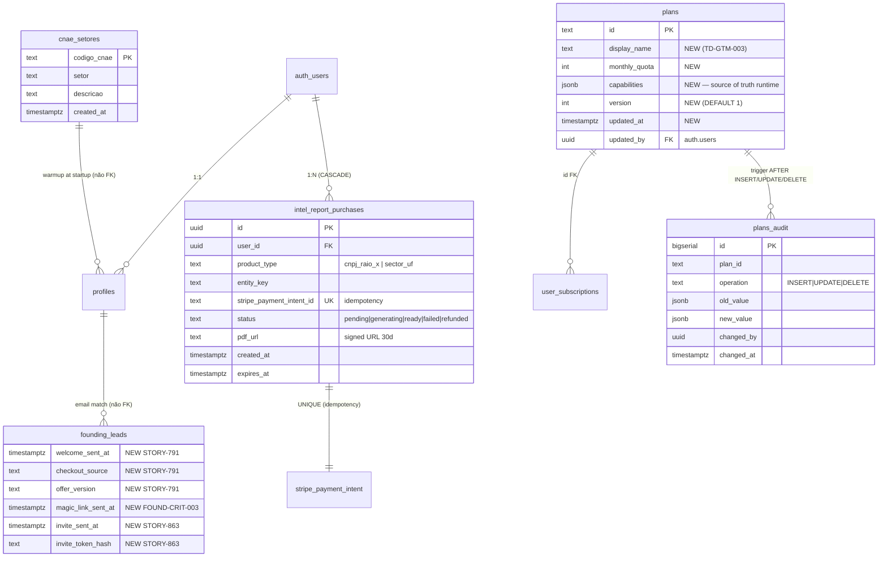

# Data Master — Análise Completa do Banco

> Gerado pelo **Reversa Data Master** em 2026-04-27
> Fonte: `supabase/migrations/` (183 arquivos), `backend/migrations/` (12 legacy), `data-dictionary.md`
>
> **Refresh 2026-05-09 (DOC-COVERAGE-001):** seções §11 (Tabelas novas/estendidas 2026-05-04→09), §12 (Views — pós SEC-VIEW-001), §13 (RPCs novas Intel + DATA-CAP-001), e §14 (ERD delta) appended at bottom. Cita PRs #955 + #957 (UNMERGED em refresh time, documentadas como post-merge canonical state — wave B sequencing) + PR #916 (`plans` capabilities) + PRs #628, #826, #710, #791, #863. Migration source files lidos diretamente (db pull bloqueado por `feedback_supabase_down_sql_schema_conflict`).

## 1. Stack

- **Database**: Supabase Postgres 17
- **Auth**: Supabase Auth (`auth.users` schema, JWT JWKS)
- **Storage**: Supabase Storage (signed URLs)
- **Connection**: PostgREST + direct via service-role key
- **RLS**: enabled em todas user-scoped tables
- **pg_cron**: scheduled jobs (purge, cleanup) com `cron_job_health` view monitorada
- **Migrations**: source of truth em `supabase/migrations/` (CRIT-050 auto-apply em deploy)

## 2. Tables (48 total)

### Core User & Auth

| # | Table | PK | FKs | RLS | Retention |
|---|-------|-----|-----|-----|-----------|
| 1 | `profiles` | `id (uuid)` | → `auth.users.id` | `user_id = auth.uid()` | infinite |
| 2 | `monthly_quota` | `(user_id, year, month)` | → `profiles` | self | infinite |
| 3 | `audit_events` | `id` | optional `user_id` | admin only | 90d |
| 4 | `mfa_recovery_codes` | `id` | → `profiles` | self | until used |
| 5 | `mfa_recovery_attempts` | `id` | → `profiles` | self | 30d |
| 6 | `user_oauth_tokens` | `(user_id, provider)` | → `profiles` | self | until revoke |

**Notable columns em `profiles`:**
- `id` (uuid, PK, references auth.users.id)
- `email`, `name`, `phone`
- `plan_type` (text, CHECK constraint enum, default 'free_trial' — synced via trigger)
- `trial_expires_at` (timestamptz)
- `is_admin` (bool, default false)
- `is_master` (bool, default false)
- `whatsapp_consent` (bool, STORY-007)
- `stripe_customer_id`, `stripe_default_pm_id` (2026-04-20 mig)
- `context_jsonb` (PerfilContexto: cnae, ufs, faixa_valor, porte, experiencia, ...)
- `subscription_status` (active, past_due, canceled, expired, trialing)
- `created_at`, `updated_at`

### Plans & Billing

| # | Table | PK | Notes |
|---|-------|-----|-------|
| 7 | `plans` | `id (text)` | catalog hardcoded sync |
| 8 | `plan_features` | `(plan_id, feature)` | feature flags por plan |
| 9 | `plan_billing_periods` | `id (uuid)` | source of truth pricing (monthly/sem/annual) |
| 10 | `user_subscriptions` | `id (uuid)` | Stripe sync; status, period_end |
| 11 | `stripe_webhook_events` (events_processed) | `id (text)` | idempotência (CRIT-072) |
| 12 | `reconciliation_log` | `id` | Stripe ↔ DB drift |
| 13 | `trial_email_log` | `id` | (lifecycle email tracking) |
| 14 | `trial_email_dlq` | `id` | dead letter queue (failed sends) |
| 15 | `trial_extensions` | `id` | manual extensions |
| 16 | `trial_exit_surveys` | `id` | exit feedback |

### Search & Pipeline

| # | Table | PK | Notes |
|---|-------|-----|-------|
| 17 | `search_sessions` | `search_id (uuid)` | mutável durante pipeline |
| 18 | `search_state_transitions` | `(search_id, sequence)` | append-only, todas transições |
| 19 | `search_results_cache` | `params_hash (text)` | TTL 24h pg_cron `cleanup-search-cache` |
| 20 | `search_results_store` | `(search_id, field)` | TTL 24h pg_cron `cleanup-search-store` |
| 21 | `pipeline_items` | `id (uuid)` | unique(user_id, pncp_id), version locking |
| 22 | `classification_feedback` | `id` | upsert por (user, search, bid) |
| 23 | `saved_filter_presets` | `id` | custom filter saves |
| 24 | `shared_analyses` | `id`, `hash (text)` | public read by hash |

### DataLake (Layer 1 ETL)

| # | Table | PK | Retention |
|---|-------|-----|-----------|
| 25 | `pncp_raw_bids` | `(content_hash)` ou `id` | 400d (`purge_old_bids` 7 UTC daily) |
| 26 | `pncp_supplier_contracts` | `(content_hash)` | similar |
| 27 | `enriched_entities` | `cnpj` | refresh ~30d (BrasilAPI) |
| 28 | `indice_municipal` | `(municipio, uf)` | refresh job |
| 29 | `ingestion_checkpoints` | `id` | active progress |
| 30 | `ingestion_runs` | `id` | 90d audit |

### Notifications & Engagement

| # | Table | PK | Notes |
|---|-------|-----|-------|
| 31 | `alerts` | `id` | per-user saved searches → email |
| 32 | `alert_sent_items` | `id` | dedup já enviado |
| 33 | `alert_runs` | `id` | execution log |
| 34 | `alert_preferences` | `user_id` | 1:1 |
| 35 | `conversations` | `id` | InMail threads |
| 36 | `messages` | `id` | thread messages |
| 37 | `tour_events` | `id` | Shepherd telemetry |
| 38 | `cta_tracking` | `id` | CTA click events |

### Multi-tenant & Growth

| # | Table | PK | Notes |
|---|-------|-----|-------|
| 39 | `organizations` | `id` | multi-seat consultoria |
| 40 | `organization_members` | `(org_id, user_id)` | role membership |
| 41 | `partners` | `id` | partner program |
| 42 | `partner_referrals` | `id` | attribution |
| 43 | `referrals` | `id` | user-to-user referral |
| 44 | `leads`, `report_leads`, `founding_leads` | `id` | landing forms capture |

### Operations

| # | Table | PK | Notes |
|---|-------|-----|-------|
| 45 | `health_checks` | `id` | 7d retention |
| 46 | `incidents` | `id` | manual + auto |
| 47 | `seo_metrics` | `id` | snapshots GSC + sitemap |
| 48 | `google_sheets_exports` | `id` | export history |

## 3. RPCs (PostgreSQL functions)

| RPC | Args | Returns | Purpose |
|-----|------|---------|---------|
| `upsert_pncp_raw_bids(rows jsonb)` | bid array | row count | ETL upsert content_hash dedup |
| `purge_old_bids(retention_days int)` | days | count | retention cleanup |
| `cleanup_search_cache()` | — | count | TTL via pg_cron |
| `cleanup_search_store()` | — | count | similar |
| `search_datalake(filters jsonb)` | params | bids[] | full-text search principal <100ms p95 |
| `get_panorama_setor(setor_id, days, uf)` | — | panorama | SEO programmatic |
| `get_contratos_orgao(cnpj, ...)` | — | contratos | SEO |
| `get_contratos_setor(setor, uf)` | — | contratos | SEO |
| `get_top_fornecedores_setor(setor_id)` | — | fornecedores | SEO |
| `get_alertas_setor_uf(setor_id, uf)` | — | preview | público |
| `check_and_increment_quota_atomic(user_id, year, month, limit int)` | — | (allowed, current, limit) | race-safe quota |
| `get_cron_health()` | — | jsonb | pg_cron monitoring |
| `get_table_columns_simple(table_name)` | — | columns | introspection (admin) |

## 4. Indexes Notáveis

| Index | Table | Type | Purpose |
|-------|-------|------|---------|
| GIN `objeto_tsvector` | `pncp_raw_bids` | GIN tsvector('portuguese') | full-text search |
| Trigram `objeto` | `pncp_raw_bids` | gin_trgm_ops | similar-string search |
| Composite `(setor, uf, data_publicacao DESC)` | `pncp_raw_bids` | btree | filtered ordered queries |
| `cnpj_orgao` | `pncp_raw_bids` | btree (SEO-013) | orgao profile queries |
| `(user_id, created_at DESC)` | `search_sessions` | composite | dashboard queries |
| `params_hash` | `search_results_cache` | PK btree | cache lookup |
| Unique `(user_id, pncp_id)` | `pipeline_items` | btree | idempotent insert |
| `user_id` partial WHERE NOT NULL | many tables | btree (RLS support) | RLS performance (2026-03-07 mig) |
| Trigram `municipio` | `pncp_supplier_contracts` (`psc_municipio_trgm`) | gin_trgm_ops | (memory: planner não-pick com ORDER+LIMIT) |
| `state` | `search_state_transitions` | composite (search_id, sequence) | timeline queries |

## 5. RLS Policies

Todas tables com `user_id` têm RLS ativo:
- SELECT: `user_id = auth.uid()`
- INSERT: `user_id = auth.uid()` (defesa via service-role bypass + `.eq("user_id")` defense-in-depth)
- UPDATE: `user_id = auth.uid()`
- DELETE: `user_id = auth.uid()` (com exceções admin-only)

Exceções:
- `audit_events`: admin-only
- `incidents`: admin write, public read
- `health_checks`: system write, admin read
- `pncp_raw_bids`, `pncp_supplier_contracts`: público SELECT (SEO programmatic via service-role bypass)
- `plans`, `plan_features`, `plan_billing_periods`: público SELECT
- `shared_analyses`: SELECT por hash sem auth (public share)

`statement_timeout`:
- anon: 3s (memory)
- authenticated: 8s
- service_role: NULL (sem timeout) — backend usa service-role + risco pool exhaustion (memory `reference_supabase_service_role_no_timeout_default`)

## 6. pg_cron Schedules

| Job | Schedule | Function | Notes |
|-----|----------|----------|-------|
| `purge-old-bids` | `0 7 * * *` (07 UTC daily) | `purge_old_bids(400)` | STORY-1.2 |
| `cleanup-search-cache` | env | `cleanup_search_cache()` | 24h TTL |
| `cleanup-search-store` | env | `cleanup_search_store()` | 24h TTL |

Monitor: `cron_job_health` view + `get_cron_health()` RPC + ARQ hourly `cron_monitoring_job` (Sentry alert se >25h sem rodar).

## 7. Migrations Policy (STORY-6.3)

- **Source of truth**: `supabase/migrations/YYYYMMDDHHMMSS_description.sql`
- **Pair `.down.sql` mandatory** (STORY-6.2) — block PR se faltar
- **Apply**: `npx supabase db push --include-all` (CI auto-apply em `deploy.yml`)
- **NOTIFY pgrst** após push para reload schema cache
- Smoke test verifica no PGRST205 errors
- Legacy `backend/migrations/` (12 arquivos): histórico audit only, NÃO executar

## 8. Migration CI Flow (CRIT-050) — 3 layers

1. **PR Warning** (`migration-gate.yml`): lista pending + valida `.down.sql` paired
2. **Push Alert** (`migration-check.yml`): block se unapplied detected
3. **Auto-Apply** (`deploy.yml`): `supabase db push` pós-deploy

## 9. Lacunas

- 🔴 RLS policies não-documentadas exhaustively (precisa export `SELECT polname, polrelid::regclass FROM pg_policy`)
- 🟡 `service_role` sem statement_timeout (memory) — risco identificado mas não-fixed
- 🔴 `psc_municipio_trgm` index criado mas planner não-pick com ORDER+LIMIT (memory) — query rewrite pendente
- 🟡 Foreign keys: investigar CASCADE vs RESTRICT consistency (e.g., `pipeline_items.user_id` ON DELETE CASCADE?)
- 🟢 Migration `.down.sql` paired enforcement live via CI

## 10. ERD ASCII (resumido)

```
auth.users
   │ 1:1
   ▼
profiles ────┬───────────────────────────────────────┬──────────────┬─────────┬────────────┐
   │         │                                       │              │         │            │
   │         │  1:N                                  │  1:N         │  1:1    │  1:N       │
   │         ▼                                       ▼              ▼         ▼            ▼
   │  search_sessions ─── 1:N ──► search_state_   pipeline_items  monthly_  alerts ─ 1:N ─ alert_sent_items
   │                                  transitions                  quota                 alert_runs
   │  classification_feedback   ◄── 1:N ──┘                                              alert_preferences (1:1)
   │  conversations ────── 1:N ──► messages
   │  user_subscriptions
   │  trial_email_log ◄ webhook tracking ◄ Resend
   │  user_oauth_tokens
   │  saved_filter_presets
   │  shared_analyses
   │  trial_exit_surveys, trial_extensions
   │  mfa_recovery_codes, mfa_recovery_attempts
   │  organization_members ────► organizations
   ▼
plans ◄─ FK ── user_subscriptions
   │
   ▼
plan_features (1:N), plan_billing_periods (1:N)

ETL Layer (system-owned, no user FK):
pncp_raw_bids (400d retention)
pncp_supplier_contracts
enriched_entities (CNPJ master)
indice_municipal
ingestion_runs ─── 1:N ─── ingestion_checkpoints

Operations:
stripe_webhook_events (idempotency)
reconciliation_log
health_checks
incidents
audit_events
seo_metrics

Growth:
partners ─── 1:N ─── partner_referrals
referrals
leads, report_leads, founding_leads
```

---

## 11. Tabelas Novas / Estendidas (refresh 2026-05-04 → 2026-05-09)

> Esta seção é additive. Documenta deltas desde §2 (baseline 2026-04-27).
> DDLs lidos direto de `supabase/migrations/*.sql` (memory `feedback_supabase_down_sql_schema_conflict` — `db pull` bloqueia por causa do paired `.down.sql` antipattern).

### 11.1 `plans` (estendida — TD-GTM-003 / PR #916 — `20260509011633_plans_capabilities_table.sql`)

Migra hardcoded `PLAN_CAPABILITIES` dict (`backend/quota/quota_core.py`) para a tabela `public.plans` adicionando colunas estruturadas + audit log. Source of truth runtime para `_load_plan_capabilities_from_db()` cache TTL=30s.

**Colunas adicionadas:**

| Coluna | Tipo | Descrição |
|--------|------|-----------|
| `display_name` | `text` | UI-facing label |
| `monthly_quota` | `int` | mirrors `max_searches`, mantida para auditoria spec #192 |
| `capabilities` | `jsonb` | structured plan limits (ver schema abaixo) — source of truth runtime |
| `version` | `int NOT NULL DEFAULT 1` | monotonically incremented em capability change; clientes detectam mudança sem polling |
| `updated_at` | `timestamptz NOT NULL DEFAULT now()` | last write |
| `updated_by` | `uuid REFERENCES auth.users(id) ON DELETE SET NULL` | audit trail |

**Schema `capabilities` jsonb:**
```json
{
  "max_history_days": 1825,
  "allow_excel": true,
  "allow_pipeline": true,
  "max_requests_per_month": 1000,
  "max_requests_per_min": 60,
  "max_summary_tokens": 10000,
  "priority": "normal"
}
```

**Plans seeded/backfilled (UPSERT):** `free`, `free_trial`, `pack_5`, `pack_10`, `pack_20`, `monthly`, `annual`, `master`, `smartlic_pro`, `consultor_agil` (legacy), `maquina` (legacy), `sala_guerra` (legacy), `founding_member`, `consultoria`. Cada `id` recebe um JSONB completo via `CASE id` no UPDATE — migration é hermetic (não depende de Python source-of-truth at apply-time).

**Invariante (self-test no migration via DO block):** `SELECT count(*) FROM public.plans WHERE is_active = true AND capabilities IS NULL = 0` — falha de apply se algum plano ativo ficar com NULL.

**RLS:**
- SELECT: público (anon hits `/v1/plans` na landing) — policy `plans_select_all` preservada
- WRITE: `plans_service_write` policy → `service_role` only
- audit log: `plans_audit` table service_role only

### 11.2 `plans_audit` (NOVA — same migration)

Immutable INSERT/UPDATE/DELETE log de qualquer mudança em `public.plans`.

| Coluna | Tipo |
|--------|------|
| `id` | `bigserial PRIMARY KEY` |
| `plan_id` | `text` |
| `operation` | `text NOT NULL CHECK (op IN ('INSERT','UPDATE','DELETE'))` |
| `old_value` | `jsonb` |
| `new_value` | `jsonb` |
| `changed_by` | `uuid` |
| `changed_at` | `timestamptz NOT NULL DEFAULT now()` |

**Index:** `idx_plans_audit_plan_id_changed_at (plan_id, changed_at DESC)`

**Trigger:** `plans_audit_trigger` AFTER INSERT OR UPDATE OR DELETE ON `public.plans` FOR EACH ROW → `plans_audit_trigger_fn()` (LANGUAGE plpgsql, SECURITY INVOKER por design — writers de `plans` constrained a `service_role` por RLS, não precisa SECDEF).

**RLS:** `plans_audit_service_all` policy — service_role only (read + write).

### 11.3 `intel_report_purchases` (NOVA — INTEL-REPORT-001 / PR #628 — `20260505113800_intel_reports_schema.sql`)

One-time PDF report purchases. Lifecycle `pending → generating → ready | failed | refunded`. Signed URL expira após 30 dias.

| Coluna | Tipo | Descrição |
|--------|------|-----------|
| `id` | `uuid PK DEFAULT gen_random_uuid()` | |
| `user_id` | `uuid NOT NULL REFERENCES auth.users(id) ON DELETE CASCADE` | owner |
| `product_type` | `text NOT NULL` | e.g. `cnpj_raio_x`, `sector_uf` (v0.2 PR #826) |
| `entity_key` | `text NOT NULL` | CNPJ digits-only para `cnpj_raio_x`; setor+uf para `sector_uf` |
| `stripe_payment_intent_id` | `text UNIQUE` | idempotency key contra Stripe webhook double-fulfillment |
| `status` | `text NOT NULL DEFAULT 'pending' CHECK IN ('pending','generating','ready','failed','refunded')` | |
| `pdf_url` | `text` | signed URL Supabase Storage (bucket `intel-reports`) |
| `created_at` | `timestamptz NOT NULL DEFAULT NOW()` | |
| `expires_at` | `timestamptz NOT NULL DEFAULT (NOW() + INTERVAL '30 days')` | signed URL expiry |

**Indexes:**
- `idx_irp_user_id (user_id, created_at DESC)` — Meus Relatórios listing
- `idx_irp_stripe_pi (stripe_payment_intent_id)` — webhook lookup
- `idx_irp_status (status, created_at DESC)` — worker que polla `generating`

**RLS:**
- `irp_owner_select` (FOR SELECT TO authenticated USING `auth.uid() = user_id`) — user só vê seus próprios
- `irp_service_select` / `irp_service_insert` / `irp_service_update` — service_role full access (webhook + worker)
- DELETE não exposto (relatórios = histórico financeiro; `refunded` é status)

**Storage bucket (`20260507110000_create_intel_reports_bucket.sql`):** bucket `intel-reports` privado; signed URL geradas pela rota `GET /v1/intel-reports/{id}/download`.

### 11.4 `cnae_setores` (NOVA — DATA-CNAE-002 / PR #710 — `20260505113807_cnae_setores_table.sql`)

Saga `#679 → #702 (revert) → #722 → #710` — re-implementação minimal pós wedge daemon-thread Redis pubsub (cold start hang). Override DB para o mapping hardcoded em `backend/utils/cnae_mapping.py:CNAE_TO_SETOR`.

| Coluna | Tipo | Descrição |
|--------|------|-----------|
| `codigo_cnae` | `text PRIMARY KEY` | 4-digit IBGE prefix (e.g. "4781") |
| `setor` | `text NOT NULL` | SmartLic sector id (deve match em `backend/sectors_data.yaml` ou `geral` fallback) |
| `descricao` | `text` | opcional |
| `created_at` | `timestamptz NOT NULL DEFAULT now()` | |

**RLS:**
- `cnae_setores_read_authenticated` (FOR SELECT TO authenticated USING true) — read público para autenticados
- service_role bypass por default (sem policy explícita necessária — Supabase pattern)

**Pattern de uso:** `startup/lifespan._warmup_cnae_mapping` faz `SELECT * FROM cnae_setores` com try/except guard — se vazio/missing/unreachable, baseline hardcoded responde (Gap-8 status quo). Não há audit log, não há Redis invalidation channel — schema deliberadamente minimal pra evitar repeat do wedge.

### 11.5 `founding_leads` (estendida — múltiplas migrations)

Lifecycle: STORY-791 (welcome email) + STORY-863 (auto-invite) + FOUND-CRIT-003 (magic-link).

**Colunas adicionadas (cumulativo):**

| Coluna | Tipo | Migration | Story | Uso |
|--------|------|-----------|-------|-----|
| `welcome_sent_at` | `timestamptz NULL` | `20260507120000_founding_leads_tracking_fields.sql` | STORY-791 | idempotency gate welcome email |
| `checkout_source` | `text NULL` | mesma | STORY-791 | UTM source / src param checkout URL |
| `offer_version` | `text NULL` | mesma | STORY-791 | Stripe metadata cohort segmentation (e.g. `v2_lifetime`) |
| `magic_link_sent_at` | `timestamptz NULL` | `20260508100000_founding_leads_invite_field.sql` | FOUND-CRIT-003/006 | idempotency gate Supabase `invite_user_by_email` |
| `invite_sent_at` | `timestamptz NULL` | `20260508100000_founding_leads_invite_fields.sql` (plural — same prefix collision) | STORY-863 | sibling idempotency gate |
| `invite_token_hash` | `text NULL` | mesma | STORY-863 | SHA-256 hash do invite token (audit) |

**Conflito documentado (same-prefix migration collision):**
Os arquivos `20260508100000_founding_leads_invite_field.sql` (singular, FOUND-CRIT-003) e `20260508100000_founding_leads_invite_fields.sql` (plural, STORY-863) compartilham o mesmo prefix de timestamp e ambos criam o índice `idx_founding_leads_invite_pending` com filtros parciais ligeiramente diferentes (`magic_link_sent_at IS NULL` vs `invite_sent_at IS NULL`). A última migration aplicada wins na index recreation. Estado final em prod: ambas colunas existem; índice é o da última migration na ordem de execução do CLI Supabase. Recomendação: futuro story `MIGRATION-DEDUP-COLLISION-001` para colocar em ordem.

**Indexes:**
- `idx_founding_leads_welcome_pending (email) WHERE checkout_status = 'completed' AND welcome_sent_at IS NULL`
- `idx_founding_leads_invite_pending (email) WHERE checkout_status = 'completed' AND <last-applied>_sent_at IS NULL`

### 11.6 `founding_policy_audit_log` (NOVA — `20260507120000_founding_policy_audit_log.sql`)

Audit trail de mudanças no canonical lifetime policy (founding cap/deadline/price overrides).

### 11.7 Migrations adicionais 2026-05-04 → 2026-05-09 (não-tabela / RPC-only / role)

| Migration | Tipo | Notas |
|-----------|------|-------|
| `20260504140600_fix_signup_trigger_search_path.sql` | trigger fix | SECDEF search_path trap fix |
| `20260504160000_secdef_search_path_audit.sql` | audit | enumera SECDEF functions sem `SET search_path` |
| `20260507100000_profiles_founder_fields.sql` | profiles ALTER | add founder fields |
| `20260507100100_founding_policy_lifetime_pivot.sql` | policy | lifetime pivot v2 (BIZ-FOUND-002 v2) |
| `20260507130000_extend_lead_capture.sql` | leads ALTER | extend lead capture |
| `20260508222200_psc_disk_io_covering_indexes.sql` | indexes | covering indexes para `pncp_supplier_contracts` (psc_*) |
| `20260505113900_cnpj_supplier_intel_rpc.sql` | RPC | INTEL v0.1 (ver §13.1) |
| `20260508120000_sector_uf_intel_rpc.sql` | RPC | INTEL v0.2 (ver §13.2) |

---

## 12. Views (refresh 2026-05-09 — pós SEC-VIEW-001)

> Forward reference: PR #955 (UNMERGED em data deste refresh) — migration `supabase/migrations/20260509171616_sec_view_001_invoker_downgrade.sql` flippa as 3 views abaixo de SECDEF default → `security_invoker = true`. Documentado aqui como post-merge canonical state (wave B sequencing per PO mandate).

Supabase advisor lint flagrou 3 views em schema `public` rodando em SECURITY DEFINER (Postgres default), o que bypass RLS do querying user. PR #955 downgrade as 3 para INVOKER mode via `ALTER VIEW SET (security_invoker = true)`.

| View | Underlying tables | Consumer | Mode pós PR #955 |
|------|-------------------|----------|------------------|
| `public.ingestion_orphan_checkpoints` | `public.ingestion_checkpoints` + `public.ingestion_runs` | admin RPC `check_ingestion_orphans()` | INVOKER |
| `public.pncp_raw_bids_bloat_stats` | `pg_class`, `pg_namespace`, `pg_stat_user_tables` (system catalogs) | manual diagnostic | INVOKER |
| `public.cron_job_health` | `cron.job`, `cron.job_run_details` | SECDEF RPC `get_cron_health()` (out of scope deste downgrade) | INVOKER |

**Por que safe em prod:** todos os caminhos reais de leitura passam por `service_role` (Railway backend / ARQ workers / SECDEF RPCs). `service_role` bypass RLS em qualquer modo, então a flip não muda o comportamento funcional do backend. `authenticated` e `anon` não tinham caminho de produção para essas views; pós-INVOKER recebem `permission denied` determinístico (least-privilege).

**Migration source paths (originais — pre-existentes):**
- `ingestion_orphan_checkpoints` — `supabase/migrations/20260331300000_debt207_checkpoint_orphan_monitoring.sql`
- `pncp_raw_bids_bloat_stats` — `supabase/migrations/20260331000000_debt203_bloat_monitoring.sql`
- `cron_job_health` — `supabase/migrations/20260414120000_cron_job_health.sql`

**Idempotência do downgrade:** `ALTER VIEW SET (security_invoker = true)` é idempotente. Down migration usa `RESET (security_invoker)` para voltar ao Postgres default (SECDEF mode).

---

## 13. RPCs Novas (refresh 2026-05-09)

### 13.1 `cnpj_supplier_intel(p_cnpj text, p_window_months int default 36)` RETURNS jsonb (PR #628)

Pipeline INTEL-REPORT-001 (R$197 → ajustado v0.1 R$67) — DataLake → RPC → LLM → PDF → Stripe → email.

- **Source:** `supabase/migrations/20260505113900_cnpj_supplier_intel_rpc.sql`
- **Security:** `SECURITY DEFINER` + `SET search_path = public, pg_temp` (mandatory por `feedback_secdef_search_path_trap`)
- **GRANT:** `service_role` only — payload sensível liberado pós-pagamento confirmado pelo backend
- **Aggregation source:** `pncp_supplier_contracts` (~2M rows; index `idx_psc_ni_fornecedor`)
- **Statement timeout local:** `SET LOCAL statement_timeout = '15s'` (defesa em profundidade vs `service_role` global timeout)

### 13.2 `count_cnpj_contracts(p_cnpj text)` RETURNS int (mesma migration)

Pre-check rápido para gate de checkout (bloquear compra se < 5 contratos disponíveis para evitar refund por falta de dados). Lightweight COUNT com `idx_psc_ni_fornecedor`.

### 13.3 `sector_uf_intel(p_sector text, p_keywords text[], p_uf text, p_window_months int default 24)` RETURNS jsonb (PR #826)

Pipeline INTEL-REPORT-002 v0.2 (R$147) — DataLake → RPC → PDF → Stripe → email.

- **Source:** `supabase/migrations/20260508120000_sector_uf_intel_rpc.sql`
- **Security:** `SECURITY DEFINER` + `SET search_path = public, pg_temp`
- **GRANT:** `service_role` only
- **Aggregation:** `pncp_supplier_contracts` filtrada por `objeto_contrato ILIKE %keyword%` sobre array `p_keywords` (mesma abordagem `count_contracts_by_setor_uf` SEO-471 — `pncp_supplier_contracts` não tem coluna `setor`)
- **Output JSONB shape:** `{total_count, total_value, avg_ticket, median_ticket, p90_ticket, top_fornecedores[], distribuicao_modalidade, serie_temporal, top_orgaos[], data_primeiro, data_ultimo}`

### 13.4 `get_orgao_top_contracts_json(p_orgao_cnpj text, p_limit int)` RETURNS json scalar (DATA-CAP-001 / PR #957 — UNMERGED forward-reference)

Pattern A do DATA-CAP-001 — RPC `RETURNS json scalar` que bypass o `max_rows=1000` cap do PostgREST. Substitui `.limit(2000)` Python-aggregation em `backend/routes/orgao_publico.py:_fetch_contracts_data`.

- **Source:** `supabase/migrations/20260509172143_data_cap_001_orgao_top_contracts_rpc.sql` (post-merge)
- **Security:** `SECURITY DEFINER` + `STABLE` + `SET search_path = public`
- **GRANT:** `anon, authenticated, service_role` (rota é programmatic SEO público — `/orgaos/[cnpj]`)
- **Output JSON shape:** `{top_fornecedores[{nome, cnpj, total_contratos, valor_total}], total_contratos_24m, valor_total_contratos_24m}` — server-side aggregation (não subject ao row-cap)
- **Pattern complementar:** `paginate_full` helper em `backend/utils/postgrest_paginate.py` para queries que precisam raw rows (lista) — emite métrica `smartlic_postgrest_truncation_suspected_total{route, entity_type}` quando vê full batches

### 13.5 RPCs pré-existentes ainda canônicas (consolidação)

Adições à §3:

| RPC | Source migration | Notas |
|-----|------------------|-------|
| `count_contracts_by_setor_uf(setor, keywords, uf)` | SEO-471 | base do pattern keyword-array filter |
| `get_cron_health()` | `20260414120000_cron_job_health.sql` | SECDEF, internamente lê view `cron_job_health` (INVOKER pós PR #955 — função own owner privilege preserva acesso) |
| `check_and_increment_quota_atomic(user_id, year, month, limit)` | já em §3 | race-safe quota |
| `paginate_full` (helper Python, não SQL) | `backend/utils/postgrest_paginate.py` (PR #957) | iterates `.range(offset, offset+batch-1).execute()` até short batch |

---

## 14. ERD Delta (Mermaid — refresh 2026-05-09)

> Diagrama complementar a §10. Foca apenas nas tabelas novas/estendidas refreshes 2026-05.



**Notas ERD:**
- `auth.users → intel_report_purchases` é ON DELETE CASCADE (cleanup user delete)
- `plans.id → user_subscriptions.plan_id` (FK pré-existente, ver §2)
- `cnae_setores ⇏ profiles` é runtime warmup, não FK
- `founding_leads` é tabela standalone com email-based join lazy (não FK para evitar overhead — pattern consciente)

