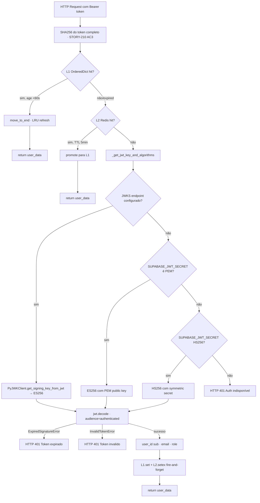
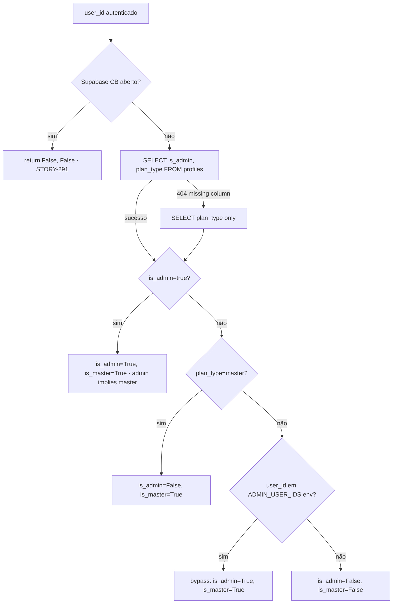
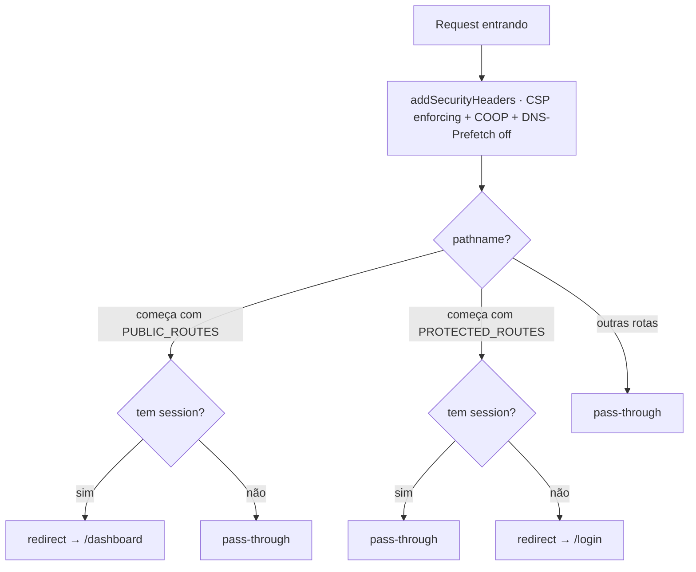

# Flowchart — Módulo `auth-oauth`

> Gerado pelo **Reversa Archaeologist** em 2026-04-27

## 1. JWT Validation Pipeline (cache 2-tier)



## 2. Authorization Roles



## 3. Google OAuth Flow (Sheets export, STORY-180)

```mermaid
sequenceDiagram
  participant U as User
  participant FE as Frontend
  participant BE as Backend FastAPI
  participant G as Google OAuth
  participant DB as google_oauth_tokens
  U->>FE: Click "Conectar Google Sheets"
  FE->>BE: GET /google
  BE->>BE: state = secrets.token_urlsafe (CSRF)
  BE->>FE: 302 → Google authorize URL
  FE->>G: Authorize com scope=spreadsheets
  G->>BE: GET /google/callback?code=X&state=Y
  BE->>BE: validate state (CSRF check)
  BE->>G: POST /token (exchange code → access+refresh)
  G->>BE: tokens
  BE->>BE: Fernet.encrypt(access_token) + Fernet.encrypt(refresh_token)
  BE->>DB: INSERT user_id, encrypted_access, encrypted_refresh, expires_at
  BE->>FE: 302 → /conta?google=connected
  Note over BE,DB: Subsequent calls: decrypt + check expires_at; auto-refresh se expired
```

## 4. Frontend Middleware Decision Tree



**Protected routes:** `/buscar, /historico, /conta, /admin, /dashboard, /pipeline, /mensagens, /planos/obrigado`
**Public routes:** `/login, /signup, /planos, /auth/callback`
**Cacheable Cloudflare:** `/blog, /licitacoes, /glossario, /calculadora, /sobre, /cnpj, /features, /pricing`

## 5. CSP Header (DEBT-108 SEO-FIX hash-based)

```
Content-Security-Policy:
  default-src 'self';
  script-src 'self' 'unsafe-inline' https://js.stripe.com https://static.cloudflareinsights.com https://cdnjs.cloudflare.com https://cdn.sentry.io https://www.clarity.ms https://www.googletagmanager.com;
  style-src 'self' 'unsafe-inline';
  img-src 'self' data: https: blob:;
  font-src 'self' data:;
  connect-src 'self' https://*.supabase.co https://api.stripe.com https://*.railway.app https://*.ingest.sentry.io https://*.smartlic.tech https://api-js.mixpanel.com wss://*.supabase.co https://*.clarity.ms;
  frame-src 'self' https://js.stripe.com;
  object-src 'none';
  base-uri 'self';
  report-uri /api/csp-report;
  report-to csp-endpoint
```

`'unsafe-inline'` aceito como risk — Next.js 16 RSC inject inline scripts dinâmicos (industry consensus vercel/next.js#89754).
