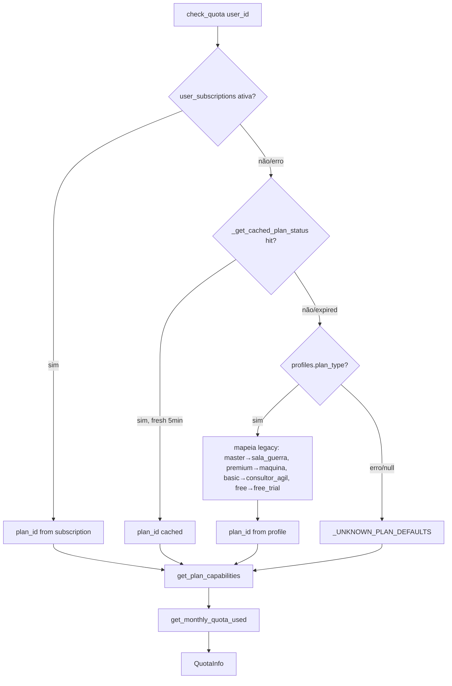
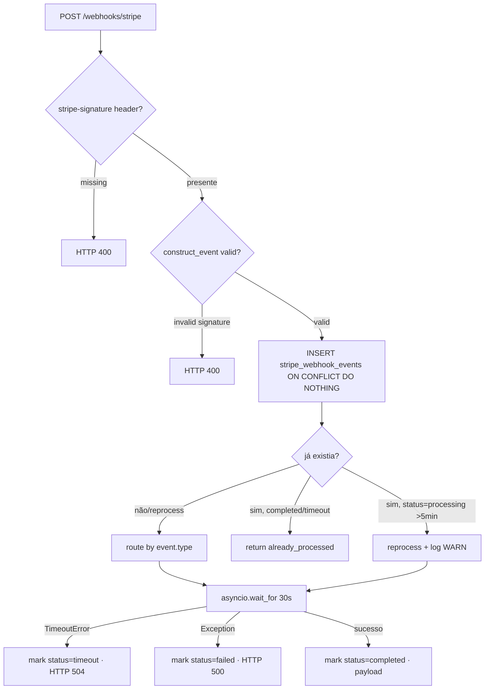
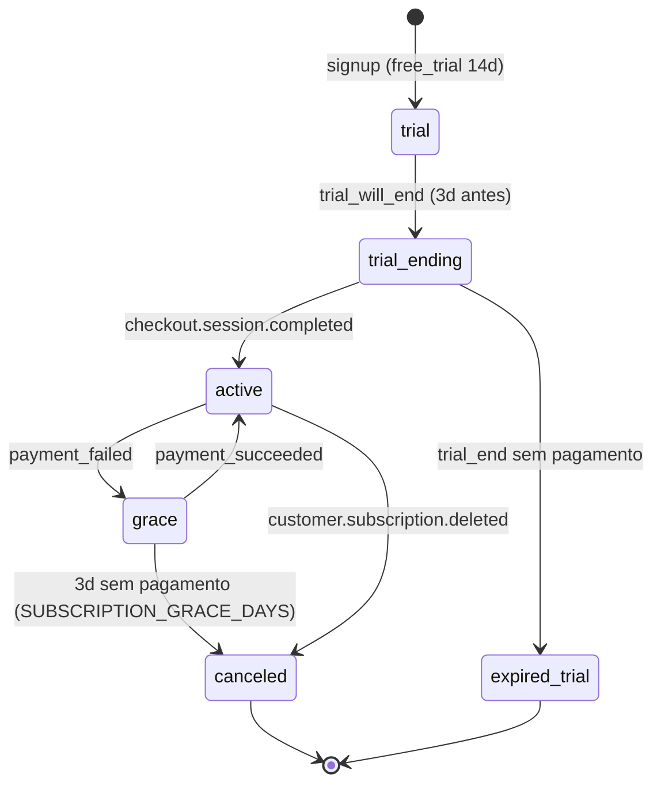

# Flowchart — Módulo `billing-quota`

> Gerado pelo **Reversa Archaeologist** em 2026-04-27 · **Refresh 2026-05-12 (DOC-COVERAGE-002):** §2 Stripe webhook pipeline com batched cleanup e pg_cron

## 1. Quota Check Multi-layer Fallback



## 2. Stripe Webhook Pipeline



## 3. Estados de Subscription



## 4. Atomic Quota Increment (race-free)

```sql
INSERT INTO monthly_quota (user_id, month_year, searches_count)
VALUES ($1, $month_key, 1)
ON CONFLICT (user_id, month_year)
DO UPDATE SET searches_count = monthly_quota.searches_count + 1
RETURNING searches_count;
```

Concurrency: PostgreSQL `ON CONFLICT DO UPDATE` é atômico — sem lost updates mesmo com N requests concorrentes (Issue #189).

## 5. Trial 14-day Lifecycle

```mermaid
gantt
  title SmartLic Trial 14 days
  dateFormat X
  axisFormat %Hd
  Day 0 signup            :milestone, 0, 0
  Trial ativo             :a1, 0, 14d
  Email Day 7 reminder    :milestone, 7, 0
  trial_will_end webhook  :milestone, 11, 0
  Email D-3 reminder      :milestone, 11, 0
  Trial encerra Day 14    :milestone, 14, 0
  Grace 3d                :a2, 14, 17d
  Downgrade definitivo    :milestone, 17, 0
```



Capabilities trial = capabilities `smartlic_pro` (full product). Anti-abuse: rate limit 2 req/min.

## 6. Batched Stripe Webhook Cleanup (SMARTLIC-BACKEND-NH)

```mermaid
flowchart TD
    Cron[pg_cron cleanup-stripe-webhooks · 04:30 UTC] --> Fn[cleanup_old_stripe_events(90, 1000)]
    Fn --> Batch1[DELETE WHERE processed_at < 90d · LIMIT 1000 ORDER BY processed_at ASC]
    Batch1 --> N{deleted > 0?}
    N -->|sim| Sleep[pg_sleep 0.1 · 100ms]
    Sleep --> Batch2[DELETE next batch 1000]
    Batch2 --> N
    N -->|não| Done[DONE · release locks]
```

> **Antes:** single-shot unbounded `DELETE FROM stripe_webhook_events WHERE processed_at < now() - 90d` — lock contention com webhooks INSERT concorrentes, timeout após ~30s, 47 falhas Sentry (SMARTLIC-BACKEND-NH).
>
> **Agora:** batched (1000 rows/lote) com 100ms pause entre lotes. Function `cleanup_old_stripe_events(INTEGER, INTEGER)` SECURITY DEFINER + SET search_path. Reduz lock pressure a zero.
