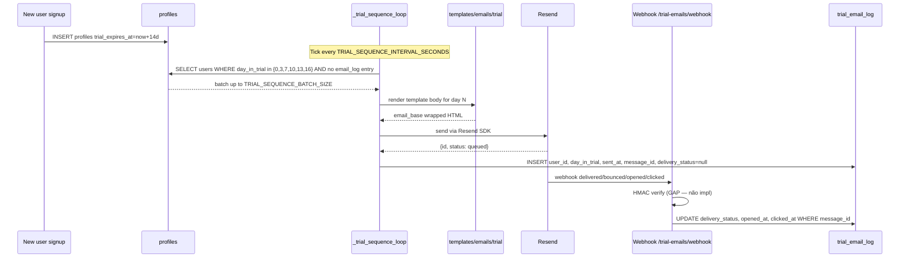
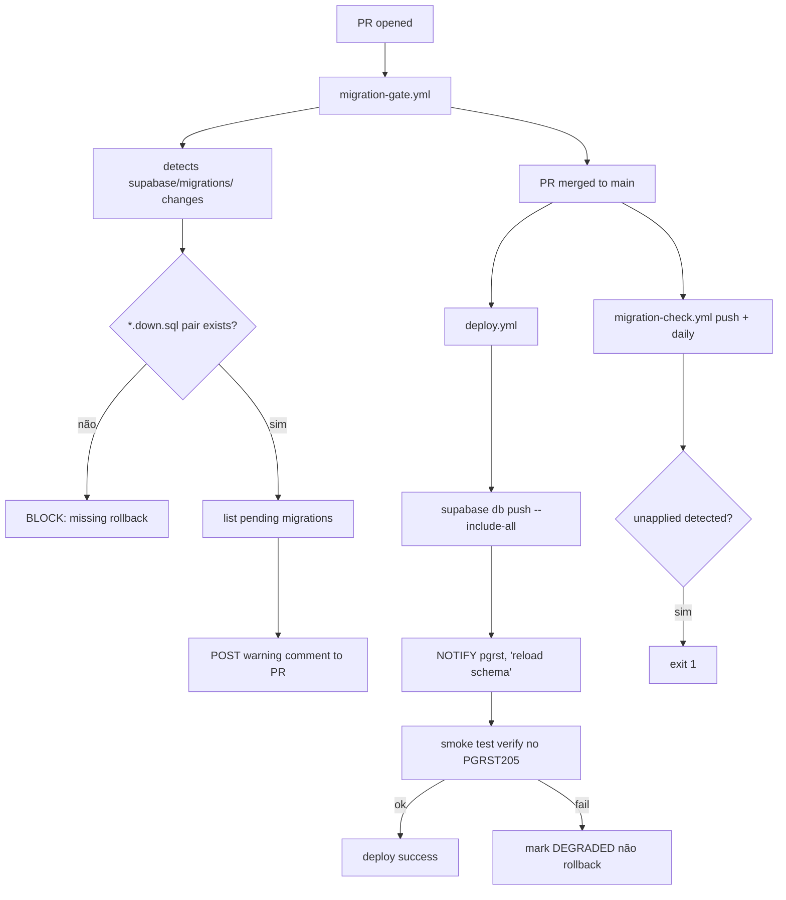
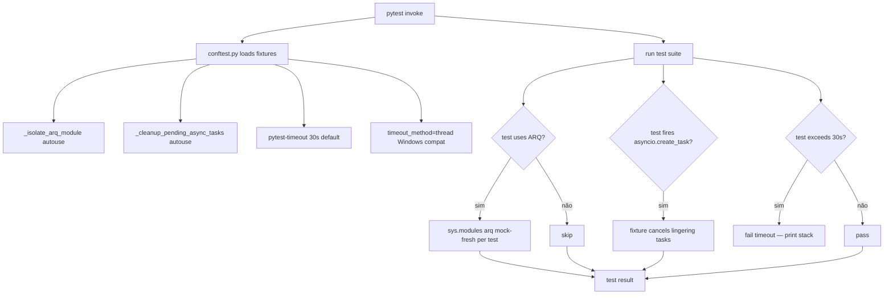
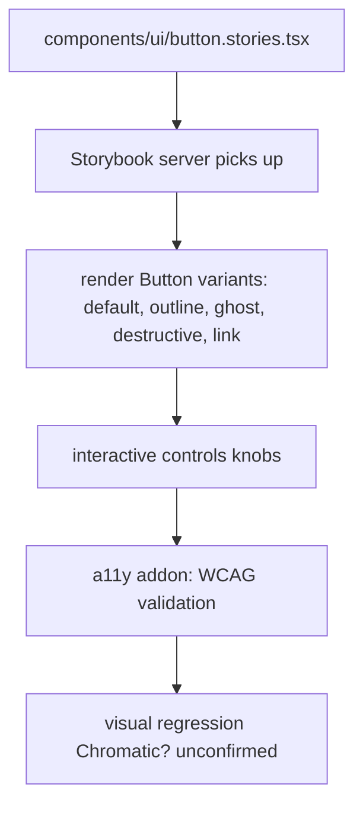

# Flowcharts — Módulos `design-system`, `email-templates`, `tests+migrations`

> Gerado pelo **Reversa Archaeologist** em 2026-04-27 · Confiança 🟢 CONFIRMADO

## Design system token resolution

```mermaid
flowchart LR
    A[Component .tsx] --> B[className 'bg-canvas text-ink rounded-card']
    B --> C[Tailwind compile]
    C --> D[CSS classes resolved]
    D --> E[bg-canvas → background-color: var(--canvas)]
    D --> F[text-ink → color: var(--ink)]
    D --> G[rounded-card → border-radius: 8px]
    E & F --> H[browser reads :root CSS vars]
    H -->|light| I[--canvas: #fff, --ink: #1e2d3b]
    H -->|dark via .dark| J[--canvas: #0a1e3f, --ink: #f7f8fa]
```

## Trial email lifecycle



## Migration apply pipeline (CRIT-050)



## Test execution (anti-hang)



## Storybook component story


