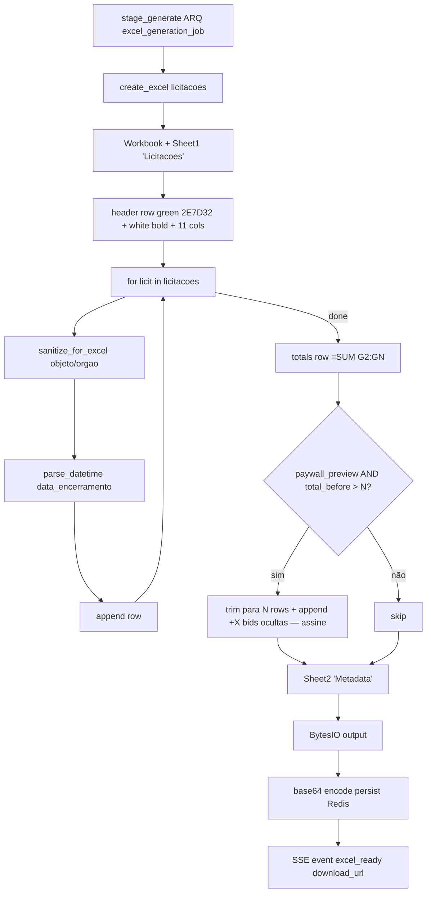
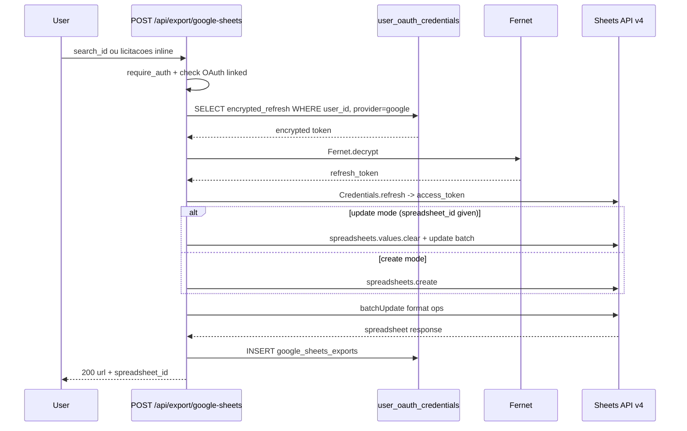
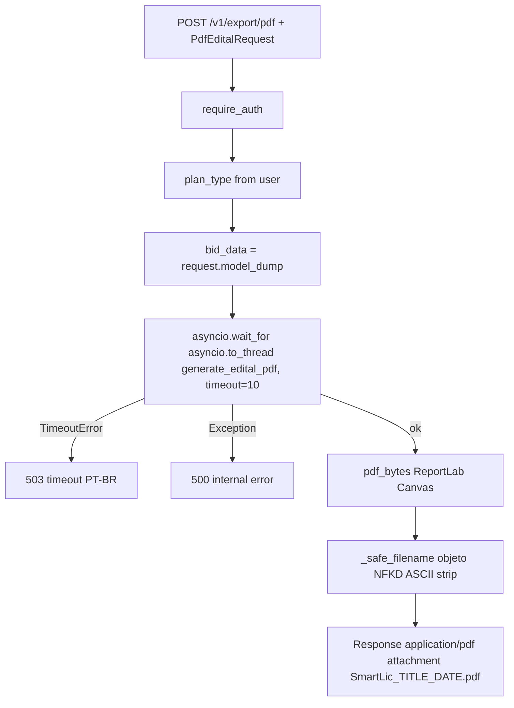
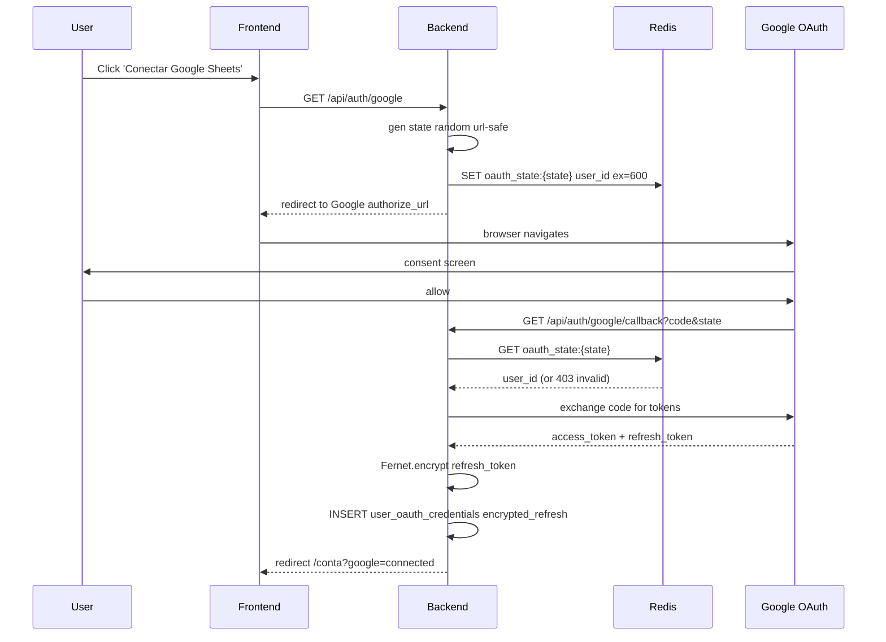
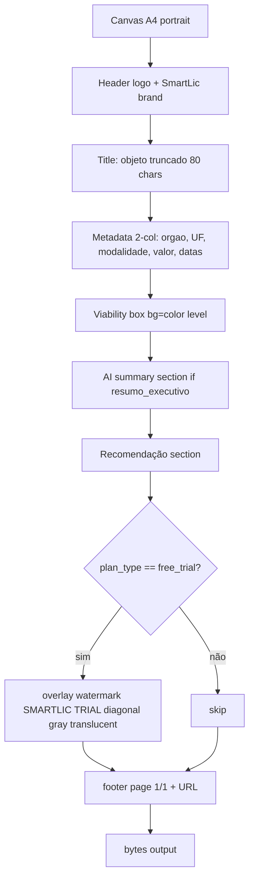

# Flowchart — Módulo `exports`

> Gerado pelo **Reversa Archaeologist** em 2026-04-27 · Confiança 🟢 CONFIRMADO

## Excel export pipeline

## Google Sheets export

## PDF export per-edital

## OAuth Google linking flow

## PDF visual layout (trial watermark)

