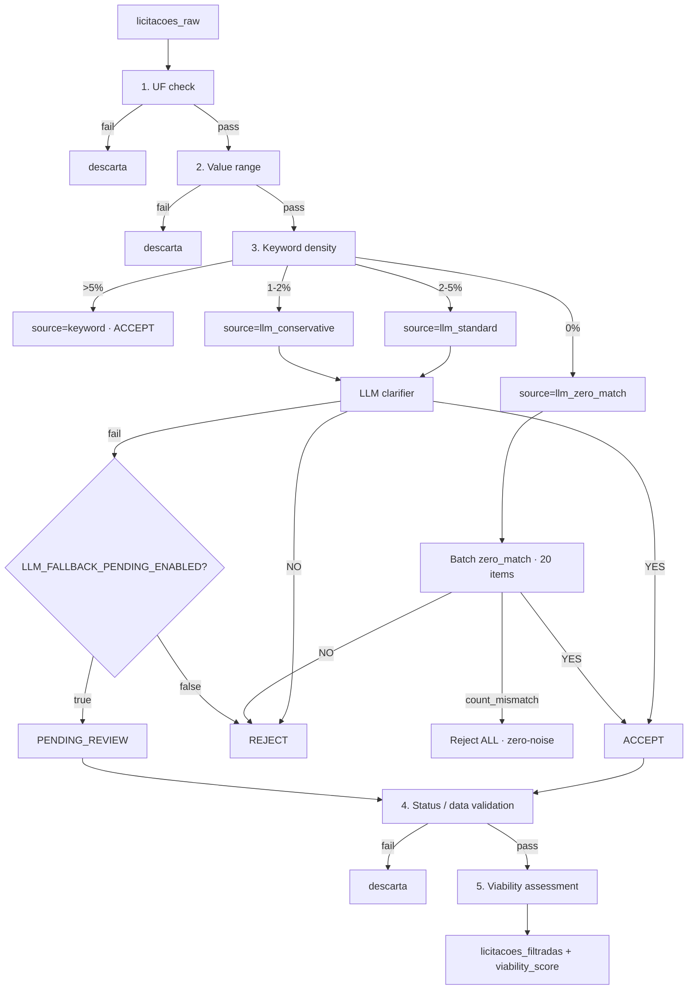
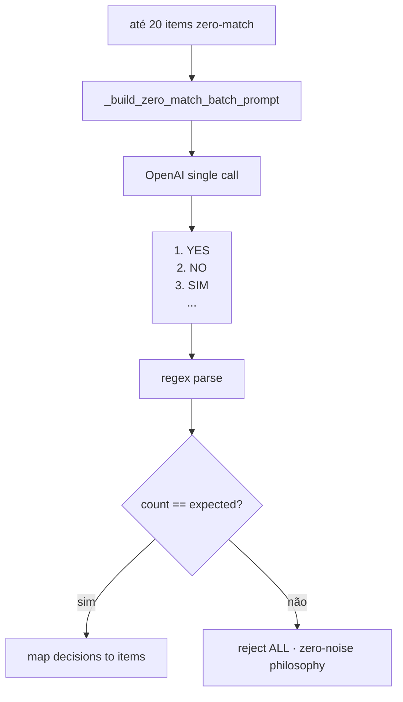

# Flowchart — Módulo `filter-llm-viability`

> Gerado pelo **Reversa Archaeologist** em 2026-04-27 · **Refresh 2026-05-12 (DOC-COVERAGE-002)**: §3 LLM cache atualizado para SHA-256 + Redis-only (Issue #160)

## 1. Pipeline de Filtros (fail-fast)



## 2. Min-Match Floor (STORY-178 AC2.2)

```
total_terms | min_matches | comportamento
1           | 1           | original (sem mudança)
2           | 1           | original (sem mudança)
3           | 1           | original (sem mudança)
4-6         | 2           | exige overlap mínimo
7-9         | 3 (cap)     | evita exclusão excessiva
10+         | 3 (cap)     | preserva recall em buscas amplas
```

`should_include`:
- A: `matched_count >= min_matches` → True
- B: `has_phrase_match` (multi-word exato) → True (override A)

`score = min(1.0, matched/total + 0.15 × phrase_count)`

## 3. LLM Cache 1-Tier Redis (DOC-COVERAGE-002 — Issue #160)

```mermaid
flowchart LR
  Req[get_or_generate_resumo_cached] --> Empty{licitacoes empty?}
  Empty -->|sim| Gen[gerar_resumo · no cache]
  Empty -->|não| Key[_build_resumo_cache_key]
  Key --> Hash[SHA-256 sorted bid IDs + params]
  Hash --> KeyF[llm:summary:{sha256}]
  KeyF --> Redis{Redis get OK?}
  Redis -->|sim| Hit[ResumoLicitacoes.model_validate_json]
  Hit --> Alert[recompute_temporal_alerts]
  Alert --> Ret1[return cached]
  Redis -->|miss/fail| LLM[gerar_resumo · OpenAI]
  LLM --> Store[Redis SETEX TTL=7d · fire-and-forget]
  Store --> Ret2[return fresh]
```

> **Mudanças desde 2026-04-27:** Antes usava MD5 + L1 in-mem + L2 Redis. Agora SHA-256 + Redis only. L1 in-mem cache removido por complexidade sem ganho mensurável (DataLake p95 <100ms). Falha de Redis faz graceful fallback para chamada OpenAI direta.

## 4. Viability — 4 Fatores (D-04)

```
Total = 0.30 × modalidade
      + 0.25 × timeline
      + 0.25 × value_fit
      + 0.20 × geography

(+ porte bonus modality, STORY-260 AC7)
```

| Fator | 100 | 80 | 70 | 60 | 50 | 40 | 30 | 20 | 10 |
|-------|-----|----|----|----|----|----|----|----|----|
| Modalidade | Pregão Eletr. | Pregão Pres. | Concorr. Eletr. | Concorr. Pres. | Credenciamento / default | Dispensa | — | — | — |
| Timeline | >14 dias | 7-14d | — | 3-7d | n/a | — | 1-3d | — | encerrada |
| Value Fit | dentro range | — | — | abaixo ≥50% / acima ≤2x | valor=0 (neutro) | — | — | abaixo <50% / acima >2x | — |
| Geography | UF na busca | — | — | mesma macro-região | n/a | — | distante | — | — |

**Levels:** alta>70 · media 40-70 · baixa<40

## 5. Batch Zero-Match (UX-402 AC5)



## 6. Macro-regiões BR (geography)

```
norte:        AC AM AP PA RO RR TO
nordeste:     AL BA CE MA PB PE PI RN SE
centro_oeste: DF GO MS MT
sudeste:      ES MG RJ SP
sul:          PR RS SC
```
