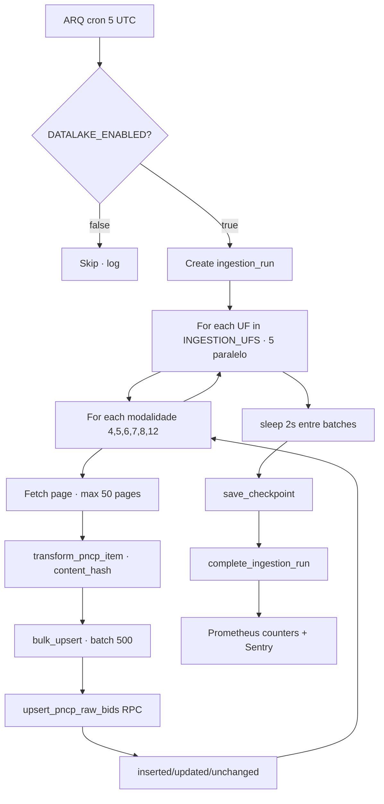
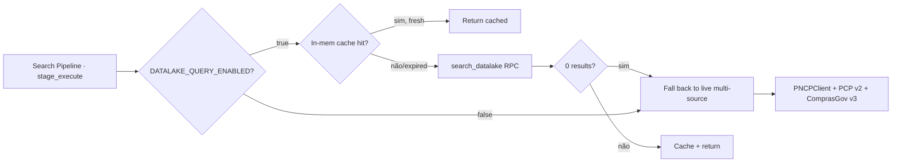
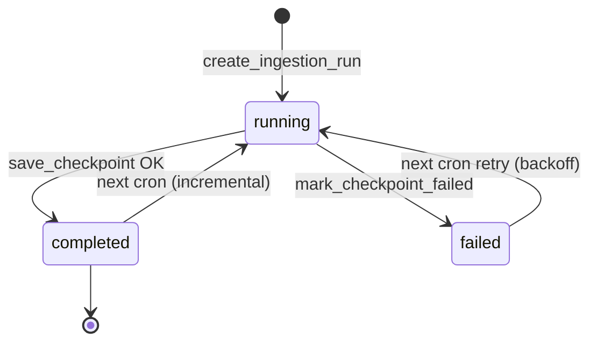

# Flowchart — Módulo `ingestion-datalake`

> Gerado pelo **Reversa Archaeologist** em 2026-04-27

## 1. Crawl Schedule (UTC → BRT)

```mermaid
gantt
  title PNCP Ingestion Schedule (UTC)
  dateFormat HH:mm
  axisFormat %H:%M
  section Daily
  Full crawl (4h timeout)        :05:00, 240m
  Incremental (1h timeout)       :11:00, 60m
  Incremental (1h timeout)       :17:00, 60m
  Incremental (1h timeout)       :23:00, 60m
  Purge (10min)                  :07:00, 10m
```



## 2. Full Crawl Flow



## 3. Query Path Layer 2 vs Legacy Fallback



## 4. Checkpoint State Machine



## 5. Content-Hash Dedup

```
content_hash = SHA-256(
  objeto_compra.lower().strip() +
  "|" +
  valor_total_estimado +
  "|" +
  situacao_compra.lower().strip()
)
```

UPSERT decide via comparison:
- `inserted` = nova `numero_controle_pncp`
- `updated` = mesmo PK, content_hash diferente
- `unchanged` = mesmo PK, mesmo hash (skip write)
