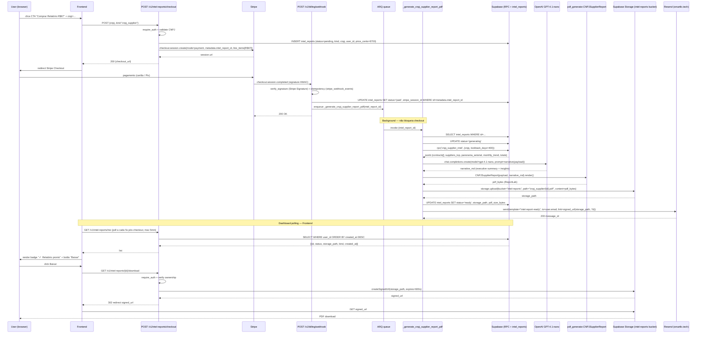
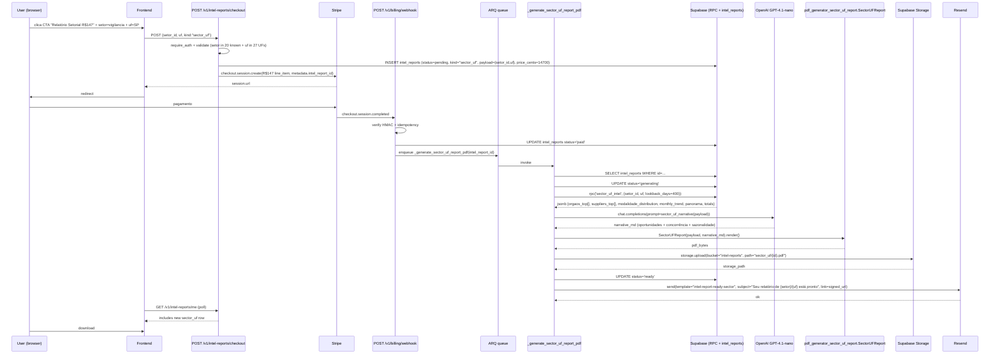
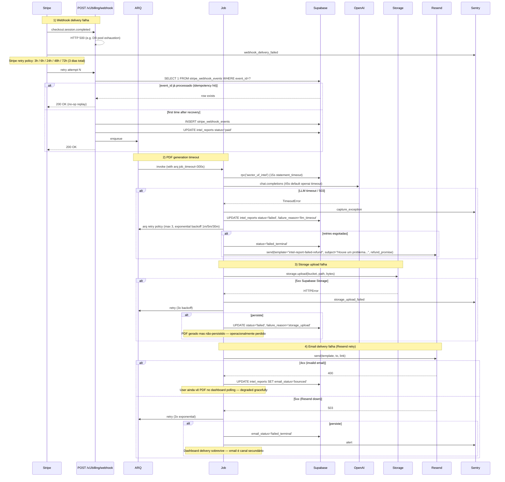

# Flowchart — Módulo `intel-reports`

> Gerado pelo **Reversa Archaeologist** em 2026-05-09 · Confiança 🟢 CONFIRMADO
> Cross-reference: `_reversa_sdd/specs/07-intel-report-sector-uf.md`, `_reversa_sdd/specs/07b-intel-pdf-generator.md`, `_reversa_sdd/specs/13-intel-reports.spec.md`

Cobre os 3 fluxos canonicais do produto Intel Reports (one-time PDF reports gerados por LLM + dados agregados):

1. **v0.1 cnpj_supplier (R$67)** — relatório de inteligência sobre um fornecedor específico (CNPJ alvo).
2. **v0.2 sector_uf (R$147)** — relatório setorial × UF (e.g., "vigilância em SP").
3. **Failure paths** — webhook delivery, PDF timeout, Storage upload, email retry.

Os fluxos compartilham o mesmo skeleton: `Stripe checkout → webhook handler → ARQ job → RPC → LLM narrative → PDF generator → Storage upload → email + dashboard delivery`. Diferenças isoladas em **payload** (CNPJ vs setor+UF), **RPC** (`cnpj_supplier_intel` vs `sector_uf_intel`), **PDF generator** (`pdf_generator.py` vs `pdf_generator_sector_uf_report.py`), **email template** (Resend `intel-report-ready-cnpj` vs `intel-report-ready-sector`), **price** (R$67 vs R$147).

---

## Flow 1 — v0.1 cnpj_supplier (R$67)

**Source files:**
- `backend/routes/intel_reports.py` — `POST /v1/intel-reports/checkout`, `GET /v1/intel-reports/me`, `GET /v1/intel-reports/{id}/download`
- `backend/services/billing.py:create_intel_report_checkout` — Stripe session creation com metadata
- `backend/jobs/queue/jobs.py:_generate_cnpj_supplier_report_pdf` — ARQ worker
- `backend/pdf_generator.py:CNPJSupplierReport` — ReportLab template (ver spec 07b)
- `backend/email_service.py:send_intel_report_ready` — Resend wrapper
- `supabase/migrations/20260505113900_cnpj_supplier_intel_rpc.sql` — RPC `cnpj_supplier_intel(cnpj, lookback_days)`
- `supabase/migrations/20260505113800_intel_reports_schema.sql` — tabela `intel_reports`
- `supabase/migrations/20260507110000_create_intel_reports_bucket.sql` — Storage bucket setup

---

## Flow 2 — v0.2 sector_uf (R$147)

**Diferenças vs Flow 1:**

| Aspecto | v0.1 cnpj_supplier | v0.2 sector_uf |
|---------|--------------------|----------------|
| Preço | R$67 (price_cents=6700) | R$147 (price_cents=14700) |
| Payload entrada | `{cnpj}` | `{setor_id, uf}` |
| RPC | `cnpj_supplier_intel(cnpj, lookback_days)` | `sector_uf_intel(setor_id, uf, lookback_days)` |
| PDF generator | `pdf_generator.CNPJSupplierReport` | `pdf_generator_sector_uf_report.SectorUFReport` |
| Email template | `intel-report-ready` (CNPJ-focused) | `intel-report-ready-sector` (setor-focused) |
| LLM prompt | foco em fornecedor (track record, contratos vencidos) | foco em mercado (oportunidades por modalidade × valor × sazonalidade) |
| Storage path prefix | `cnpj_supplier/` | `sector_uf/` |

**Source files (incremental):**
- `backend/pdf_generator_sector_uf_report.py` — ReportLab template v0.2
- `backend/jobs/queue/jobs.py:_generate_sector_uf_report_pdf` — sibling worker
- `backend/schemas/intel_report.py` — Pydantic models (`IntelReportKind`, `SectorUFPayload`, `CnpjSupplierPayload`)
- `supabase/migrations/20260508120000_sector_uf_intel_rpc.sql` — RPC

---

## Flow 3 — Failure paths

**Failure mode summary:**

| Failure | Mitigação | Recuperação automática? | User-facing impact |
|---------|-----------|-------------------------|--------------------|
| Webhook delivery (Stripe→backend) | Stripe retry policy 3d + idempotency `stripe_webhook_events` | Sim (até 3 dias) | Latência variável até job iniciar |
| PDF generation timeout (LLM/RPC) | ARQ retry 3x exponential + `intel_reports.failure_reason` | Sim | Email refund promise se terminal |
| Storage upload | ARQ retry 3x | Sim | Operacionalmente perdido se persiste — manual intervention |
| Email delivery (Resend) | ARQ retry 3x + dashboard delivery preserva acesso | Parcial | Email pode falhar mas PDF acessível via dashboard |
| User abandona checkout | TTL Stripe session 24h, intel_reports SET status='abandoned' via cron job | Sim | Sem cobrança |

**Refund policy (gap atual — backlog):** decisão de refund quando `status='failed_terminal'` é manual hoje (admin via Stripe dashboard). Story `INTEL-FAIL-REFUND-001` no backlog para automatizar.

**HMAC webhook signature:** Stripe-Signature já enforced em `POST /v1/billing/webhook`. Diferente do gap aberto em `POST /v1/trial-emails/webhook` (HMAC ainda não-implementado — ver memory `reference_trial_email_log_delivery_status_null.md`). Esta diferenciação é importante: Intel Reports webhook está em paridade de segurança Stripe-recommended; trial-emails webhook NÃO está.

---

## Cross-references

- **Spec SDD:** `_reversa_sdd/specs/13-intel-reports.spec.md` — contrato funcional + AC
- **Spec v0.2 detalhe:** `_reversa_sdd/specs/07-intel-report-sector-uf.md` — payload sector_uf, prompts LLM, layout PDF
- **Spec PDF generator:** `_reversa_sdd/specs/07b-intel-pdf-generator.md` — ReportLab styles, footer com signed_url, paginação
- **Code analysis Module 19:** `_reversa_sdd/code-analysis.md` — files, LOC, confidence
- **Data master:** `_reversa_sdd/data-master.md` — `intel_reports` table + RPCs
