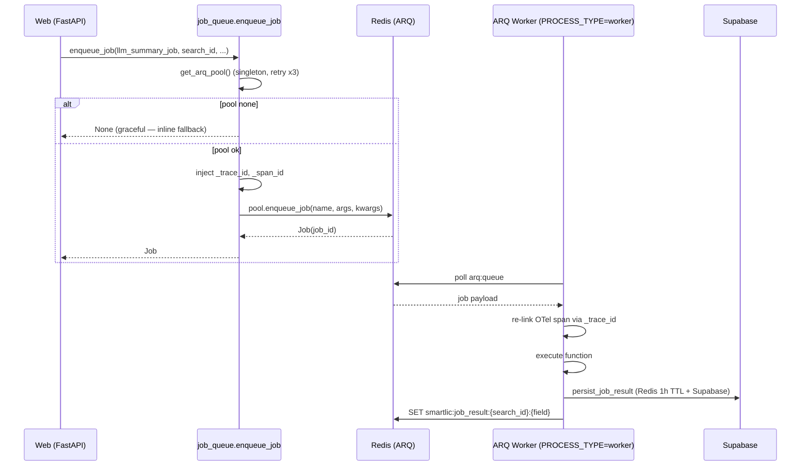
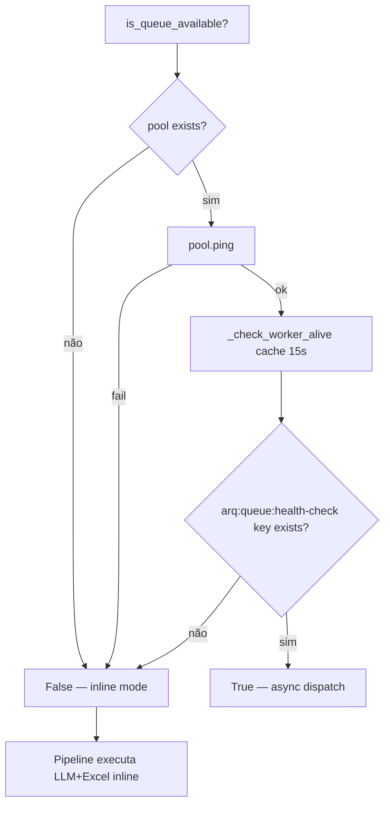
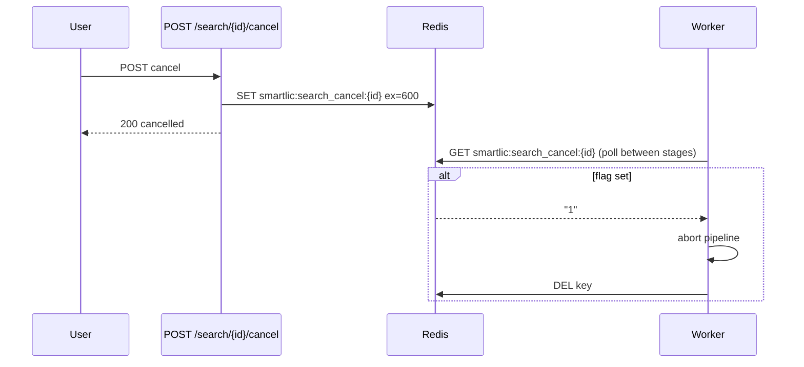
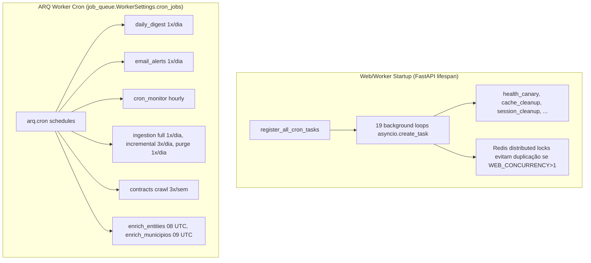
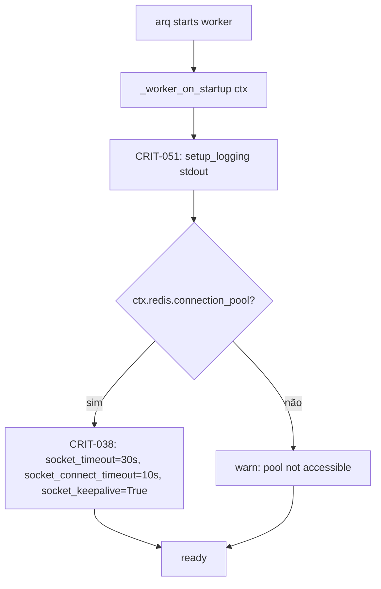
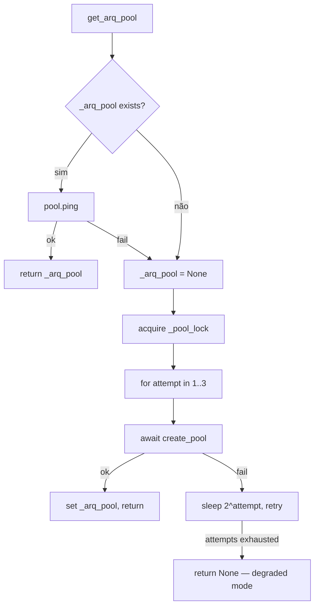

# Flowchart — Módulo `jobs+cron`

> Gerado pelo **Reversa Archaeologist** em 2026-04-27 · Confiança 🟢 CONFIRMADO

## ARQ enqueue + worker dispatch

## Worker alive check (CRIT-033)

## Cancel flag handshake (STORY-281)

## Cron architecture (dual)

## Worker on_startup hardening

## Pool reconnect retry

