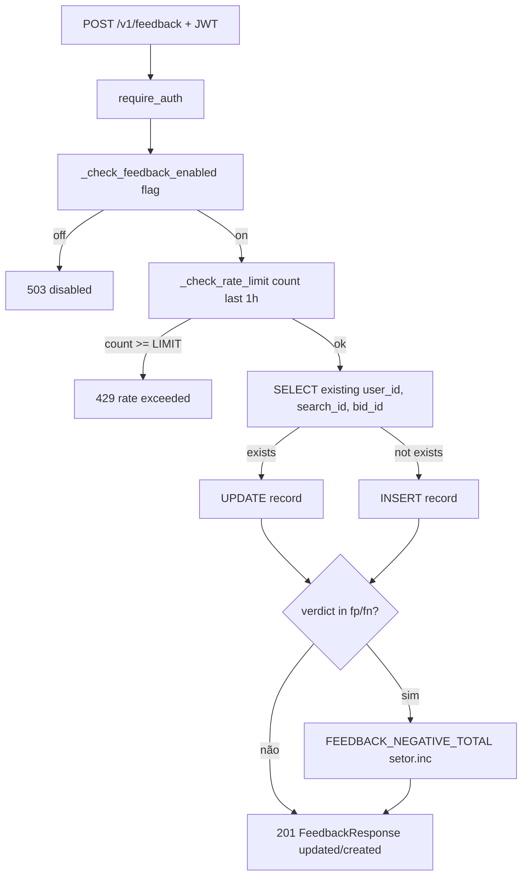
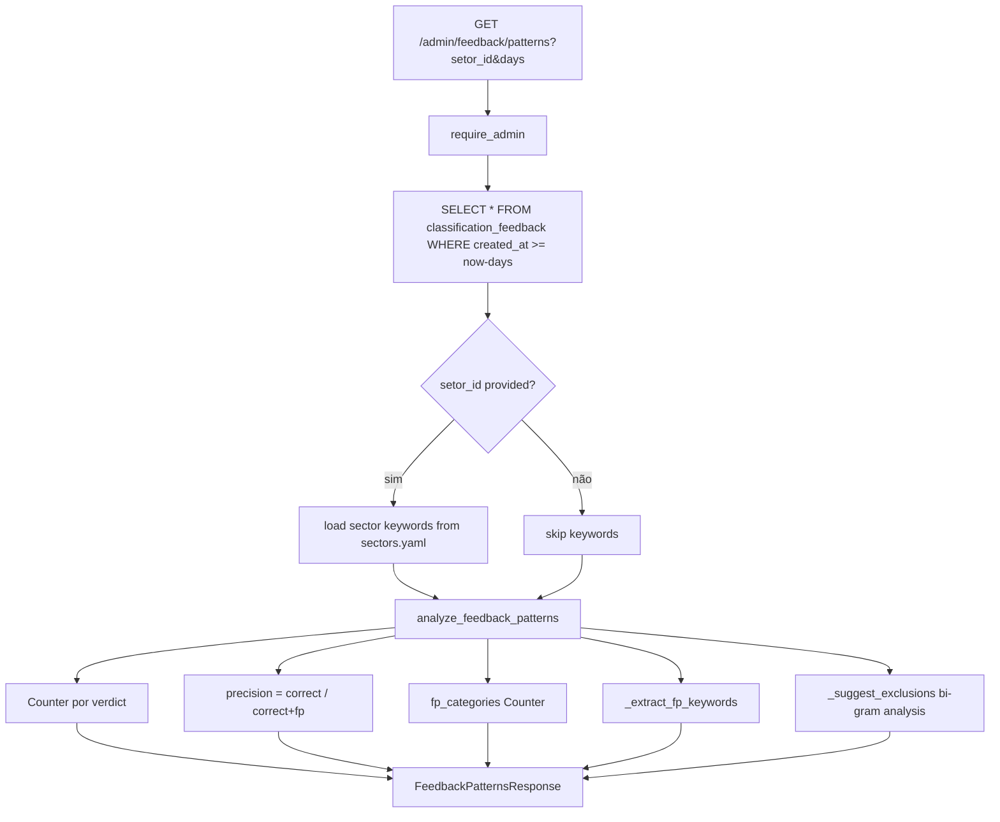
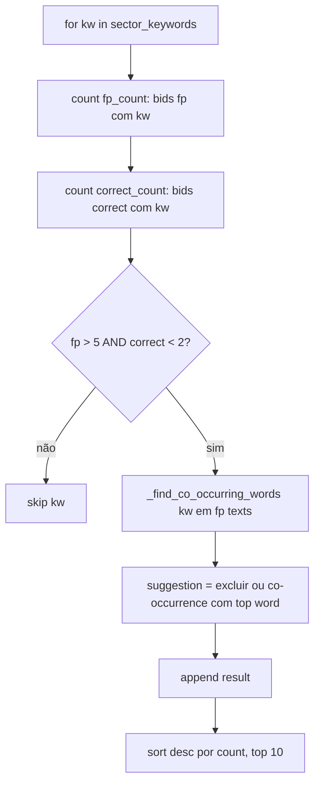
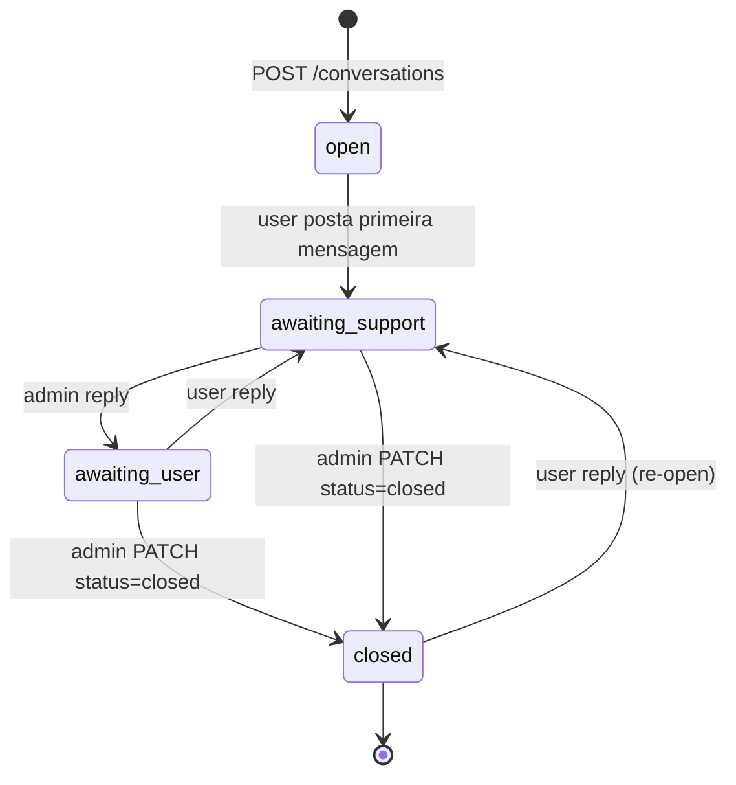
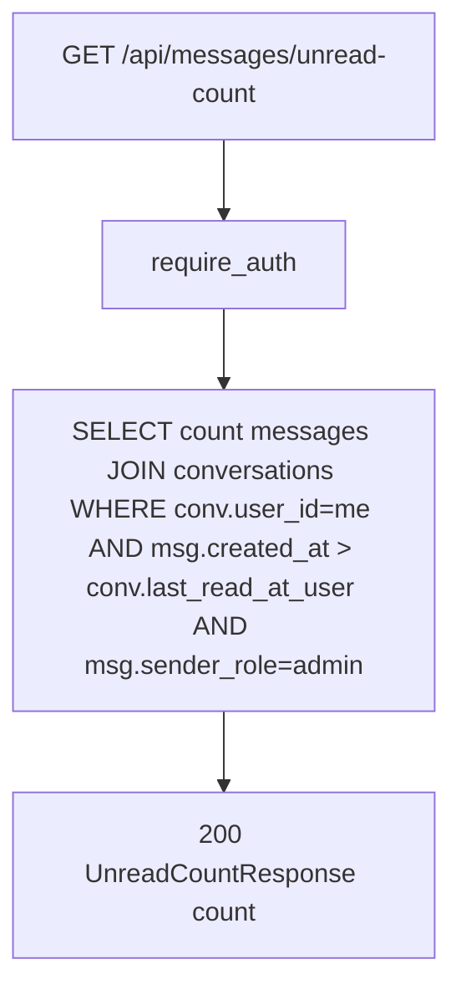

# Flowchart — Módulo `messages+feedback`

> Gerado pelo **Reversa Archaeologist** em 2026-04-27 · Confiança 🟢 CONFIRMADO

## Feedback submit (POST /feedback)



## Pattern analysis (admin GET /admin/feedback/patterns)



## Keyword extraction (FP)



## Bi-gram exclusion suggestion

```mermaid
flowchart TD
    A[fp_bigrams = Counter de bi-grams em FP bid_objeto] --> B[correct_bigrams = Counter em correct bid_objeto]
    B --> C[for bigram, count in fp_bigrams.most_common 20]
    C --> D{count >= 3 AND correct_bigrams[bigram] == 0?}
    D -->|sim| E[append to suggestions]
    D -->|não| N[skip]
    E --> F[return top 10 suggestions]
```

## Messages — conversation lifecycle



## Unread count


