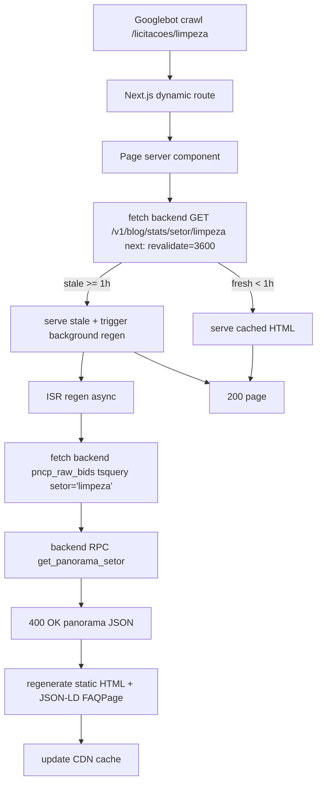
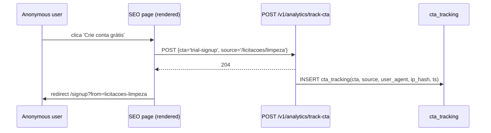

# Flowchart — Módulo `observatory+seo-programmatic`

> Gerado pelo **Reversa Archaeologist** em 2026-04-27 · Confiança 🟢 CONFIRMADO
> **Refresh 2026-05-12 (DOC-COVERAGE-002):** §2 sitemap atualizado para materialized views (SEO-SITEMAP-MV-001)

## SEO programmatic page lifecycle (frontend ISR)



## Sitemap generation hierarchy (Materialized Views — SEO-SITEMAP-MV-001)

```mermaid
flowchart TD
    A[/sitemap.xml index] --> B[lists 4 sub-sitemaps]
    B --> S1[/sitemap-licitacoes.xml]
    B --> S2[/sitemap-orgaos.xml]
    B --> S3[/sitemap-cnpjs.xml]
    B --> S4[/sitemap-licitacoes-do-dia.xml]
    S1 -->|backend| BE1[GET sitemap_licitacoes.py]
    S2 -->|backend| BE2[GET sitemap_orgaos.py]
    S3 -->|backend| BE3[GET sitemap_cnpjs.py]
    S4 -->|backend| BE4[GET sitemap_licitacoes_do_dia.py daily fresh]
    BE1 --> Q1[query mv_sitemap_cnpjs · <50ms]
    BE2 --> Q2[query mv_sitemap_orgaos · <50ms]
    BE3 --> Q3[query mv_sitemap_fornecedores · <50ms]
    BE4 --> Q4[query bids WHERE data_publicacao = today]
    Q1 & Q2 & Q3 & Q4 --> R[XML render with Cache-Control max-age=3600 swr=86400]
    R -->|cap 50k URLs por arquivo| OUT[response]
    subgraph pg_cron 7UTC daily
        REF[REFRESH MATERIALIZED VIEW CONCURRENTLY]
    end
    REF -->|mv_sitemap_cnpjs| Q1
    REF -->|mv_sitemap_orgaos| Q2
    REF -->|mv_sitemap_fornecedores| Q3
```

> **Mudanças desde 2026-04-27:** Antes queries agregadas ao vivo (`SELECT distinct setor_id FROM pncp_raw_bids` — 30-45s). Agora materialized views pré-agregadas (`mv_sitemap_cnpjs`, `mv_sitemap_orgaos`, `mv_sitemap_fornecedores`) refrescadas via pg_cron 7 UTC daily. Queries <50ms. Regex CNPJ alpha validation (`~* '^[A-Z0-9]{12}[0-9]{2}$'`) substituiu `length >= 11` (SEO-CNPJ-ALPHA-001).

## CNPJ profile flow (/empresa/{cnpj})

```mermaid
flowchart TD
    A[GET /v1/empresa/{cnpj}] --> B[validate CNPJ format]
    B --> C[query supplier_contracts WHERE cnpj_fornecedor]
    C --> D[aggregate: total_won, valor_total, top_orgaos, evolucao_temporal]
    D --> E[query entities WHERE cnpj for BrasilAPI enriched data]
    E --> F[query sanctions_master WHERE cnpj]
    F --> G[combine FornecedorProfile]
    G --> H[200 JSON]
    H --> I[Frontend /cnpj/{cnpj}/page.tsx renders + Organization JSON-LD]
```

## DataLake query path (RPC)

```mermaid
flowchart TD
    A[SEO route handler] --> B[get_supabase service-role]
    B --> C[sb.rpc 'get_panorama_setor', {setor_id, days, uf}]
    C --> D[Postgres function]
    D --> E[uses GIN index on objeto tsquery + idx setor_id, UF]
    E --> F[returns aggregated panorama]
    F --> G[Backend serialize PanoramaStats]
    G --> H[Frontend consume]
```

## Trial CTA tracking



## SEN-FE-001 cache alignment fix

```mermaid
flowchart TD
    OLD[ANTIPATTERN: export const revalidate = 3600 + fetch cache:'no-store'] --> X[SSG quebra: 4146 fetches build-time]
    X --> XX[backend saturação Stage 2 outage 2026-04-27]
    NEW[FIX: export const revalidate = 3600 + fetch next:{revalidate:3600}] --> OK[ISR funcional]
    OK --> OK1[build estático bem-formed]
    OK1 --> OK2[regen on-demand 1h]
```
