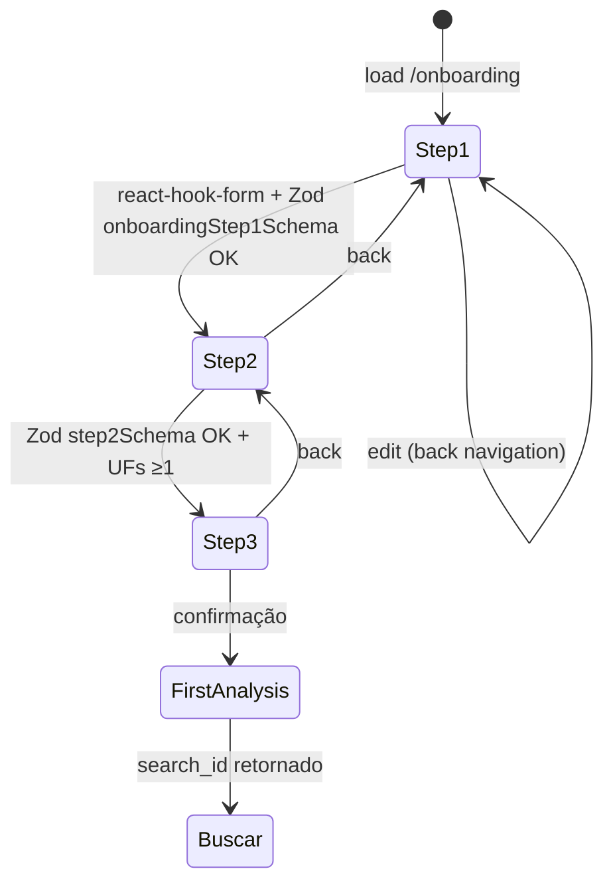
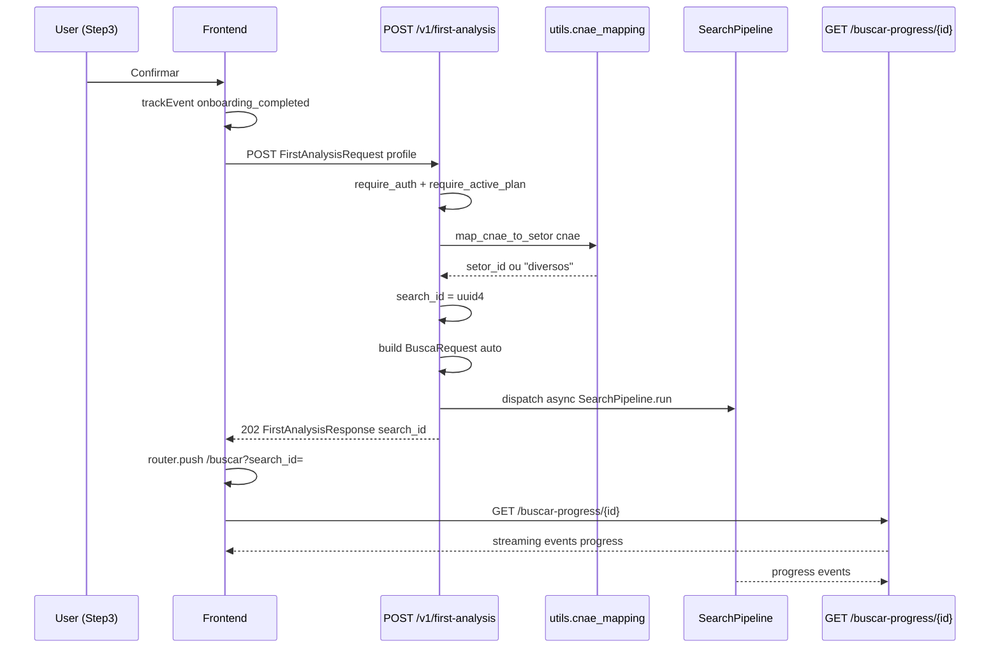
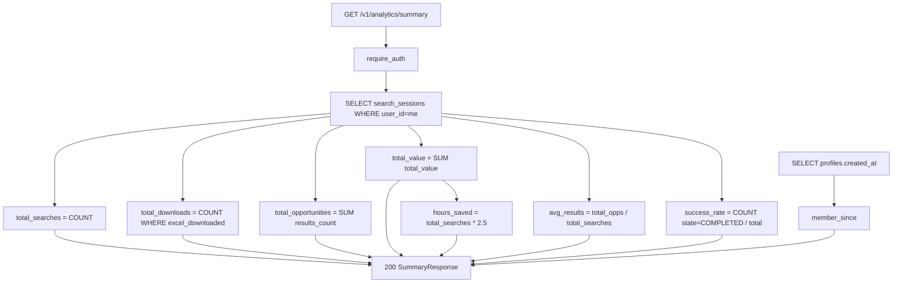
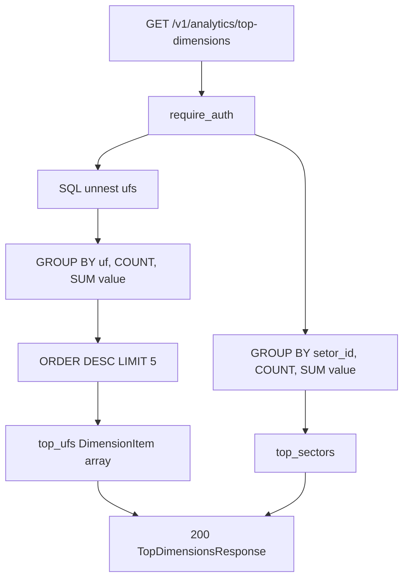
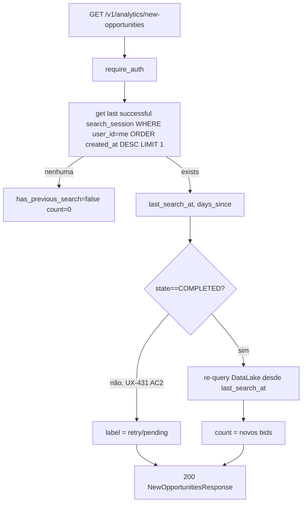
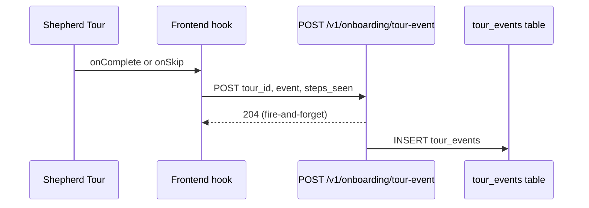

# Flowchart — Módulo `onboarding+analytics`

> Gerado pelo **Reversa Archaeologist** em 2026-04-27 · Confiança 🟢 CONFIRMADO

## Onboarding wizard (3-step)

## First analysis flow (GTM-004)

## Analytics — summary aggregation

## Top dimensions (UFs + sectors)

## New opportunities (DEBT-127)

## Tour event telemetry

