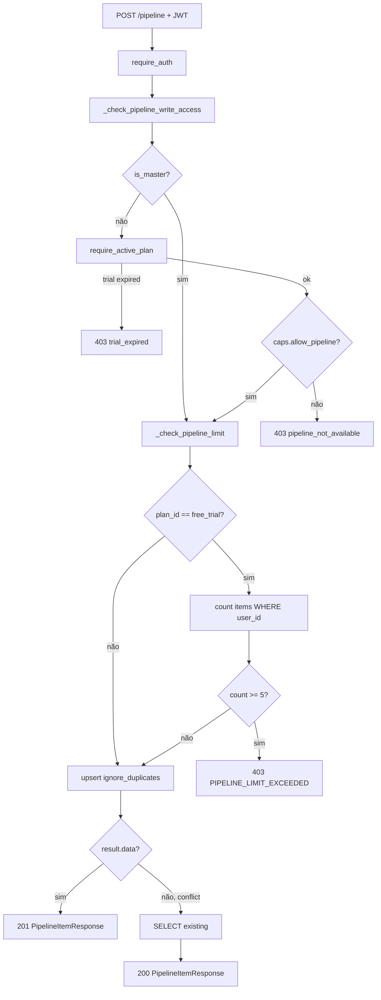
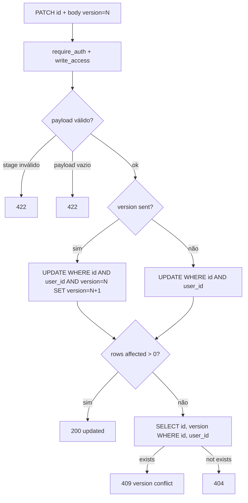
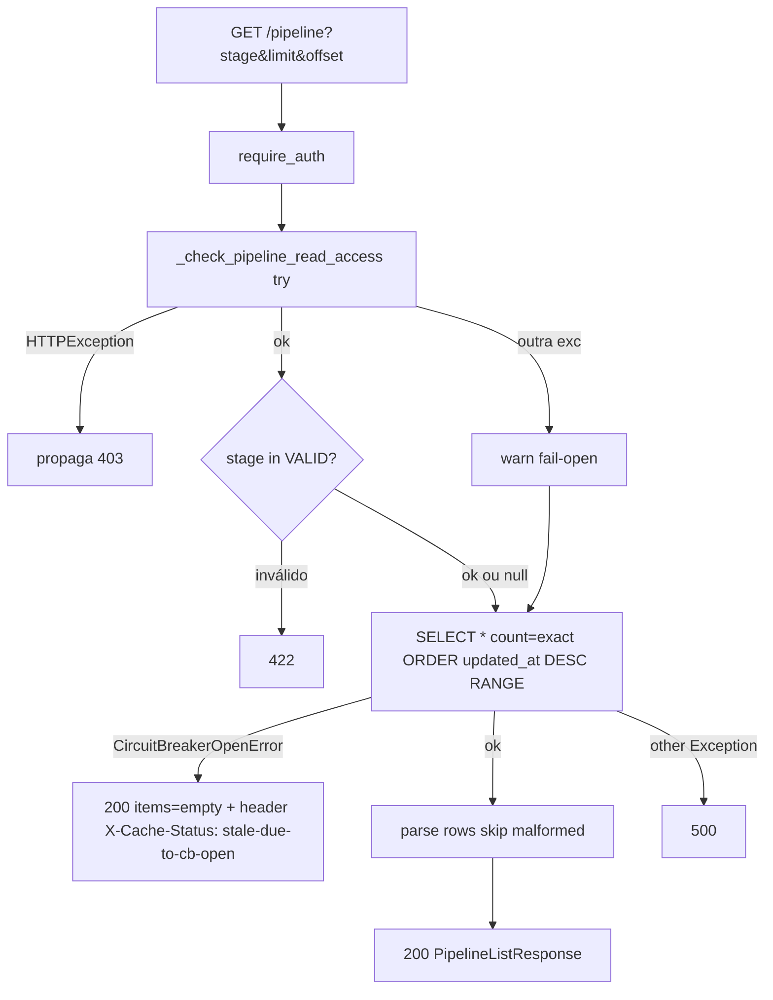
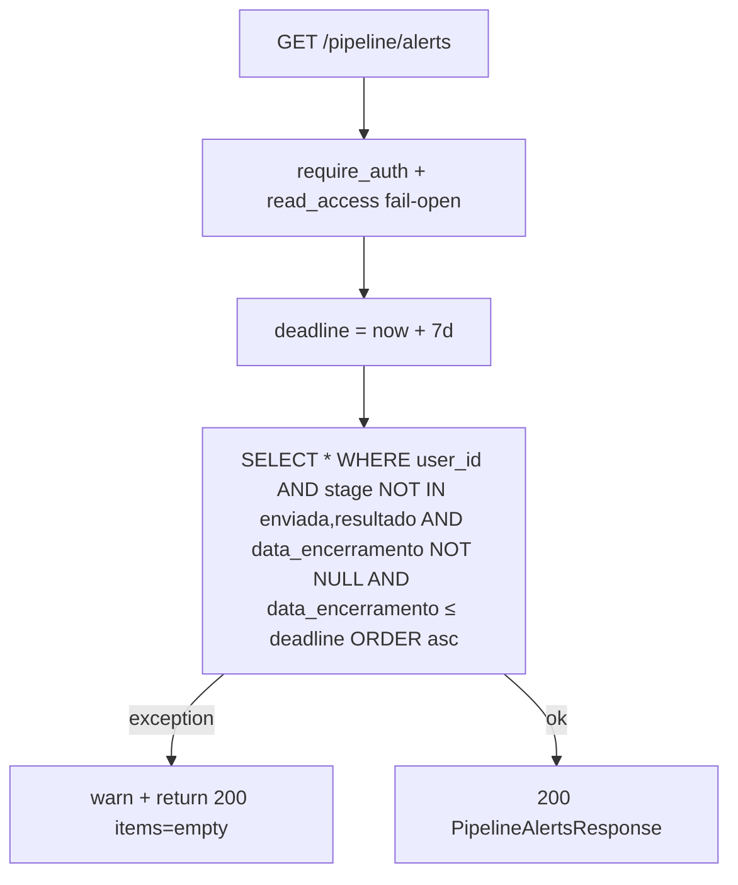
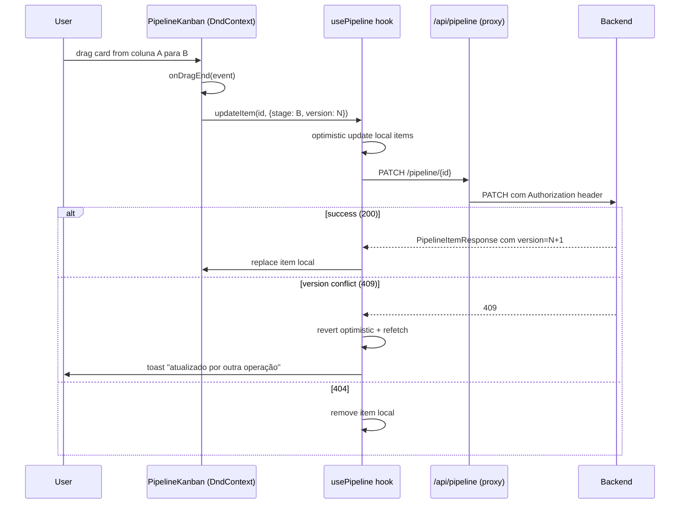

# Flowchart — Módulo `pipeline-kanban`

> Gerado pelo **Reversa Archaeologist** em 2026-04-27 · Confiança 🟢 CONFIRMADO

## POST /pipeline (create)

## PATCH /pipeline/{id} — optimistic locking

## GET /pipeline (list with fail-open)

## GET /pipeline/alerts

## Frontend drag-drop (PipelineKanban.tsx)

## Estados

| Estado | Origem | Comportamento |
|--------|--------|---------------|
| Trial active + caps.allow_pipeline | profiles + plan_billing_periods | Full RW |
| Trial expired | trial_expires_at < now | Read-only (STORY-265 AC15), badge âmbar |
| Pago | subscription_status=active | Full RW, sem limite |
| CB open | supabase circuit breaker | Read 200 com items=[], write 5xx |
| Master/admin | profiles.is_master/is_admin | Bypass de quota+limit |
