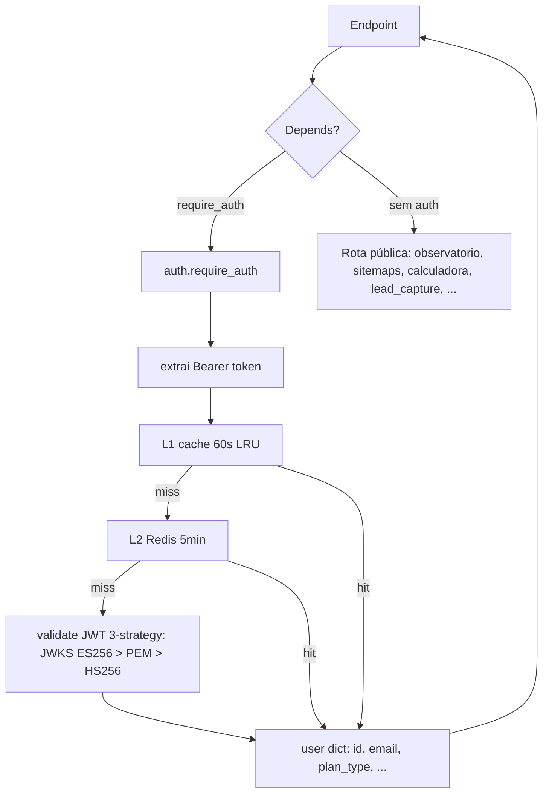
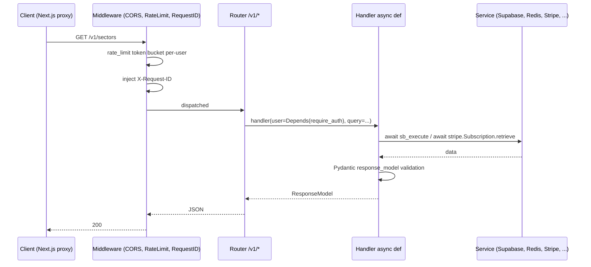
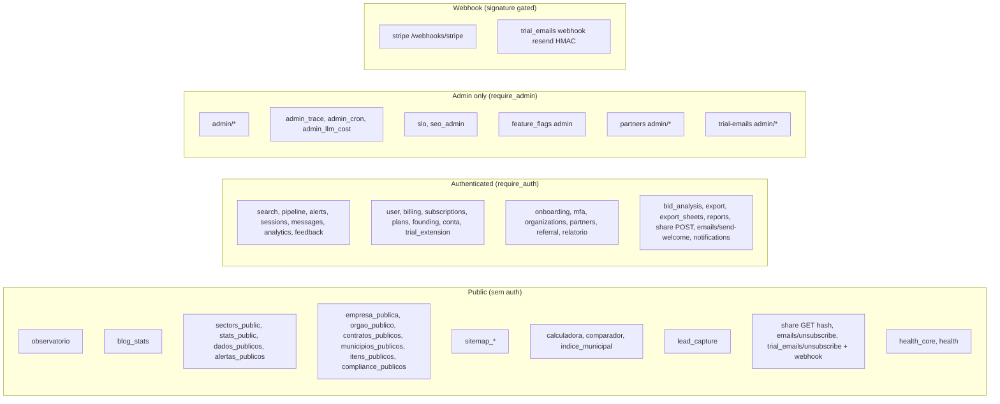

# Flowchart — Módulo `routes`

> Gerado pelo **Reversa Archaeologist** em 2026-04-27 · Confiança 🟢 CONFIRMADO

## Routing pipeline (FastAPI lifespan)

```mermaid
flowchart TD
    A[uvicorn main:app] --> B[startup.app_factory.create_app]
    B --> C[middleware_setup: CORS, RequestID, Sentry, RateLimit]
    C --> D[exception_handlers]
    D --> E[lifespan startup: register_all_cron_tasks + DB schema check]
    E --> F[register_routes app]
    F --> G[health_core_router root]
    F --> H[for r in _v1_routers: include_router prefix=/v1]
    F --> I[admin_trace, admin_cron, admin_llm_cost, slo self-prefixed]
    F --> J[stripe_webhook_router root /webhooks/stripe]
    G --> X[/health/live, /health/ready, /sources/health]
    H --> Y[~150 endpoints sob /v1/*]
    I --> Z[~10 endpoints /v1/admin/*]
```

## Auth dependency tree



## Request → Response



## Public vs authenticated routes


