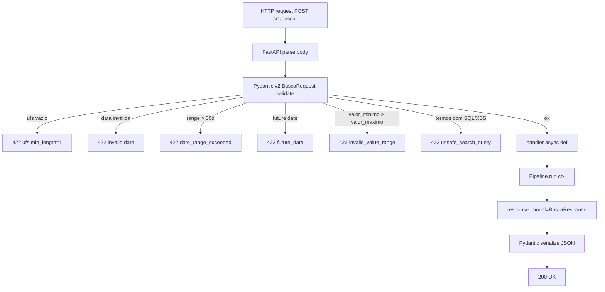
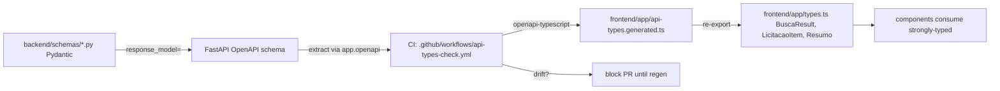
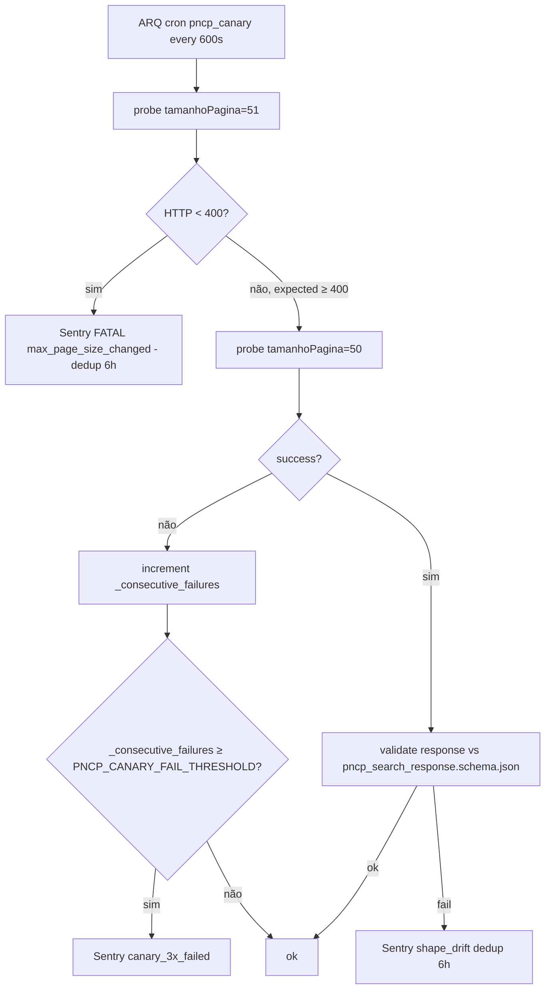
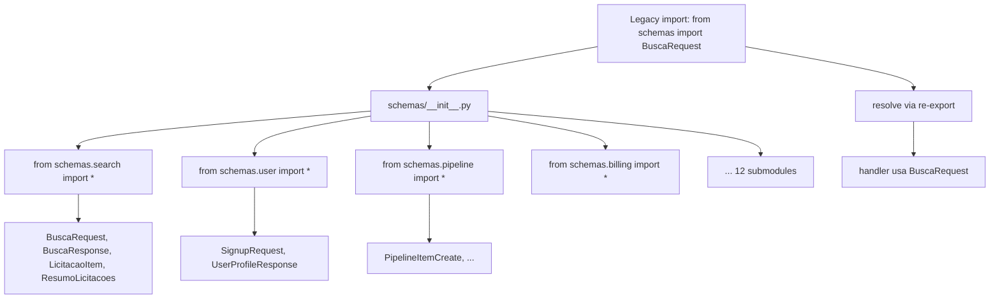
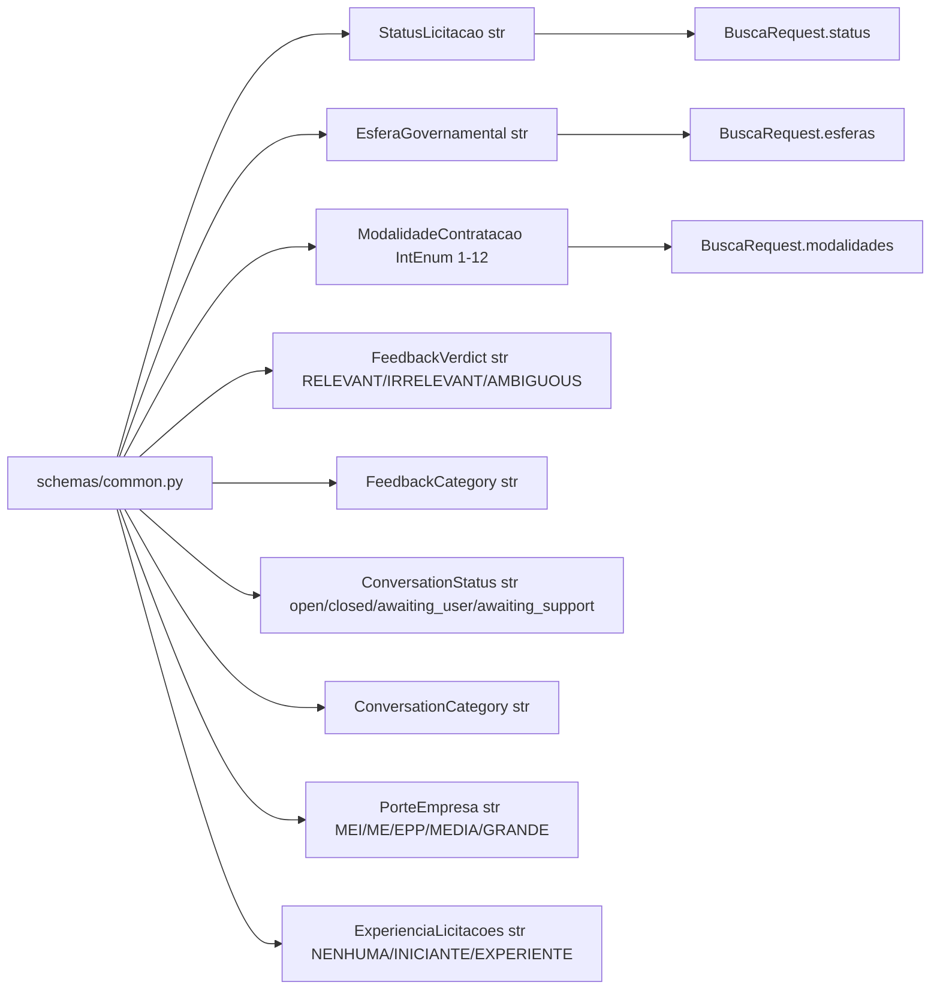

# Flowchart — Módulo `schemas+contracts`

> Gerado pelo **Reversa Archaeologist** em 2026-04-27 · Confiança 🟢 CONFIRMADO

## Validation pipeline (request → handler)

## Schema source-of-truth → frontend codegen (STORY-2.1)

## PNCP shape canary (STORY-4.5)

## Re-export pattern (DEBT-302)

## Enum hierarchy

