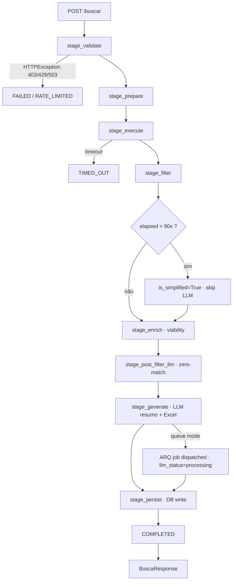
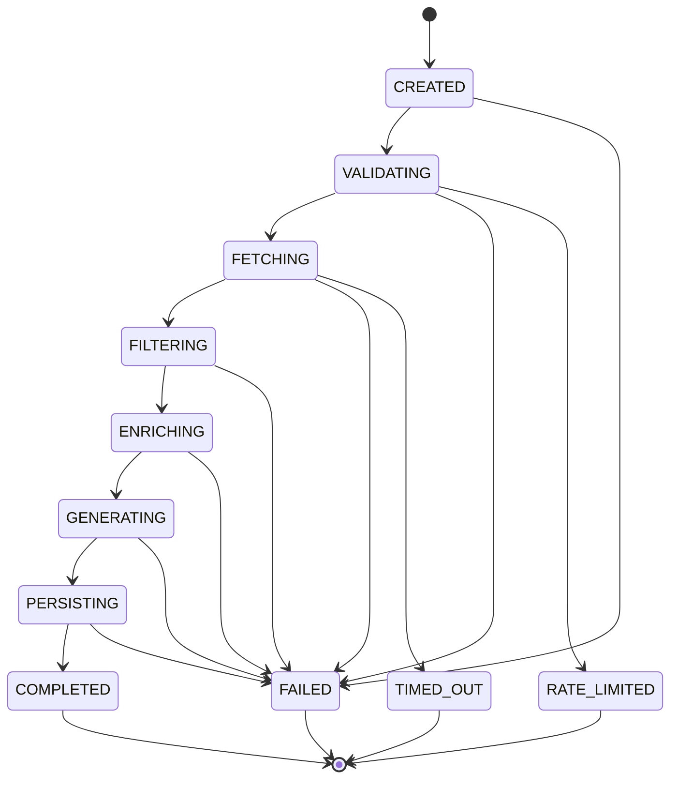
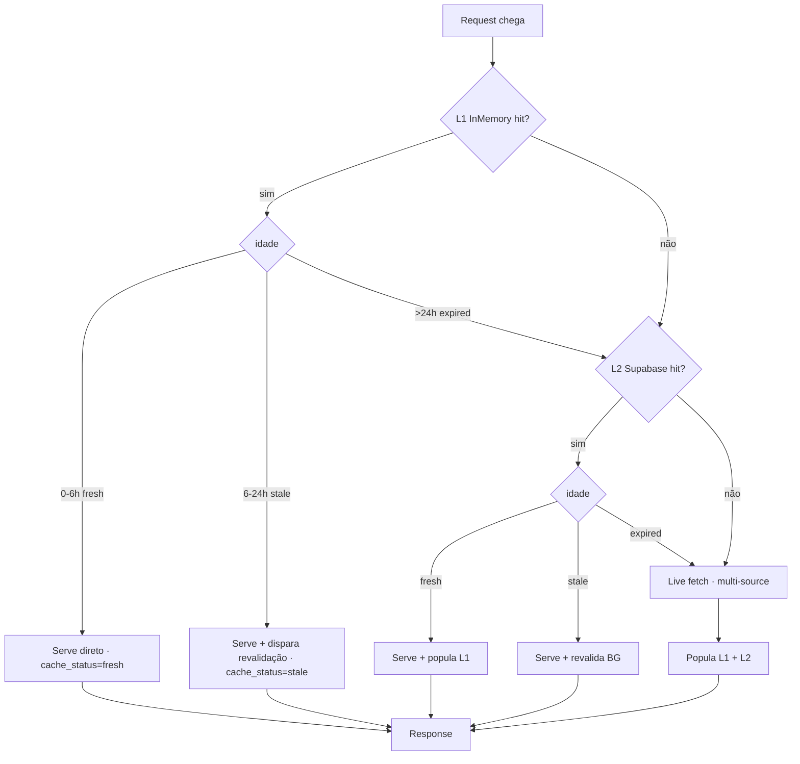
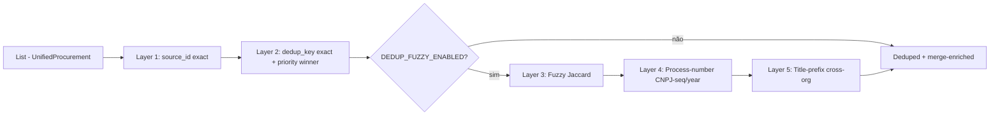

# Flowchart — Módulo `search`

> Gerado pelo **Reversa Archaeologist** em 2026-04-27

## 1. Pipeline de 7 estágios



## 2. Máquina de estados (`SearchState`)



## 3. Cache SWR (per-request)



## 4. Dedup Engine (5 layers)



## 5. Time Budget Waterfall

```
Railway proxy     [================== 120s ==================]
Gunicorn worker   [============== 110s ===============]
Pipeline budget   [============ 100s =============]
  Consolidation   [========== 90s ==========]
    PerSource     [======= 70s =======]
      PerUF       [=== 25s ===]
        httpx     [10c+15r]
```

Invariante: `pipeline(100) > consolidation(90) > per_source(70) > per_uf(25) > (per_modality 20 + httpx 15)` — assertado em `tests/test_timeout_invariants.py`.
