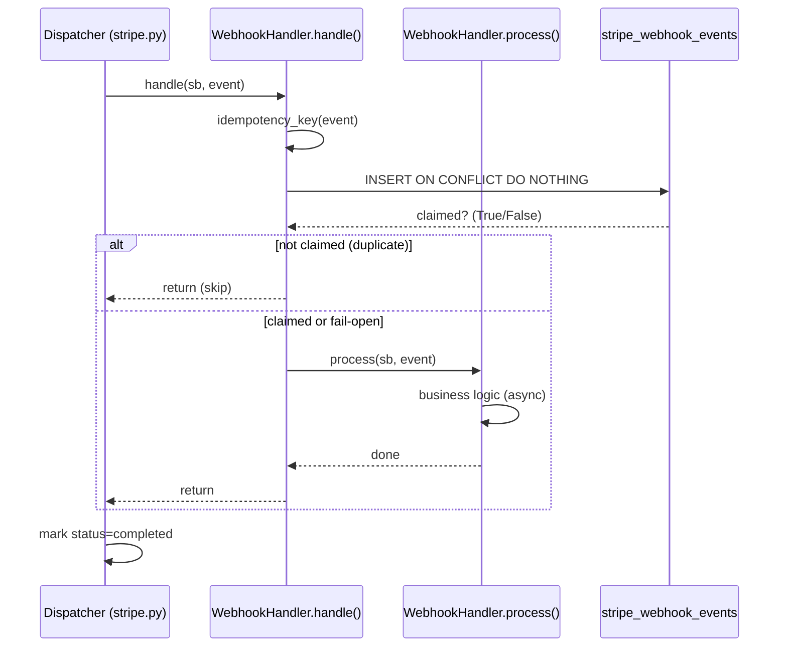
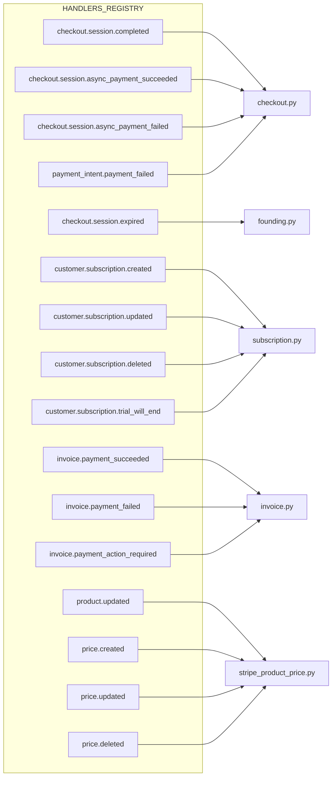

# Flowchart — Módulo `webhook-abc` (REF-MON-002)

> Gerado pelo **Reversa Writer** em 2026-05-12

## 1. Stripe Webhook Dispatcher + ABC Handler

```mermaid
flowchart TD
    Stripe[Stripe POST /webhooks/stripe] --> Sig{stripe-signature header present?}
    Sig -->|missing| 400[HTTP 400]
    Sig -->|present| Verify{construct_event valid?}
    Verify -->|invalid sig| 400
    Verify -->|valid| Idem[INSERT stripe_webhook_events\nid=event.id ON CONFLICT DO NOTHING]
    Idem --> Dup{already exists?}
    Dup -->|processing + >5min| ReProc[reprocess · log WARN]
    Dup -->|completed/timeout| Done[HTTP 200 already_processed]
    Dup -->|no / reprocess| Dispatch[dispatch via HANDLERS_REGISTRY]
    ReProc --> Dispatch
    Dispatch --> Find{event.type in registry?}
    Find -->|no| Unsup[log unknown event · HTTP 200 OK]
    Find -->|yes| Handler[handler.handle(sb, event)]
    Handler --> Sub[WebhookHandler template method]
```

## 2. WebhookHandler ABC Template Method



## 3. Handler Registry (16 event types)



## 4. In-Handler Idempotency Flow

```mermaid
flowchart TD
    Process[handler.handle] --> Key[idempotency_key(event)]
    Key --> Upsert[INSERT stripe_webhook_events upsert ignore_duplicates]
    Upsert --> Result{data returned?}
    Result -->|sim (fresh claim)| Run[run process()]
    Result -->|não (already existed)| Skip[skip · log duplicate]
    Result -->|DB error| FailOpen[return True · proceed anyway]
```
