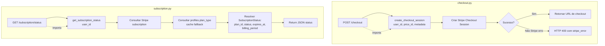
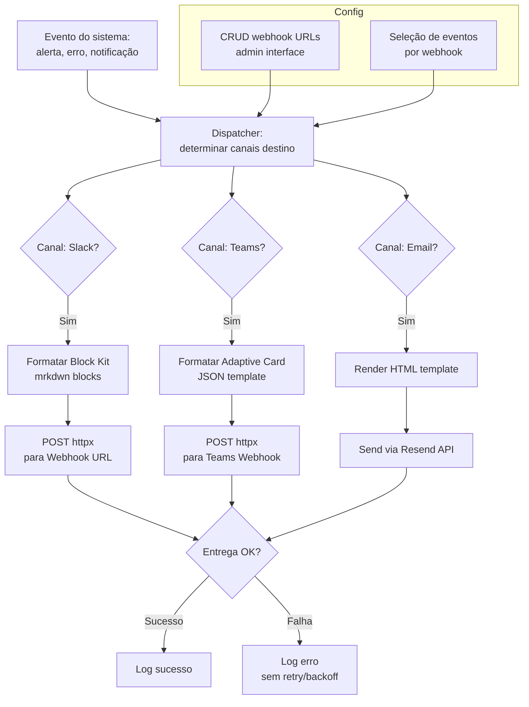
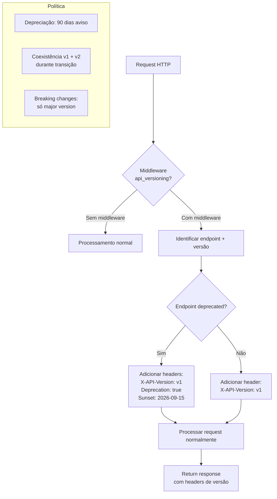
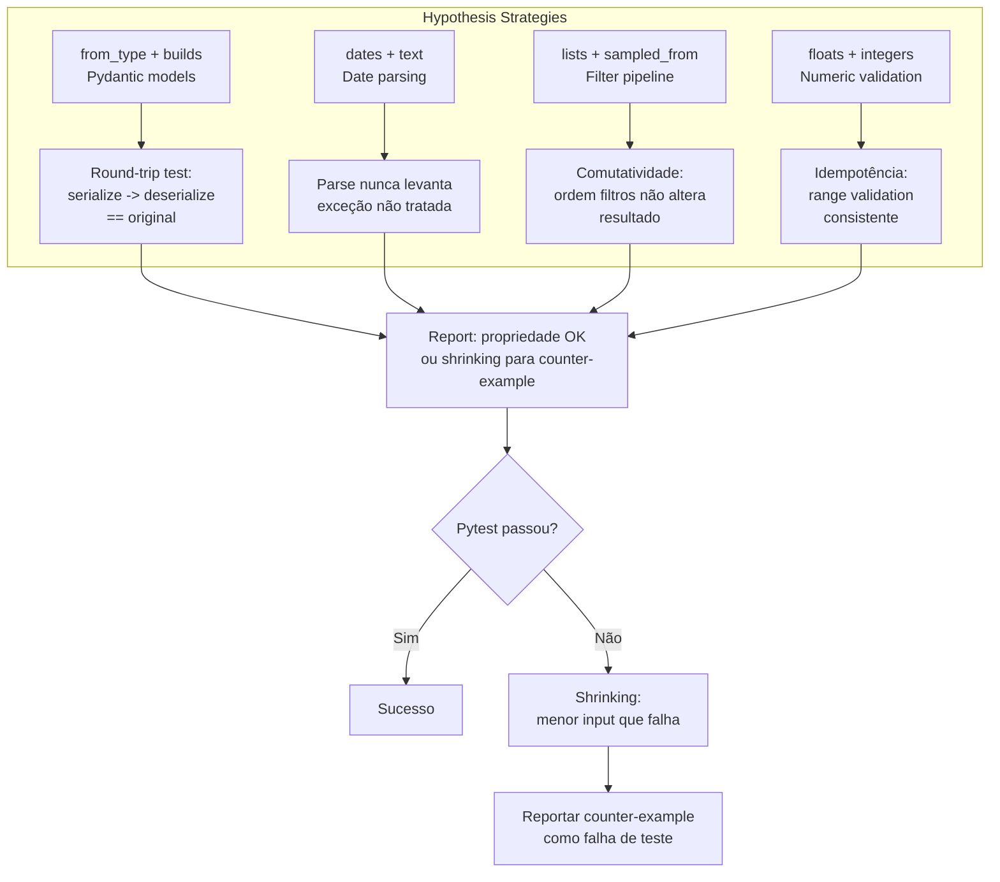
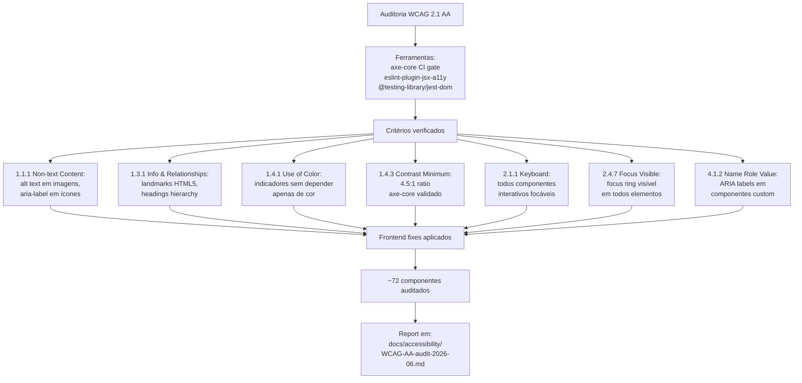

# Flowcharts — Módulos 25 a 36

> Gerado para Issue #1976 (P2 Flowcharts). Diagramas Mermaid baseados em `_reversa_sdd/code-analysis.md` e código fonte.

---

## Módulo 25 — `rbac-granular`

Substitui `is_admin` boolean por 8 roles granulares (Fase 1: novos endpoints admin).

```mermaid
flowchart TD
    A[Request para endpoint admin] --> B{FastAPI Depends\nrequire_admin_role(role)}
    B --> C[require_auth valida JWT]
    C --> D{Token válido?}
    D -->|Não| E[HTTP 401]
    D -->|Sim| F[get_profile_admin_roles\nconsulta profiles.admin_roles]
    F --> G{Role permitida?}
    G -->|admin:super presente| H[PERMITIDO]
    G -->|role específica encontrada| H
    G -->|Nenhuma role corresponde| I[HTTP 403 Forbidden]
    H --> J[Executa handler do endpoint]

    subgraph Roles
        K[8 roles:\nadmin:users\nadmin:billing\nadmin:cache\nadmin:partners\nadmin:seo\nadmin:ops\nadmin:compliance\nadmin:super]
    end

    K -.-> G
```

**Entry point:** `backend/rbac_granular.py::require_admin_role(role)`
**DB:** `profiles.admin_roles TEXT[]` (migration `20260616120000`)
**Dependencies:** `auth.require_auth`, `supabase_client`, FastAPI `Depends`/`HTTPException`

---

## Módulo 26 — `circuit-breaker-admin`

Endpoint admin para estado real-time de todos os circuit breakers.

```mermaid
flowchart TD
    A[GET /v1/admin/circuit-breakers] --> B[require_admin_role admin:ops]
    B --> C{Autenticado?}
    C -->|Não| D[HTTP 401]
    C -->|Sim| E{admin:ops ou super?}
    E -->|Não| F[HTTP 403]
    E -->|Sim| G[get_all_circuit_breaker_states]

    G --> H[Query CB state: PNCP]
    G --> I[Query CB state: PCP]
    G --> J[Query CB state: ComprasGov]
    G --> K[Query CB state: BrasilAPI]
    G --> L[Query CB state: IBGE]

    H --> M[Aggregate results]
    I --> M
    J --> M
    K --> M
    L --> M

    M --> N[Return JSON:\n{circuit_breakers:\n  {source: state,\n   failures, open_since,\n   config}}]
```

**Entry point:** `backend/routes/admin_circuit_breakers.py` (36 LOC)
**Dependencies:** `clients/*/circuit_breaker.py`, `rbac_granular.require_admin_ops`
**Sem cache** — cada chamada consulta Redis para todos os CBs.

---

## Módulo 27 — `data-retention-admin`

Endpoint read-only para inspecionar última execução de purge por tabela.

```mermaid
flowchart TD
    A[GET /v1/admin/data-retention/status] --> B[require_admin]
    B --> C{Autenticado?}
    C -->|Não| D[HTTP 401]
    C -->|Sim| E[Ler Redis keys:\ndata_retention:*]

    E --> F{Redis disponível?}
    F -->|Não| G[status: error\ncom detail message]

    F -->|Sim| H[Ler data_retention:last_run:trial_email_log]
    H --> I[Ler data_retention:last_run:messages]
    I --> J[Ler data_retention:last_run:ingestion_checkpoints]

    J --> K[Ler keys de:\nlast_rows, last_error, last_duration]

    K --> L[Aggregar resultados]
    L --> M[Return:\n{tables[], total_rows_purged,\n last_cycle_duration_seconds}]
```

**Entry point:** `backend/routes/admin_data_retention.py` (125 LOC)
**Redis keys:** `data_retention:last_run:{table}`, `data_retention:last_rows:{table}`, `data_retention:last_error:{table}`, `data_retention:last_duration`
**TTL:** 7 dias (consistente com `data_retention.py`)

---

## Módulo 28 — `admin-sessions-log-level`

Admin session revocation + runtime log level toggle.

```mermaid
flowchart TD
    subgraph Session Revocation
        A1[POST /v1/admin/sessions/revoke\nbody: {user_id}] --> B1[require_admin_role admin:users]
        B1 --> C1{Autenticado + role?}
        C1 -->|Não| D1[HTTP 401/403]
        C1 -->|Sim| E1[Revogar sessões Redis]
        E1 --> F1[Revogar sessões Supabase]
        F1 --> G1[Return 204 No Content]
    end

    subgraph Log Level Toggle
        A2[POST /v1/admin/log-level\nbody: {level: DEBUG|INFO|WARN|ERROR}] --> B2[require_admin_role admin:ops]
        B2 --> C2{Autenticado + role?}
        C2 -->|Não| D2[HTTP 401/403]
        C2 -->|Sim| E2[Validar nível]
        E2 --> F2{Nível válido?}
        F2 -->|Não| G2[HTTP 422]
        F2 -->|Sim| H2[logging.getLogger().setLevel]
        H2 --> I2[Registrar em Redis:\nadmin:log_level]
        I2 --> J2[Return 204]
    end
```

**Entry points:** `backend/routes/admin_sessions.py`, `backend/routes/admin_log_level.py`
**Tests:** `test_admin_sessions.py` (217 LOC), `test_admin_log_level.py` (437 LOC)
**Limitação:** Log level não persiste entre deploys (volta ao default).

---

## Módulo 29 — `billing-services`

Extrai lógica de billing de `routes/billing.py` para serviços dedicados.



**Entry points:** `backend/services/billing/checkout.py`, `backend/services/billing/subscription.py`
**Dependencies:** Stripe SDK, `supabase_client`, `schemas/billing`
**Status:** Apenas checkout + subscription extraídos (cancel, update, portal ainda em `billing.py`).

---

## Módulo 30 — `dedup-engine-v2`

Motor de dedup extraído em 5 layers independentes com engine orquestradora.

```mermaid
flowchart TD
    A[DeduplicationEngine.run\nrecords: list[dict]] --> B[Layer 1: Exact Hash\nSHA-256 do registro]
    B --> C{Duplicata exata?}
    C -->|Sim| D[Marcar como duplicada]
    C -->|Não| E

    D --> E[Layer 2: Composite Key\nUF + modalidade + objeto + data]
    E --> F{Chave composta match?}
    F -->|Sim| G[Manter priority source\ncampos merge]
    F -->|Não| H

    G --> H[Layer 3: Fuzzy Jaccard\nSimilaridade de descrição]
    H --> I{Similaridade > threshold?}
    I -->|Sim| J[Juntar registros]
    I -->|Não| K

    J --> K[Layer 4: Process Number\nNúmero processo + ano + órgão]
    K --> L{Process match?}
    L -->|Sim| M[Dedup por processo]
    L -->|Não| N

    M --> N[Layer 5: Title Prefix\nSimilaridade de objeto resumido]
    N --> O{Title match?}
    O -->|Sim| P[Dedup por título]
    O -->|Não| Q[Registro único]

    P --> Q
    Q --> R[Return list[dict]\ndeduplicada]
```

**Entry point:** `backend/consolidation/dedup/engine.py::DeduplicationEngine.run()`
**Layers:** Exata (~60%) > Chave (~25%) > Fuzzy > Processo > Título (~15%)
**Early termination:** Layers N+1..5 skipadas se conjunto reduz abaixo de threshold.

---

## Módulo 31 — `filter-llm-zero-match`

Stage dedicado para zero keyword match com recovery path.

```mermaid
flowchart TD
    A[classify_zero_match\nitems, sector] --> B[Detectar zero-match:\nkeyword_density == 0.0]

    B --> C[Batch LLM classification\nGPT-4.1-nano\naté 10 itens/call]

    C --> D{LLM respondeu?}
    D -->|Sim timeout | E[recover_zero_match\nFallback determinístico]
    D -->|Sim 429/5xx| E
    D -->|Sim sucesso| F[Parse result:\nYES/NO por item]

    E --> G[Expansão de keywords:\nsinônimos + radicais]
    G --> H[CNAE mapping]
    H --> I{Recovery OK?}
    I -->|Sim| F
    I -->|Não| J[Marcar como PENDING_REVIEW\nnão REJECT]

    F --> K[Return list[ClassificationResult]\nYES=include, NO=reject]
```

**Entry points:** `backend/filter/stages/llm_zero_match.py`, `backend/filter/stages/recovery.py`
**Dependencies:** `llm_arbiter` (GPT-4.1-nano), `filter/keywords`, `utils/cnae_mapping`
**Batch size:** 10 itens (hardcoded).

---

## Módulo 32 — `webhook-integrations`

Sistema de notificação multicanal para alertas (Slack, Teams, Email).



**Entry point:** `backend/services/webhooks/` (integrações) + `backend/routes/admin_alerts.py` (configuração)
**Canais:** Slack (Block Kit), Teams (Adaptive Cards), Email (Resend HTML)
**Dependencies:** `httpx`, `email_service`, `admin.rbac_granular`
**Lacunas:** Sem retry com backoff, sem fila, sem idempotency key.

---

## Módulo 33 — `cicd-security-ops`

Automação de segurança operacional independente do código da aplicação.

```mermaid
flowchart TD
    subgraph Secrets Rotation
        A1[scripts/rotate_secrets.sh] --> B1[Rotacionar Supabase JWT]
        B1 --> C1[Rotacionar Stripe keys]
        C1 --> D1[Rotacionar OpenAI key]
        D1 --> E1[Rotacionar Resend key]
        E1 --> F1[Atualizar Railway secrets]
        F1 --> G1[Restart serviços]
    end

    subgraph Env Parity
        A2[audit-prod-env.yml\nCI daily] --> B2[Comparar env vars\nstaging vs production]
        B2 --> C2{Drift detectado?}
        C2 -->|Sim| D2[FAIL: report diff]
        C2 -->|Não| E2[PASS]
    end

    subgraph Chaos Engineering
        A3[scripts/chaos/redis_failure.sh] --> B3[Simular Redis down]
        B3 --> C3[Observar degradação\ngraceful]
        A4[scripts/chaos/db_failover.sh] --> D3[Simular DB failover]
        D3 --> E3[Observar reconexão]
    end

    subgraph Penetration Test
        A5[docs/security/penetration-test-plan.md] --> B5[Scan scripts:\nscripts/security/scan.sh]
        B5 --> C5[Relatório de\nvulnerabilidades]
    end
```



**Artefatos:** `scripts/rotate_secrets.sh`, `.github/workflows/audit-prod-env.yml`, `scripts/chaos/`, `docs/security/`
**Nota:** Componentes independentes, sem entry point unificado. Operações SRE automatizadas.

---

## Módulo 34 — `api-versioning`

Estratégia de versionamento de API com depreciação e plano v1->v2.



**Entry point:** `backend/api_versioning.py` (middleware + headers)
**Headers:** `X-API-Version`, `Deprecation`, `Sunset`
**Política:** 90 dias de aviso, coexistência v1+v2, breaking changes apenas em major.
**Status:** Rollout progressivo — aplicado em poucos endpoints ainda.

---

## Módulo 35 — `property-based-testing`

Testes baseados em propriedades com Hypothesis para schemas e funções críticas.



**Entry points:** `backend/tests/test_hypothesis_*.py`, `backend/tests/conftest.py` (Hypothesis profiles)
**Dependencies:** `hypothesis`, `pytest`, `schemas/`
**Status:** Cobertura inicial (~5 arquivos), sem CI profile dedicado.

---

## Módulo 36 — `accessibility-wcag-aa`

Auditoria WCAG AA completa — keyboard navigation, screen reader, contraste.



**Entry point:** `docs/accessibility/WCAG-AA-audit-2026-06.md` + frontend component fixes
**Ferramentas:** `axe-core` (CI gate), `eslint-plugin-jsx-a11y`, `@testing-library/jest-dom`
**Status:** 7 critérios WCAG 2.1 AA verificados e aprovados.
